# AWS Cognito Authentication Flow

## 1. Mục tiêu

Hệ thống hỗ trợ hai phương thức xác thực:

```text
1. Email + Password
2. Google Sign-In
```

Quy tắc nghiệp vụ trung tâm:

```text
EMAIL = ĐỊNH DANH NGHIỆP VỤ

Cùng normalized email
    => cùng một account
    => cùng một native Cognito user
    => cùng một cognito_sub
```

Nguyên tắc:

- Native Cognito user là account chính.
- Google là phương thức xác thực được liên kết với native user.
- `email_normalized` được dùng để xác định cùng một account.
- `cognito_sub` được dùng làm định danh kỹ thuật trong database và JWT.
- Không tạo account hoặc `cognito_sub` thứ hai cho cùng một normalized email.
- Google email phải có `email_verified = true`.
- `cognito_sub` không thay đổi trong suốt vòng đời account.

> Lưu ý triển khai: “Không cần tự động link” trong tài liệu này có nghĩa là người dùng không phải thực hiện màn hình hoặc thao tác Link Account riêng. Backend vẫn phải thực hiện account-linking kỹ thuật trong Cognito để Google Sign-In trả về đúng native user và cùng `cognito_sub`.

---

## 2. Chuẩn hóa và định danh email

Trước mọi thao tác Sign Up, Sign In hoặc Google callback, backend phải chuẩn hóa email.

```text
Input email
    => trim khoảng trắng
    => chuyển về lowercase
    => lưu thành email_normalized
```

Ví dụ:

```text
" User@Gmail.com " => "user@gmail.com"
```

Quy tắc:

```yaml
email:
  business_identity: true
  normalize:
    trim: true
    lowercase: true
  unique_in_database: true
  require_google_email_verified: true
```

Không tự ý áp dụng các biến đổi phụ thuộc provider như xóa dấu chấm hoặc xóa `+alias`, trừ khi đó là yêu cầu nghiệp vụ riêng.

---

## 3. Mô hình account

```text
Application Account
├── email_normalized
├── cognito_sub
├── account_state
└── authentication methods
    ├── Password, optional
    └── Google, optional
```

Các trạng thái logic:

```text
UNCONFIRMED_PASSWORD
PASSWORD_ONLY
GOOGLE_ONLY
PASSWORD_AND_GOOGLE
INCOMPLETE_GOOGLE_ONBOARDING
DISABLED
```

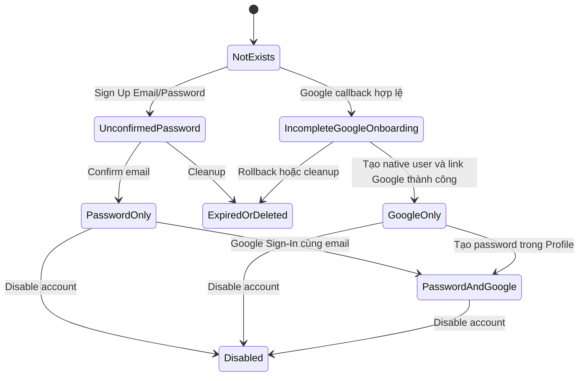

---

## 4. Case A: Đăng ký Email/Password trước

### 4.1 Happy case: Sign Up và confirm email

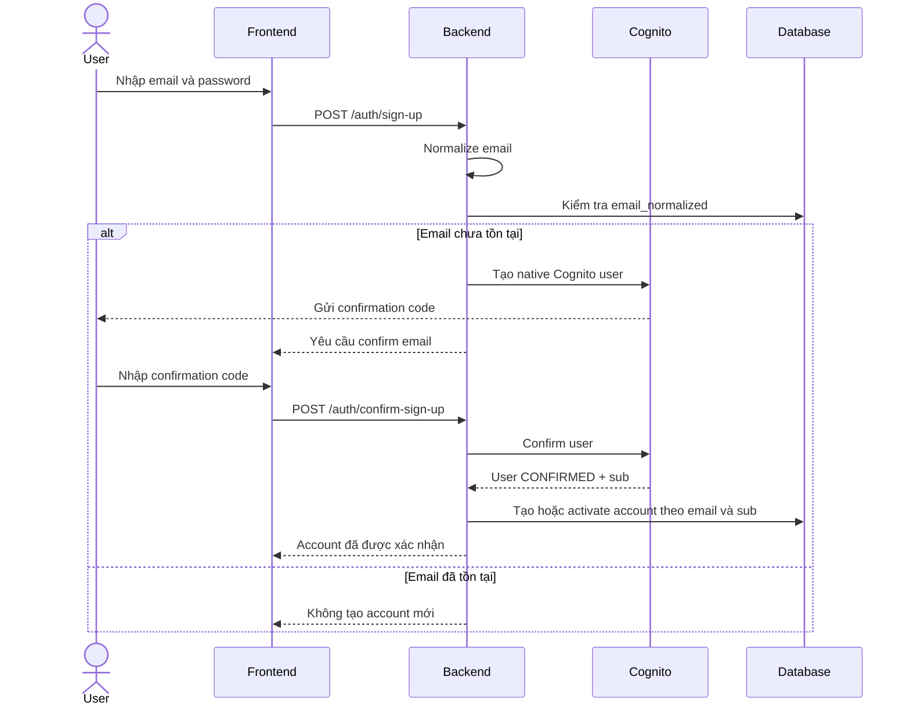

Kết quả:

```text
account_state: PASSWORD_ONLY
email_normalized: user@gmail.com
cognito_sub: SUB001
methods:
  - PASSWORD
```

### 4.2 Password Sign-In

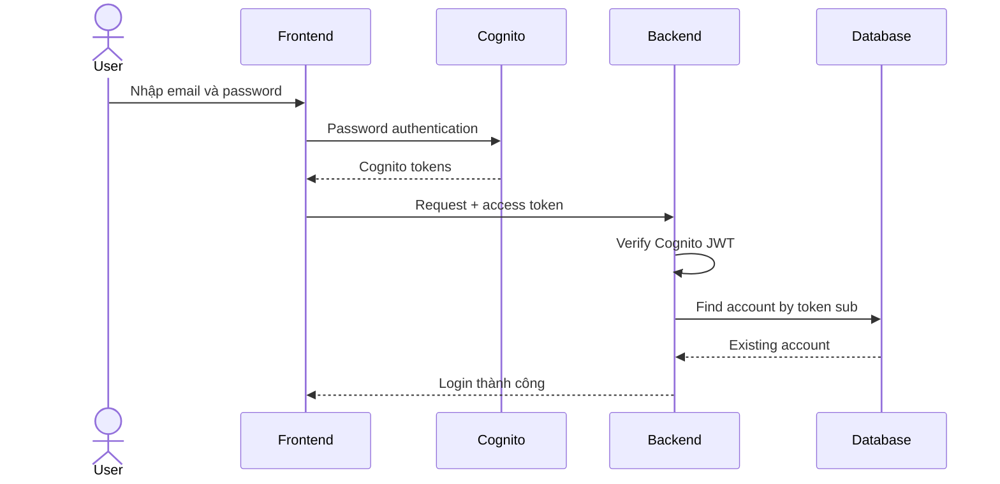

### 4.3 Sau đó Sign In with Google cùng email

Người dùng không phải vào Profile và không phải bấm Link Google.

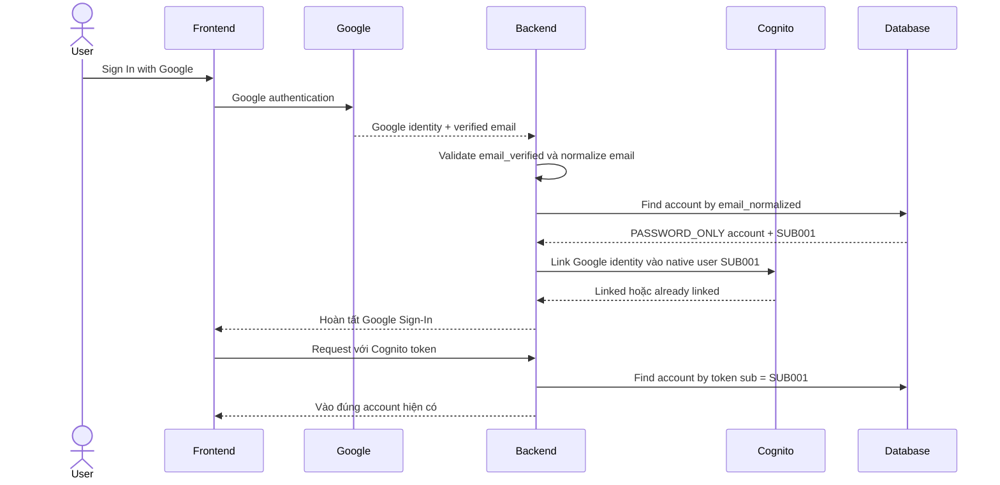

Kết quả:

```text
account_state: PASSWORD_AND_GOOGLE
email_normalized: user@gmail.com
cognito_sub: SUB001
methods:
  - PASSWORD
  - GOOGLE
```

Không tạo:

```text
- application account mới
- native Cognito user mới
- cognito_sub mới
```

---

## 5. Edge cases của Password-first

### 5.1 User chưa confirm email

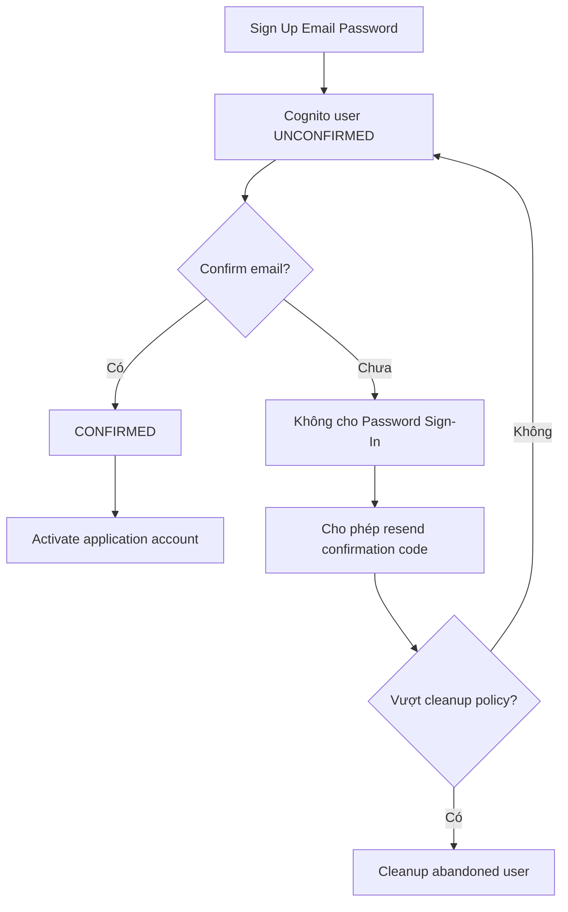

Quy tắc:

- Account chưa confirm không được coi là account hợp lệ hoàn chỉnh.
- Không tạo dữ liệu nghiệp vụ quan trọng trước khi confirm.
- Cho phép resend confirmation code.
- Cleanup phải không xóa nhầm account đã hoàn thành Google onboarding.

### 5.2 User `UNCONFIRMED` Sign In with Google cùng email

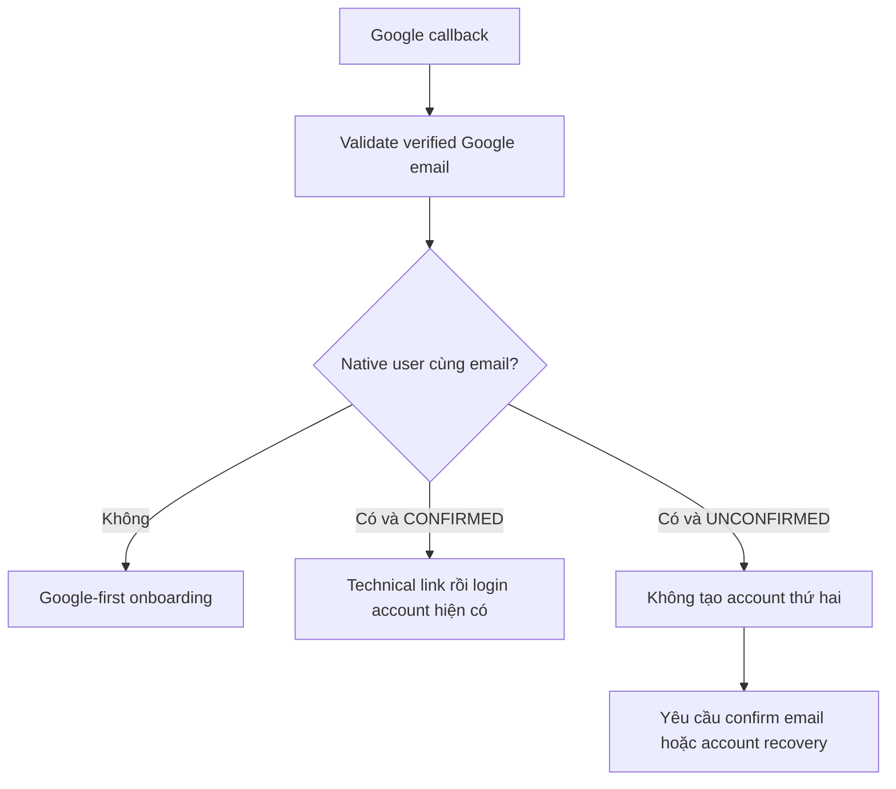

Thông báo gợi ý:

```text
Tài khoản với email này chưa được xác minh.
Vui lòng xác minh email hoặc gửi lại mã xác minh.
```

### 5.3 Google email khác email của account đang đăng nhập

```text
Không tự động gộp hai account khác email.
Google Sign-In được xử lý theo email Google đã xác minh.
```

### 5.4 Google identity đã thuộc account khác

```text
Reject linking.
Không tự động chuyển ownership.
Không tạo account thứ hai.
Ghi security audit log.
```

### 5.5 Hai Google callback chạy đồng thời

```text
- Callback phải idempotent.
- Dùng lock hoặc cơ chế chống race condition theo email_normalized.
- Unique constraint phải ngăn duplicate account.
- Nếu provider đã link, coi thao tác là thành công.
```

### 5.6 Link Cognito thành công nhưng cập nhật database thất bại

```text
- Không tạo account mới khi retry.
- Retry phải đọc lại trạng thái Cognito và database.
- Ghi audit/error log.
- Dùng trạng thái phục hồi hoặc reconciliation job.
```

---

## 6. Case B: Đăng nhập Google trước

### 6.1 Happy case: Google-first onboarding

Hệ thống sử dụng Native-first architecture.

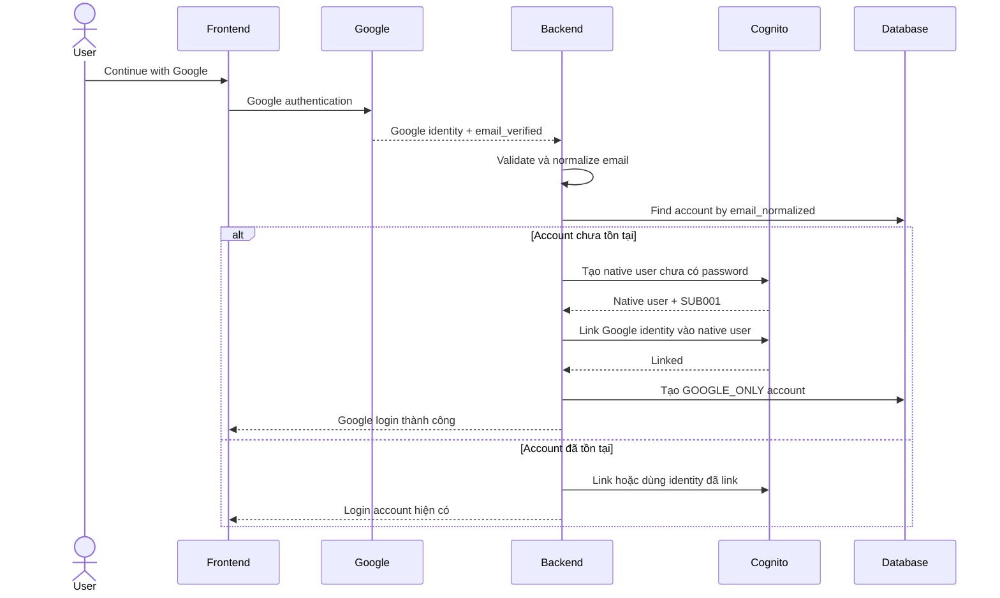

Kết quả ban đầu:

```text
account_state: GOOGLE_ONLY
email_normalized: user@gmail.com
cognito_sub: SUB001
methods:
  - GOOGLE
password: not configured
```

### 6.2 Tạo password trong Profile

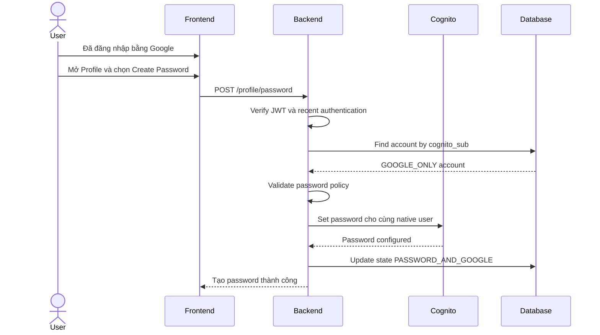

Kết quả:

```text
account_state: PASSWORD_AND_GOOGLE
email_normalized: user@gmail.com
cognito_sub: SUB001
methods:
  - GOOGLE
  - PASSWORD
```

`cognito_sub` không thay đổi.

---

## 7. Edge cases của Google-first

### 7.1 Google callback không có verified email

```text
Reject onboarding.
Không tạo native user.
Không tìm hoặc gộp account bằng email chưa verified.
```

Thông báo gợi ý:

```text
Không thể xác minh email từ Google.
Vui lòng sử dụng một tài khoản Google có email đã được xác minh.
```

### 7.2 Tạo native user thành công nhưng link Google thất bại

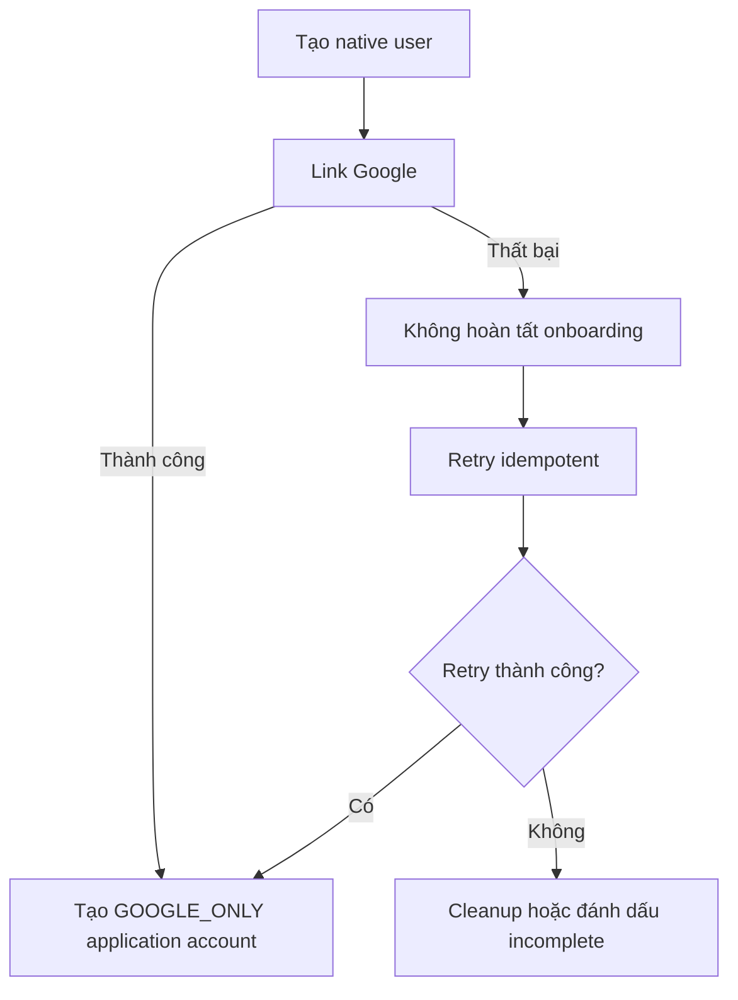

Quy tắc:

- Không cho login vào account chưa link Google thành công.
- Không tạo application account hoạt động một phần.
- Retry không được tạo native user thứ hai.

### 7.3 Google-first user cố Sign Up bằng Email/Password

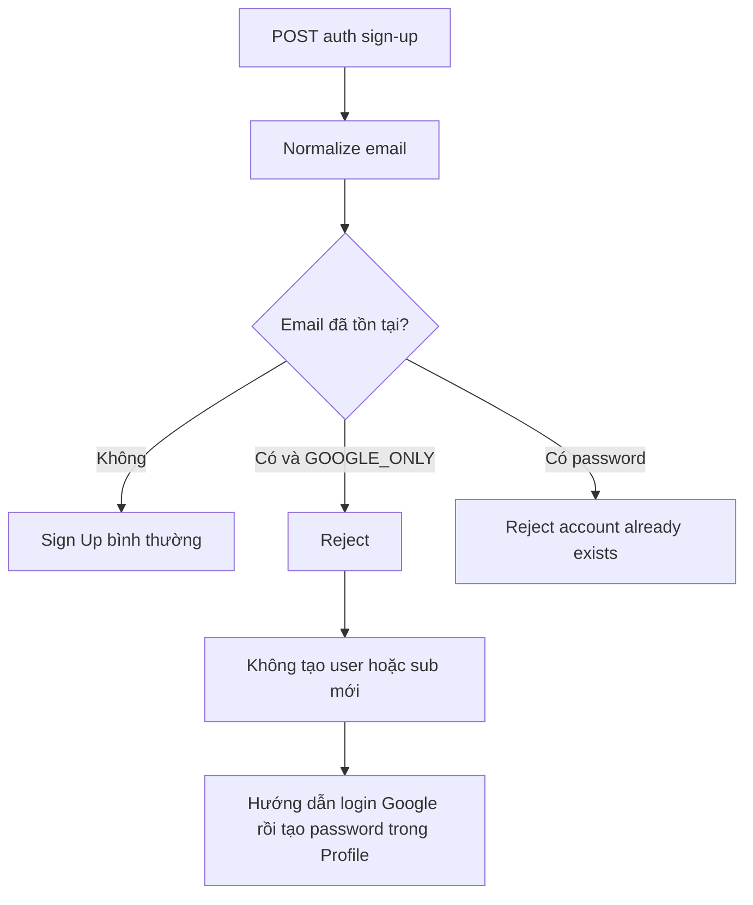

Thông báo lỗi:

```text
Tài khoản này đã được tạo bằng Google.
Vui lòng đăng nhập bằng Google, sau đó tạo mật khẩu trong trang Profile.
```

### 7.4 Google-first user cố Sign In bằng Email/Password

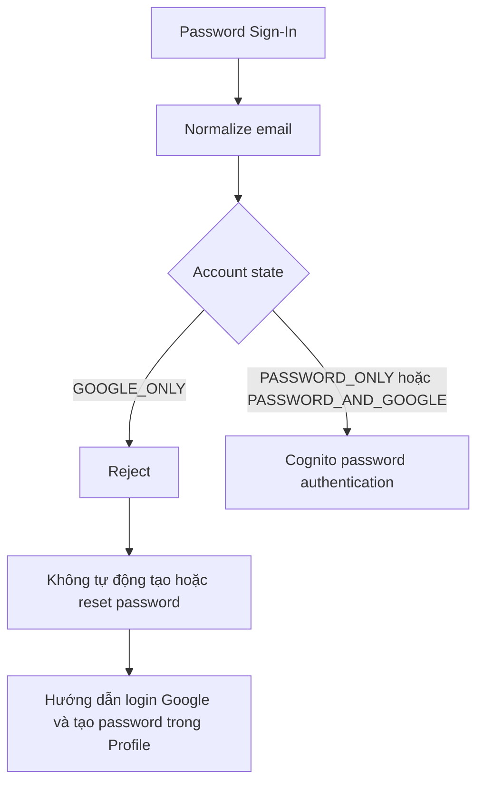

Thông báo lỗi:

```text
Tài khoản này chưa được thiết lập mật khẩu.
Vui lòng đăng nhập bằng Google, sau đó tạo mật khẩu trong trang Profile.
```

### 7.5 Google-only user chọn Forgot Password

```text
Không bắt đầu password reset nếu account chưa từng có password.
Hướng dẫn user đăng nhập bằng Google và tạo password trong Profile.
```

### 7.6 User gọi Create Password khi chưa login

```text
Reject với lỗi authentication.
Không cho phép tạo password chỉ bằng email.
```

### 7.7 User gọi Create Password nhiều lần

```text
GOOGLE_ONLY:
  Create Password được phép.

PASSWORD_AND_GOOGLE:
  Không chạy Create Password lần nữa.
  Chuyển sang Change Password flow.
```

### 7.8 Hai Google login đầu tiên chạy đồng thời

```text
- Lock theo email_normalized hoặc dùng transaction/idempotency key.
- Database unique constraint trên email_normalized.
- Database unique constraint trên cognito_sub.
- Request thua race phải đọc lại account hiện có.
- Không tạo native user thứ hai.
```

### 7.9 Database tạo account thất bại sau khi Cognito đã hoàn tất

```text
Retry phải dùng cùng native Cognito user.
Không tạo cognito_sub mới.
Hệ thống phải có cơ chế reconcile Cognito user với application account.
```

---

## 8. Decision flow tổng hợp

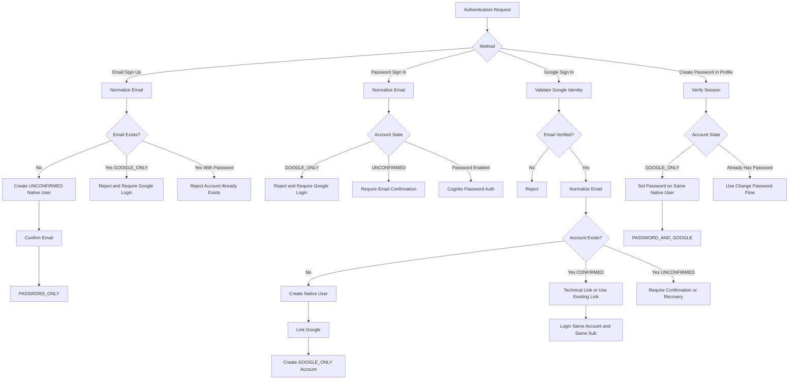

---

## 9. API gợi ý

```text
POST /auth/sign-up
POST /auth/confirm-sign-up
POST /auth/resend-confirmation
POST /auth/sign-in/password

GET  /auth/google
GET  /auth/google/callback

POST /profile/password
PUT  /profile/password
GET  /profile/auth-methods
```

Ý nghĩa:

```text
POST /profile/password
  Tạo password lần đầu cho GOOGLE_ONLY account.

PUT /profile/password
  Đổi password cho account đã có password.
```

Không cần public endpoint riêng để user tự Link Google. Linking kỹ thuật được backend thực hiện trong Google Sign-In flow dựa trên normalized verified email.

---

## 10. Database model gợi ý

```prisma
enum AccountState {
  UNCONFIRMED_PASSWORD
  PASSWORD_ONLY
  GOOGLE_ONLY
  PASSWORD_AND_GOOGLE
  INCOMPLETE_GOOGLE_ONBOARDING
  DISABLED
}

enum AuthProviderType {
  PASSWORD
  GOOGLE
}

model User {
  id              String         @id @default(uuid())
  cognitoSub      String         @unique
  email           String
  emailNormalized String         @unique
  accountState    AccountState
  authProviders   AuthProvider[]
  createdAt       DateTime       @default(now())
  updatedAt       DateTime       @updatedAt
}

model AuthProvider {
  id              String           @id @default(uuid())
  userId          String
  provider        AuthProviderType
  providerSubject String?
  createdAt       DateTime         @default(now())

  user User @relation(fields: [userId], references: [id])

  @@unique([userId, provider])
  @@unique([provider, providerSubject])
}
```

Ví dụ Password-first rồi Google:

```text
User
  emailNormalized = user@gmail.com
  cognitoSub = SUB001
  accountState = PASSWORD_AND_GOOGLE

AuthProvider
  PASSWORD
  GOOGLE / google-sub-123
```

Ví dụ Google-first chưa tạo password:

```text
User
  emailNormalized = user@gmail.com
  cognitoSub = SUB002
  accountState = GOOGLE_ONLY

AuthProvider
  GOOGLE / google-sub-456
```

---

## 11. Error codes gợi ý

```text
AUTH_EMAIL_UNCONFIRMED
AUTH_ACCOUNT_ALREADY_EXISTS
AUTH_GOOGLE_LOGIN_REQUIRED
AUTH_PASSWORD_NOT_CONFIGURED
AUTH_GOOGLE_EMAIL_NOT_VERIFIED
AUTH_PROVIDER_ALREADY_LINKED
AUTH_PROVIDER_OWNED_BY_ANOTHER_ACCOUNT
AUTH_GOOGLE_ONBOARDING_INCOMPLETE
AUTH_RECENT_LOGIN_REQUIRED
AUTH_INVALID_CREDENTIALS
```

Mapping đề xuất:

```yaml
AUTH_EMAIL_UNCONFIRMED:
  message: "Tài khoản chưa được xác minh. Vui lòng xác minh email."

AUTH_GOOGLE_LOGIN_REQUIRED:
  message: "Tài khoản này được tạo bằng Google. Vui lòng đăng nhập bằng Google."

AUTH_PASSWORD_NOT_CONFIGURED:
  message: "Tài khoản này chưa được thiết lập mật khẩu. Vui lòng đăng nhập bằng Google, sau đó tạo mật khẩu trong trang Profile."

AUTH_GOOGLE_EMAIL_NOT_VERIFIED:
  message: "Không thể xác minh email từ Google."
```

Các endpoint public có thể dùng thông báo chung hơn nếu cần hạn chế email enumeration.

---

## 12. Quy tắc bắt buộc cho AI coding agent

```yaml
identity:
  business_identity: email_normalized
  technical_identity: cognito_sub
  same_email_same_account: true
  same_email_same_cognito_sub: true
  cognito_sub_immutable: true

email:
  normalize_trim: true
  normalize_lowercase: true
  unique: true
  google_email_must_be_verified: true

account:
  canonical_account: native_cognito_user
  never_create_duplicate_for_same_email: true
  never_create_second_application_user: true

password_first:
  google_login_same_email:
    require_user_link_action: false
    use_existing_account: true
    perform_backend_cognito_linking: true
    create_new_account: false
    create_new_cognito_sub: false

google_first:
  create_native_user_before_linking_google: true
  initial_state: GOOGLE_ONLY
  password_sign_up_same_email: reject
  password_sign_in_before_password_created: reject
  forgot_password_before_password_created: reject
  create_password:
    location: authenticated_profile_only
    keep_same_cognito_sub: true

security:
  admin_cognito_operations_backend_only: true
  never_link_unverified_email: true
  reject_provider_owned_by_another_account: true
  require_recent_auth_for_create_password: true
  audit_auth_linking_and_conflicts: true

reliability:
  signup_idempotent: true
  google_callback_idempotent: true
  concurrency_safe_by_normalized_email: true
  cleanup_unconfirmed_users: true
  reconcile_partial_cognito_database_failure: true
```

---

## 13. Acceptance checklist

### Email và identity

```text
[ ] Email được trim và lowercase trước khi lookup
[ ] email_normalized có unique constraint
[ ] cognito_sub có unique constraint
[ ] Cùng email luôn map tới cùng application account
[ ] Cùng email luôn trả về cùng cognito_sub
[ ] cognito_sub không đổi khi thêm Password hoặc Google
```

### Password-first

```text
[ ] Sign Up tạo native user UNCONFIRMED
[ ] Chưa confirm email thì không Password Sign-In được
[ ] Resend confirmation hoạt động
[ ] Confirm email chuyển account sang PASSWORD_ONLY
[ ] Google Sign-In cùng email vào đúng account hiện có
[ ] User không phải thao tác Link Google thủ công
[ ] Backend linking không tạo account hoặc sub mới
[ ] Google identity thuộc account khác bị reject
```

### Google-first

```text
[ ] Google email chưa verified bị reject
[ ] Tạo native user trước khi link Google
[ ] Link thành công thì account ở trạng thái GOOGLE_ONLY
[ ] Sign Up Password cùng email bị reject
[ ] Sign In Password trước khi tạo password bị reject
[ ] Forgot Password trước khi tạo password bị reject
[ ] User phải login Google rồi tạo password trong Profile
[ ] Create Password chuyển GOOGLE_ONLY thành PASSWORD_AND_GOOGLE
[ ] Create Password không thay đổi cognito_sub
[ ] Create Password lần hai chuyển sang Change Password flow
```

### Reliability và security

```text
[ ] Concurrent Sign Up không tạo duplicate
[ ] Concurrent Google callback không tạo duplicate
[ ] Retry không tạo native Cognito user thứ hai
[ ] Partial failure có retry, cleanup hoặc reconciliation
[ ] Admin Cognito API chỉ chạy ở backend
[ ] Authentication conflict được audit log
[ ] Public error không vô tình lộ thông tin nhạy cảm ngoài chủ đích
```

---

## 14. Kết luận

```text
Password-first:
  Sign Up Password
      => Confirm email
      => PASSWORD_ONLY
      => Google Sign-In cùng email
      => backend link kỹ thuật
      => PASSWORD_AND_GOOGLE
      => cùng account, cùng cognito_sub
```

```text
Google-first:
  Google Sign-In
      => tạo native user
      => link Google
      => GOOGLE_ONLY
      => cấm Password Sign Up
      => cấm Password Sign-In
      => login Google và tạo password trong Profile
      => PASSWORD_AND_GOOGLE
      => cùng account, cùng cognito_sub
```

Golden rule:

```text
Same normalized verified email
    => Same account
    => Same native Cognito user
    => Same cognito_sub
```
