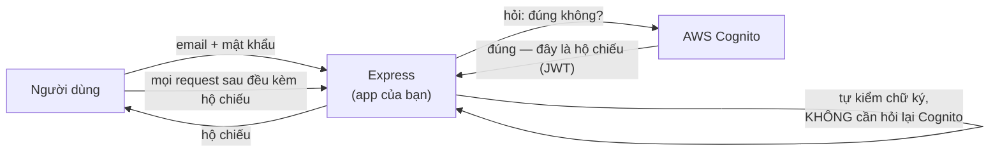

# Setup AWS Cognito — hướng dẫn từng bước cho người chưa từng dùng

Tài liệu này dẫn bạn từ con số 0 đến chỗ có đủ **3 giá trị** để dán vào `backend/.env`. Làm xong file này rồi mới chạy được tính năng đăng nhập.

Thời gian: khoảng 10–15 phút. Không tốn tiền — Cognito miễn phí tới 50.000 người dùng hoạt động hằng tháng.

---

## 0. Cognito là cái gì, và tại sao lại cần nó?

Trước khi bấm nút, hãy hiểu mình đang mua cái gì.

Nếu tự làm đăng nhập, bạn phải tự viết: lưu mật khẩu đã băm, gửi email xác thực, quên mật khẩu, khoá tài khoản khi bị dò mật khẩu, chống bot đăng ký hàng loạt... Đó là hàng tháng trời và là chỗ rất dễ làm sai — sai ở đây thì mất toàn bộ tài khoản người dùng.

**Cognito làm hết phần đó.** Nó là một dịch vụ của AWS chuyên giữ danh sách người dùng và mật khẩu. Ứng dụng của bạn **không bao giờ lưu mật khẩu**.

Đổi lại, cách nó hoạt động hơi lạ so với trực giác:



Điểm quan trọng nhất, cũng là điểm hay bị hiểu nhầm: **sau khi đăng nhập xong, Express không hỏi Cognito nữa.**

Tấm "hộ chiếu" (gọi là **JWT** — JSON Web Token) đã được Cognito **ký bằng chữ ký số**. Express chỉ cần lấy **khoá công khai** của Cognito một lần rồi tự kiểm chữ ký ngay tại chỗ. Giống như bảo vệ toà nhà nhìn con dấu nổi trên thẻ ra vào là biết thẻ thật hay giả, không cần gọi điện về phòng nhân sự mỗi lần.

Nhờ vậy hệ thống chạy nhanh và không sập khi Cognito bận.

**Cognito không lưu ghi chú (todo) của bạn.** Nó chỉ trả lời đúng một câu hỏi: "người này là ai?". Câu trả lời là một chuỗi ID gọi là `sub` (viết tắt của *subject*), ví dụ `a4e8b1c2-...`. Todo vẫn nằm trong PostgreSQL của bạn, và bạn sẽ lưu `sub` đó vào cột `userId` để biết todo nào của ai.

---

## 1. Từ vựng cần biết trước

Cognito có vài từ nghe rất giống nhau nhưng là ba thứ khác hẳn. Rối chỗ này là rối cả buổi, nên đọc kỹ bảng sau:

| Từ | Là cái gì | So sánh cho dễ nhớ |
|---|---|---|
| **User Pool** | Cái kho chứa danh sách người dùng của bạn | Quyển sổ hộ khẩu |
| **App client** | Một "cửa" để ứng dụng nói chuyện với User Pool | Thẻ nhân viên của app, để Cognito biết app nào đang hỏi |
| **User Pool ID** | Mã của kho, dạng `ap-southeast-1_AbCdEf123` | Số hiệu quyển sổ |
| **Client ID** | Mã của cửa, một chuỗi dài chữ + số | Số hiệu thẻ nhân viên |
| **Client secret** | Mật khẩu đi kèm Client ID | Mã PIN của thẻ — **tuyệt đối không lộ** |

> ⚠️ **Đừng nhầm với Identity Pool.** Trong Console bạn sẽ thấy cả "User pools" và "Identity pools". Chúng ta chỉ dùng **User pool**. Identity pool là thứ khác hẳn (cấp quyền truy cập thẳng vào tài nguyên AWS như S3), dự án này không cần.

---

## 2. Tạo tài khoản AWS (bỏ qua nếu đã có)

1. Vào <https://aws.amazon.com> → **Create an AWS Account**
2. Cần email + số điện thoại + **thẻ tín dụng/ghi nợ quốc tế** (AWS trừ ~1 USD để xác minh rồi hoàn lại)
3. Chọn gói **Basic support — Free**

---

## 3. Chọn Region — làm trước, nhớ kỹ

Góc **trên bên phải** Console có tên một thành phố (ví dụ "N. Virginia"). Đó là **Region** — trung tâm dữ liệu vật lý mà tài nguyên của bạn sẽ nằm ở đó.

Bấm vào đó và chọn một region, gợi ý **Asia Pacific (Singapore) `ap-southeast-1`** vì gần Việt Nam nhất.

**Ghi lại mã region** (`ap-southeast-1`) — đây là **giá trị thứ 0 trong 4 giá trị** bạn cần.

> 🔴 **Cái bẫy phổ biến nhất với người mới:** tài nguyên AWS bị **cô lập theo region**. Nếu bạn tạo User Pool ở Singapore rồi hôm sau mở Console thấy nó đang ở region Virginia, danh sách sẽ **trống trơn** — trông như bị mất, nhưng thật ra nó vẫn nằm nguyên ở Singapore, bạn chỉ đang nhìn nhầm chỗ. Mỗi lần "không thấy User Pool đâu", việc đầu tiên là kiểm tra góc trên bên phải.

---

## 4. Tạo User Pool

Gõ `Cognito` vào ô tìm kiếm trên cùng của Console → chọn **Amazon Cognito** → **User pools** → **Create user pool**.

> 📌 AWS thay đổi giao diện Console khá thường xuyên, nên thứ tự các bước dưới đây có thể lệch chút ít so với màn hình của bạn. Vì thế tôi mô tả theo **tên của từng thiết lập** thay vì "bấm nút thứ 3 từ trên xuống" — cứ tìm đúng tên đó, dù nó nằm ở bước nào.
>
> Nếu Console hỏi bạn chọn giữa luồng nhanh (có sẵn các preset như *Single-page application*, *Traditional web application*) và luồng đầy đủ, hãy chọn **luồng đầy đủ / "Traditional web application"** — luồng nhanh sẽ tạo app client **không có client secret**, mà chúng ta thì cần có.

Các thiết lập cần đặt đúng:

### 4.1. Sign-in options (cách người dùng đăng nhập)

✅ Tick **Email**. Bỏ trống các ô còn lại (`User name`, `Phone number`).

Nghĩa là người dùng đăng nhập bằng email + mật khẩu.

> Lưu ý: thiết lập này **không sửa được sau khi tạo**. Muốn đổi phải xoá pool làm lại — nên tick cẩn thận.

### 4.2. Password policy

Để nguyên mặc định của Cognito cũng được (tối thiểu 8 ký tự, có chữ hoa, chữ thường, số, ký tự đặc biệt).

> 💡 Nếu bạn thấy phiền khi tạo tài khoản test, chọn **Custom** rồi bỏ bớt yêu cầu. Nhưng nhớ: đây là thiết lập cho môi trường học. Đừng làm vậy với sản phẩm thật.

### 4.3. Multi-factor authentication (MFA)

Chọn **No MFA**.

MFA là lớp bảo mật thứ hai (nhập thêm mã OTP). Rất tốt cho sản phẩm thật, nhưng bật lên thì luồng đăng nhập có thêm một bước và code phức tạp hơn nhiều. Chúng ta bỏ qua để tập trung vào phần cốt lõi.

### 4.4. Self-service account recovery

Bật, chọn **Email only**. Đây là chức năng "Quên mật khẩu".

### 4.5. Self-registration

✅ Bật **Enable self-registration**.

Đây là thứ cho phép người dùng **tự bấm nút đăng ký** trên web của bạn. Nếu tắt, chỉ mình bạn tạo được tài khoản thủ công trong Console.

### 4.6. Attribute verification

Chọn **Send email message, verify email address**.

Đây là lý do người dùng nhận được **mã 6 số** trong hộp thư sau khi đăng ký. Trang `/confirm` trong app sẽ nhận mã đó.

### 4.7. Required attributes

✅ Tick **email**. Không cần thêm gì khác.

### 4.8. Email provider

Chọn **Send email with Cognito**.

> ⚠️ Cách này bị giới hạn **50 email/ngày** và email gửi đi trông không chuyên nghiệp (địa chỉ người gửi là `no-reply@verificationemail.com`). Hoàn toàn đủ để học. Sản phẩm thật thì dùng Amazon SES.

### 4.9. User pool name

Đặt tên gì cũng được, ví dụ `todo-app-user-pool`. Tên này chỉ để bạn dễ nhận ra, không dùng trong code.

### 4.10. App client — **bước quan trọng nhất, đọc kỹ**

Đây là chỗ hay sai nhất. Có hai thứ phải đúng:

**a) Chọn loại client: `Confidential client`**

Nếu Console hỏi *App type*, chọn **Confidential client** (không phải `Public client`).

Tại sao? Vì "confidential" nghĩa là *client này có thể giữ bí mật* — và điều đó chỉ đúng khi code chạy trên **server**. Trong dự án của chúng ta, Cognito được gọi từ **Express**, tức là server → được phép giữ secret. Ngược lại, nếu code gọi Cognito chạy trong **trình duyệt**, ai cũng bấm F12 xem được secret, nên loại đó phải là "public" (không có secret).

**b) ✅ Tick `Generate a client secret`**

**c) Bật đúng authentication flow**

Tìm mục **Authentication flows** và tick:

- ✅ `ALLOW_USER_PASSWORD_AUTH` — **bắt buộc.** Cho phép Express gửi thẳng email + mật khẩu lên Cognito để hỏi "đúng không?".
- ✅ `ALLOW_REFRESH_TOKEN_AUTH` — **bắt buộc.** Cho phép gia hạn phiên đăng nhập mà không bắt người dùng nhập mật khẩu lại.

> 🔴 **AWS mặc định TẮT `ALLOW_USER_PASSWORD_AUTH`.** Nếu quên tick, lúc đăng nhập bạn sẽ nhận lỗi `InvalidParameterException: USER_PASSWORD_AUTH flow not enabled for this client`. Đây là lỗi số 1 mà người mới gặp. Nếu lỡ quên: vào User Pool → tab **App clients** → chọn client → **Edit** → tick vào rồi Save. Thiết lập này sửa sau được, không cần tạo lại.

Bấm **Create user pool**.

---

## 5. Lấy 4 giá trị để dán vào `.env`

Giờ đi thu thập. Mở User Pool vừa tạo.

### `AWS_REGION`
Đọc ở góc trên bên phải Console, hoặc nhìn ngay trong `User Pool ID` — phần trước dấu gạch dưới chính là region.
→ Ví dụ: `ap-southeast-1`

### `COGNITO_USER_POOL_ID`
Ở trang tổng quan của User Pool, mục **User pool ID**. Dạng `<region>_<chuỗi ngẫu nhiên>`.
→ Ví dụ: `ap-southeast-1_AbCdEf123`

### `COGNITO_CLIENT_ID`
Vào tab **App clients** → bấm vào client của bạn → mục **Client ID**. Một chuỗi dài chữ thường + số.
→ Ví dụ: `1h57kf5cpq17m0eml12fake9ab`

### `COGNITO_CLIENT_SECRET`
Cùng trang đó, mục **Client secret** → bấm **Show client secret**.
→ Một chuỗi rất dài (~52 ký tự)

> 🔒 **Client secret là mật khẩu.** Nó chỉ được nằm trong `backend/.env` — file này đã được `.gitignore` chặn nên không lên GitHub. Đừng bao giờ đặt nó ở frontend: mọi thứ gửi tới trình duyệt đều xem được bằng F12.

---

## 6. Dán vào `backend/.env`

Mở `backend/.env` và điền (file `.env.example` đã có sẵn khung này):

```bash
AWS_REGION=ap-southeast-1
COGNITO_USER_POOL_ID=ap-southeast-1_AbCdEf123
COGNITO_CLIENT_ID=1h57kf5cpq17m0eml12fake9ab
COGNITO_CLIENT_SECRET=chuoi_rat_dai_lay_tu_console
```

Không cần khai báo AWS access key. Ba API mà backend gọi (`SignUp`, `ConfirmSignUp`, `InitiateAuth`) đều là **API công khai không cần xác thực AWS** — chúng tự bảo vệ bằng chính Client ID + Client secret. Đây cũng là lý do vì sao cặp ID/secret đó quan trọng đến vậy.

Sau khi sửa `.env`, **khởi động lại backend** (`npm run dev`) vì biến môi trường chỉ được đọc lúc server khởi động.

---

## 7. Thử xem đã chạy chưa

Chạy cả hai server:

```bash
# terminal 1
cd backend && npm run dev

# terminal 2
cd frontend && npm run dev
```

Mở <http://localhost:3001> → bạn sẽ bị đá về trang `/login`.

Luồng thử đầy đủ:

1. Bấm **Đăng ký** → nhập email thật (để nhận được mã) + mật khẩu
2. Kiểm tra hộp thư → **nhớ xem cả thư mục Spam**, email từ Cognito rất hay bị lọc vào đó
3. Nhập mã 6 số vào trang xác thực
4. Đăng nhập → thấy danh sách todo trống
5. Thêm vài todo
6. Đăng xuất, đăng ký một email khác, đăng nhập → **danh sách trống**, không thấy todo của tài khoản đầu tiên

Bước 6 chính là bằng chứng tính năng đã đúng.

Muốn nhìn tận mắt: vào Console → User Pool → tab **Users**, bạn sẽ thấy các tài khoản vừa tạo cùng cột `sub`. So sánh `sub` đó với cột `userId` trong bảng `Todo` (xem bằng `cd backend && npm run prisma:studio`) — chúng khớp nhau.

---

## 8. Bảng tra lỗi thường gặp

| Thông báo lỗi | Nguyên nhân | Cách sửa |
|---|---|---|
| `USER_PASSWORD_AUTH flow not enabled for this client` | Quên tick auth flow | App clients → Edit → tick `ALLOW_USER_PASSWORD_AUTH` |
| `Unable to verify secret hash for client` | `COGNITO_CLIENT_SECRET` sai/thiếu, hoặc `COGNITO_CLIENT_ID` không khớp với secret | Copy lại cả hai từ đúng một app client |
| `ResourceNotFoundException` | Sai `COGNITO_USER_POOL_ID`, hoặc `AWS_REGION` không khớp region của pool | Kiểm tra phần trước dấu `_` của Pool ID có bằng `AWS_REGION` không |
| `NotAuthorizedException: Incorrect username or password` | Sai mật khẩu — **hoặc** tài khoản chưa xác thực email | Kiểm tra trạng thái user trong tab Users |
| `UserNotConfirmedException` | Đăng ký rồi nhưng chưa nhập mã 6 số | Vào trang `/confirm`, bấm "Gửi lại mã" nếu cần |
| `CodeMismatchException` | Nhập sai mã | Nhập lại, hoặc bấm gửi lại mã mới |
| `ExpiredCodeException` | Mã đã quá 24 giờ | Bấm "Gửi lại mã" |
| Không nhận được email | Vào thư mục Spam; hoặc đã vượt hạn mức 50 email/ngày | Chờ sang ngày hôm sau, hoặc xác thực tay: Console → Users → chọn user → **Confirm user** |
| `Token is expired` khi đang dùng app | Access token chỉ sống 1 giờ | Bình thường — middleware của frontend tự làm mới. Nếu vẫn lỗi, đăng xuất rồi đăng nhập lại |

---

## 9. Dọn dẹp khi học xong

Cognito miễn phí ở mức sử dụng của dự án học nên **không cần** xoá gấp. Nếu vẫn muốn dọn: User pools → chọn pool → **Delete**. Thao tác này xoá luôn toàn bộ tài khoản trong đó và **không hoàn tác được**.
