# Bản đồ các luồng xác thực

Tài liệu này mô tả **toàn bộ đường đi của một request** trong dự án: từ lúc người dùng bấm nút, qua Next.js, qua Express, tới Cognito và Postgres, rồi quay ngược trở lại. Mỗi luồng có một sequence diagram kèm phần giải thích những chỗ dễ nhầm.

Hai tài liệu anh em:

- [`cognito-setup.md`](./cognito-setup.md) — dựng User Pool cho luồng email + mật khẩu
- [`google-login-setup.md`](./google-login-setup.md) — dựng Hosted UI + Google IdP

Tài liệu này **không** hướng dẫn bấm nút trong AWS Console. Nó trả lời câu hỏi khác: *"code đang chạy cái gì, theo thứ tự nào, và mang theo token gì?"*

---

## 1. Sáu diễn viên và ranh giới giữa họ

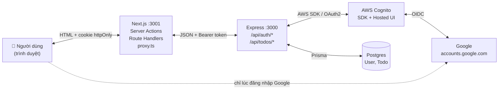

Bốn nguyên tắc chi phối toàn bộ thiết kế. Đọc kỹ bốn dòng này thì mọi diagram phía dưới đều dễ hiểu:

| # | Nguyên tắc | Hệ quả thực tế |
|---|---|---|
| 1 | **Chỉ backend biết Cognito tồn tại** | Frontend không có `COGNITO_CLIENT_ID`, không tự dựng URL Hosted UI. Đổi nhà cung cấp danh tính chỉ phải sửa một tầng. |
| 2 | **Token không bao giờ chạm vào JavaScript trình duyệt** | Mọi token nằm trong cookie `httpOnly`. Code React không đọc được, nên XSS cũng không lấy được. |
| 3 | **Trình duyệt nói chuyện với Next.js, Next.js nói chuyện với Express** | Trình duyệt **chưa từng** gọi thẳng `localhost:3000`. Ngoại lệ duy nhất: lúc bị chuyển hướng sang Google/Cognito. |
| 4 | **Cognito giữ danh tính, Postgres giữ dữ liệu** | Bảng `User` chỉ để gộp hai `sub` của cùng một người. Mật khẩu không nằm trong database của ta. |

---

## 2. Bốn loại token và ba cái cookie

Đây là bảng cần thuộc trước khi đọc các diagram. Nhầm token nào dùng ở đâu là nguồn gốc của phần lớn bug trong luồng auth.

### Token do Cognito phát ra

| Token | Sống bao lâu | Ai giữ | Dùng để làm gì |
|---|---|---|---|
| **ID token** | 1 giờ | ❗ **không ai giữ** | Backend mở ra đọc `sub` + `email` ngay tại chỗ, rồi **vứt đi**. Không gửi về frontend. |
| **Access token** | 1 giờ | Cookie `access_token` | Gắn vào header `Authorization: Bearer ...` ở mọi request cần đăng nhập |
| **Refresh token** | 30 ngày | Cookie `refresh_token` | Đổi lấy access token mới khi cái cũ hết hạn |

> 🔍 **ID token bị vứt đi — cố ý.** Backend trả nó về trong JSON, nhưng type `AuthSession` ở [types.ts:142](../frontend/src/lib/types.ts#L142) không khai trường `idToken`, và [`saveSession()`](../frontend/src/lib/auth.ts#L93) không lưu nó vào cookie nào.
>
> Vì sao? ID token trả lời câu hỏi *"người này là ai"* — mà câu trả lời đó backend đã trích ra và cất vào cookie `session_user` dưới dạng dữ liệu thường rồi. Giữ thêm một token nữa chỉ tăng bề mặt tấn công mà không thêm khả năng gì. Access token mới là thứ trả lời *"người này được làm gì"*, và đó mới là thứ cần mang theo.

### Cookie trên trình duyệt

Tất cả đều `httpOnly` + `sameSite=lax` + `secure` khi production ([auth.ts:74](../frontend/src/lib/auth.ts#L74)).

| Cookie | Nội dung | Hạn |
|---|---|---|
| `access_token` | Access token thô | `expiresIn - 60s` (≈ 59 phút) |
| `refresh_token` | Refresh token thô | 30 ngày |
| `session_user` | JSON `{ id, sub, email, username, provider }` | 30 ngày |
| `oauth_state` | JSON `{ state, next }` — chỉ tồn tại giữa chừng luồng Google | 10 phút |

> ⏱️ **Vì sao trừ 60 giây?** `TOKEN_EXPIRY_SAFETY_MARGIN_SECONDS` ([constants.ts:116](../frontend/src/lib/constants.ts#L116)) khiến cookie **chết trước** token. Nhờ vậy không bao giờ có cảnh gửi lên một token mà server đã coi là hết hạn — đồng hồ hai máy lệch nhau vài giây là chuyện thường.
>
> Đây cũng là cơ chế phát hiện hết hạn của cả hệ thống: `proxy.ts` không giải mã token để xem còn hạn không, nó chỉ hỏi **"cookie `access_token` còn không?"**. Trình duyệt tự xoá cookie hết hạn, nên câu hỏi đơn giản đó là đủ.

### Endpoint nào cần token nào

| Endpoint | Token gửi kèm | Vì sao |
|---|---|---|
| `POST /api/auth/register` | ❌ không | Chưa có tài khoản thì lấy đâu ra token |
| `POST /api/auth/confirm` | ❌ không | Mã 6 số chính là bằng chứng |
| `POST /api/auth/resend-code` | ❌ không | |
| `POST /api/auth/login` | ❌ không | Email + mật khẩu chính là bằng chứng |
| `GET /api/auth/google/url` | ❌ không | Chỉ là nối chuỗi, chưa ai đăng nhập |
| `POST /api/auth/google/callback` | ❌ không | `code` của Cognito chính là bằng chứng |
| `POST /api/auth/refresh` | 🔄 **refresh token** trong body | Không phải Bearer — xem mục 7 |
| `GET /api/auth/me` | 🔑 **access token** (Bearer) | |
| `ALL /api/todos/*` | 🔑 **access token** (Bearer) | `router.use(requireAuth)` chắn toàn bộ |

---

## 3. Luồng đăng ký (email + mật khẩu)

Ba bước rời nhau: đăng ký → nhận mã → xác thực. Người dùng có thể đóng trình duyệt giữa chừng rồi quay lại sau.

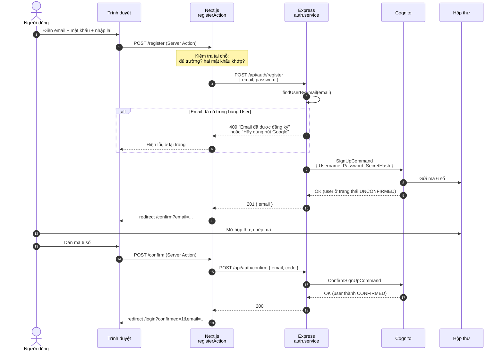

Ba điểm đáng chú ý:

**Chưa có hàng nào trong bảng `User`.** Đăng ký xong, xác thực xong, database của ta vẫn trống. Hàng `User` chỉ sinh ra ở **lần đăng nhập thành công đầu tiên** — xem mục 8. Trạng thái trung gian "đã đăng ký nhưng chưa từng đăng nhập" nằm hoàn toàn bên Cognito, ta không cần lưu bản sao.

**`SecretHash` là bắt buộc.** App client có client secret, nên mọi lệnh gửi lên Cognito phải kèm `HMAC-SHA256(username + clientId, clientSecret)`. Thiếu nó thì Cognito trả `NotAuthorizedException` với thông báo không liên quan gì tới nguyên nhân thật.

**Lỗi Cognito được dịch, không được ném thẳng.** Bảng `COGNITO_ERROR_MESSAGES` ([auth.service.ts:57](../backend/src/services/auth.service.ts#L57)) ánh xạ tên exception sang câu tiếng Việt + mã HTTP. Ví dụ `UserNotFoundException` **cố ý** trả về đúng câu như `NotAuthorizedException` — *"Email hoặc mật khẩu không đúng"* — để kẻ tấn công không dò được email nào đã tồn tại trong hệ thống.

### Gửi lại mã

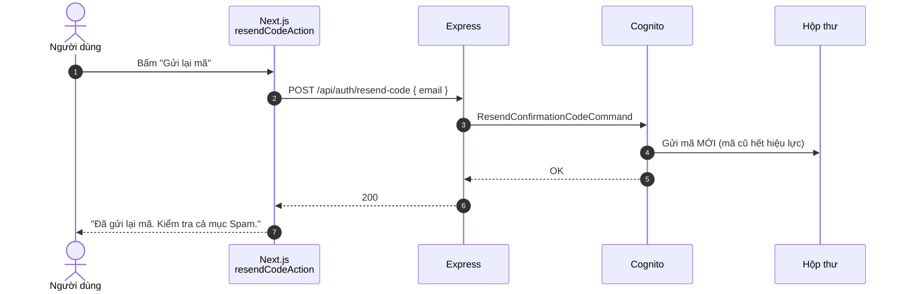

> ⚠️ Bấm quá nhiều lần sẽ dính `TooManyRequestsException` → HTTP 429. Cognito tự giới hạn, ta không cần tự đếm.

---

## 4. Luồng đăng nhập bằng email + mật khẩu

Đây là luồng ngắn nhất: mật khẩu đi thẳng lên Cognito, token quay về ngay trong một lượt.

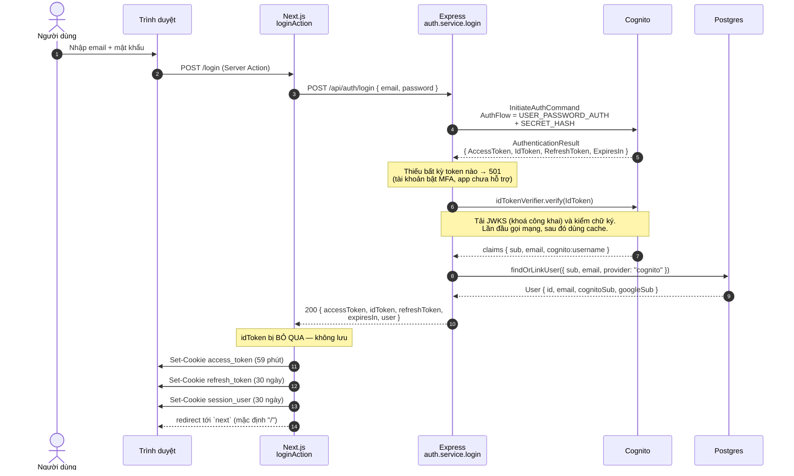

**Vì sao phải verify ID token trong khi chính Cognito vừa đưa nó cho ta?**

Ở luồng này thì đúng là hơi thừa — token đến qua kênh HTTPS trực tiếp từ AWS SDK. Nhưng `idTokenVerifier.verify()` làm ba việc trong một lần gọi: kiểm chữ ký, kiểm hạn, **và trả về claims đã được ép kiểu**. Ta cần cái thứ ba, nên gọi luôn cả ba. Quan trọng hơn: cùng đúng một dòng code này sẽ được dùng lại ở luồng Google (mục 5), nơi token đến qua một đường vòng dài hơn nhiều — giữ hai luồng dùng chung một hàm nghĩa là không có luồng nào bị bỏ quên khi sau này siết bảo mật.

**`username` trong `session_user` không phải cho hiển thị.** Nó là `cognito:username`, và nó tồn tại vì **luồng refresh cần nó** để tính `SECRET_HASH` — xem mục 7.

---

## 5. Luồng đăng nhập bằng Google

Luồng dài nhất, đi qua năm hệ thống. Chia làm hai nửa, ngăn cách bởi khoảnh khắc người dùng **rời khỏi app**.

### Nửa đầu — đá người dùng đi

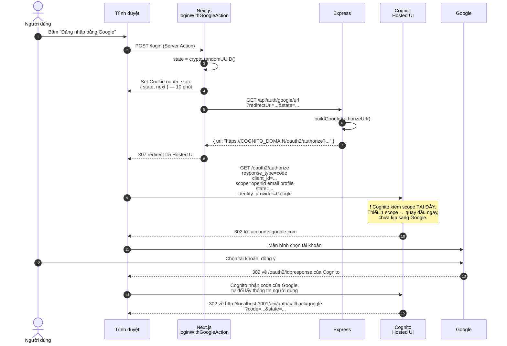

Ba tham số quyết định trên URL `/oauth2/authorize`:

| Tham số | Giá trị | Hỏng thì sao |
|---|---|---|
| `redirect_uri` | `http://localhost:3001/api/auth/callback/google` | Lệch một ký tự → `redirect_mismatch` |
| `scope` | `openid email profile` | Thiếu một cái → `invalid_scope`, quay đầu trước khi tới Google |
| `state` | UUID ngẫu nhiên | Thiếu → mất lá chắn CSRF |

> 🔒 **`state` chống đòn "login CSRF".** Kẻ xấu tự đăng nhập Google của **hắn**, lấy được `code` của hắn, rồi lừa bạn bấm vào link `/api/auth/callback/google?code=<code_của_hắn>`. Không kiểm gì thì bạn bị đăng nhập vào **tài khoản của hắn** mà không biết — sau đó bạn gõ gì, lưu gì, hắn mở tài khoản mình ra là thấy hết.
>
> Có `state` thì đòn này gãy: `code` của hắn đi kèm `state` của hắn, mà cookie trên máy bạn giữ `state` khác → không khớp → từ chối.

> 📌 **Cookie `oauth_state` là sợi dây duy nhất nối hai nửa.** Giữa nửa đầu và nửa sau, server của ta **không nhớ gì cả** — không session, không cache. Cả `state` lẫn `next` (trang người dùng định vào) đều nằm trong cookie đó.
>
> Vì sao `next` không gắn lên URL callback cho tiện? Vì `redirect_uri` phải khớp **tuyệt đối** với danh sách khai bên Cognito — thêm bất kỳ tham số nào là hỏng. Cookie là chỗ duy nhất còn lại.

### Nửa sau — nhận người dùng về

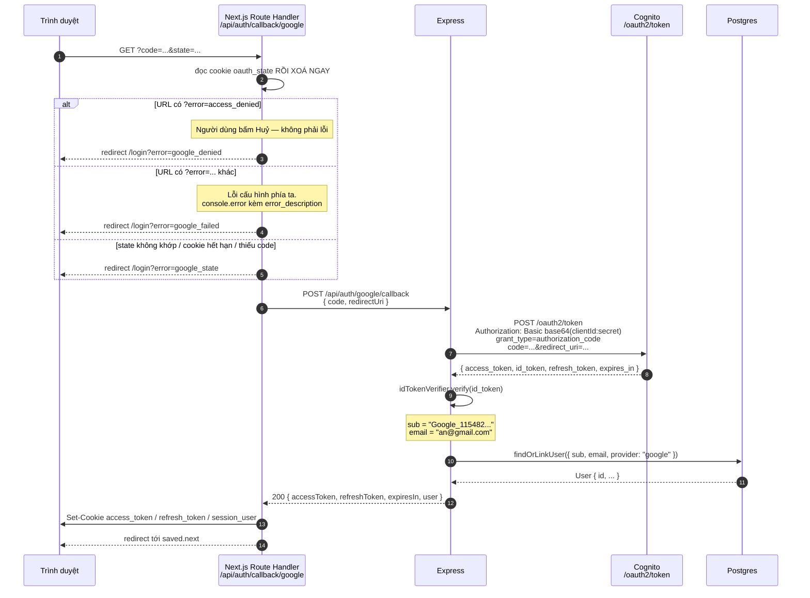

**Vì sao nửa sau là Route Handler mà không phải Server Action?**

Vì đây là lời gọi đến từ **bên ngoài**. Cognito không biết Server Action là gì — nó chỉ biết chuyển hướng trình duyệt tới một URL bình thường. Server Action thì ngược lại, chỉ gọi được từ chính app của ta.

Nói gọn: **Server Action là cửa trong nhà, Route Handler là cửa ra đường.** Webhook thanh toán, callback OAuth, ping từ dịch vụ giám sát — tất cả đều phải là Route Handler.

**Vì sao `code` phải đưa xuống Express đổi mà Next.js không tự đổi?**

Vì đổi `code` cần **client secret**. Giữ secret ở đúng một nơi (backend) là nguyên tắc số 1 ở mục 1. Next.js chạy trên server nên về mặt kỹ thuật vẫn giấu được secret, nhưng khi đó frontend lại phải biết domain Hosted UI, client ID, client secret — kiến thức về Cognito rò rỉ sang tầng khác, mai này đổi nhà cung cấp phải sửa hai nơi.

> ⚠️ **`code` chỉ dùng được MỘT LẦN.** Bấm F5 ở trang callback → Cognito trả `invalid_grant` → người dùng thấy *"Phiên đăng nhập Google đã hết hạn hoặc mã đã được dùng rồi"*. Đây là hành vi đúng của chuẩn OAuth, không phải bug.

> 🚧 **Route callback không đi qua `proxy.ts`.** `matcher` ở [proxy.ts:285](../frontend/src/proxy.ts#L285) loại trừ `api/`. Cố ý: proxy có nhiệm vụ chặn người chưa đăng nhập, mà lúc này người dùng **đang trên đường** đăng nhập — chặn thì thành vòng lặp vô tận.

---

## 6. Luồng query dữ liệu (đã đăng nhập)

Đây là luồng chạy nhiều nhất — mỗi lần mở trang, mỗi lần thêm/sửa/xoá todo.

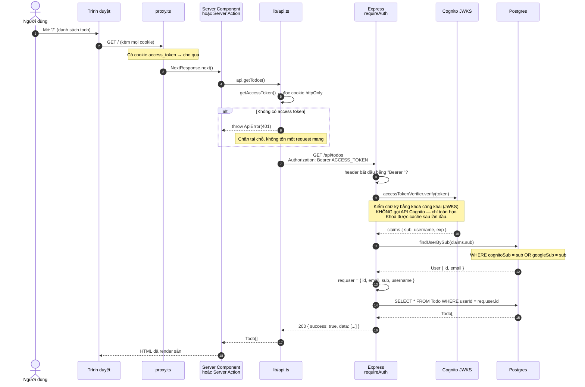

**Access token, không phải ID token.** Đây là chỗ hay nhầm nhất khi mới học OIDC:

- **ID token** trả lời *"người này là ai"* → dành cho **client**, để hiển thị tên, email.
- **Access token** trả lời *"người này được phép làm gì"* → dành cho **API**, để mở cửa.

Gửi ID token lên API là dùng sai công cụ. Nó có thể tình cờ chạy được nếu server chỉ đọc `sub`, nhưng sẽ vỡ ngay khi server bắt đầu kiểm `scope` hoặc `token_use`. `accessTokenVerifier` trong dự án này kiểm `token_use = "access"`, nên đưa ID token vào là bị từ chối.

**Hai lần chạm database cho mỗi request.** `findUserBySub` rồi mới query todo. Nghe thừa, nhưng nó là cái giá của việc gộp hai danh tính: `claims.sub` là **danh tính Cognito**, còn `Todo.userId` là **danh tính trong app ta**. Phải có một bước dịch giữa hai thứ đó.

**Nếu không tìm thấy `User`** → 401 *"Phiên đăng nhập không còn hợp lệ"*. Xảy ra khi access token được phát ra **trước** khi bảng `User` tồn tại (tức là trước khi chạy migration thêm bảng này). Đăng nhập lại một lần là xong.

---

## 7. Luồng tự động làm mới token

Access token sống 1 giờ. Không có luồng này thì cứ mỗi giờ người dùng lại bị đá về trang đăng nhập.

Điểm đặc biệt: **việc làm mới xảy ra ở `proxy.ts`, trước khi trang được render** — nên người dùng không thấy gì cả.

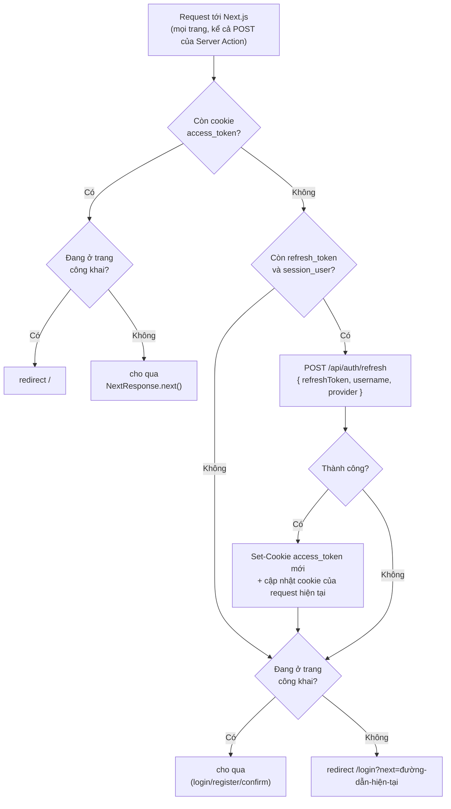

### Hai đường refresh khác nhau cho hai provider

Đây là chỗ mà cookie `session_user.provider` chứng minh giá trị của nó.

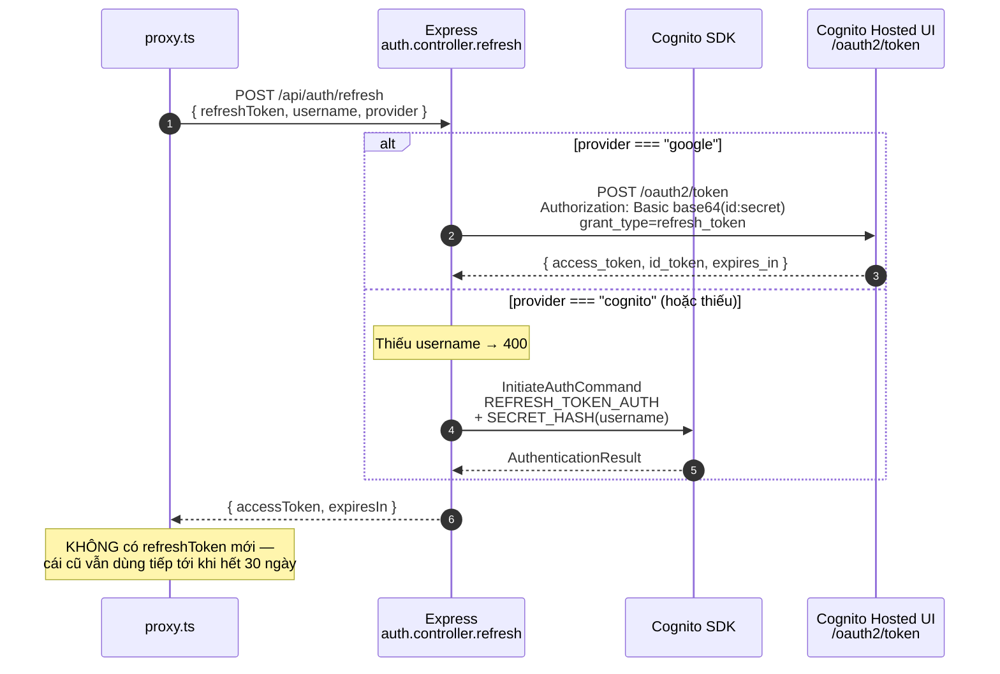

Vì sao phải chia hai đường?

| | Luồng `cognito` | Luồng `google` |
|---|---|---|
| Gọi qua | AWS SDK | HTTP tới Hosted UI |
| Chứng minh danh tính app | `SECRET_HASH` (cần `username`) | HTTP Basic Auth |
| Cần `username`? | ✅ **có** — thiếu là 400 | ❌ không |

Refresh token cấp qua Hosted UI **không dùng được** với `InitiateAuthCommand` của SDK, và ngược lại. Chọn nhầm đường thì đúng **một giờ sau** khi đăng nhập, người dùng bị đá ra ngoài — loại bug rất khó lần vì nó không xảy ra ngay lúc bạn test.

> 💡 **Proxy chạy cả trên `POST` của Server Action.** Nhìn log dev sẽ thấy `POST /login 200 in 72ms (... proxy.ts: 10ms ...)`. Nghĩa là việc refresh cũng che luôn các thao tác submit form, không riêng gì lúc chuyển trang.

> ⚠️ **Refresh không kéo dài phiên vô hạn.** Mỗi lần chỉ nhận về access token mới; refresh token giữ nguyên. Sau 30 ngày là phải đăng nhập lại thật.

---

## 8. Luồng gộp danh tính

Cognito coi *"an@gmail.com đăng ký bằng mật khẩu"* và *"an@gmail.com đăng nhập bằng Google"* là **hai người khác nhau** — hai bản ghi, hai `sub` riêng. Với người dùng thì hai cái đó phải là một. `findOrLinkUser()` là chỗ hoà giải.

Hàm này chạy ở **cả hai** luồng đăng nhập, ngay sau khi verify ID token xong.

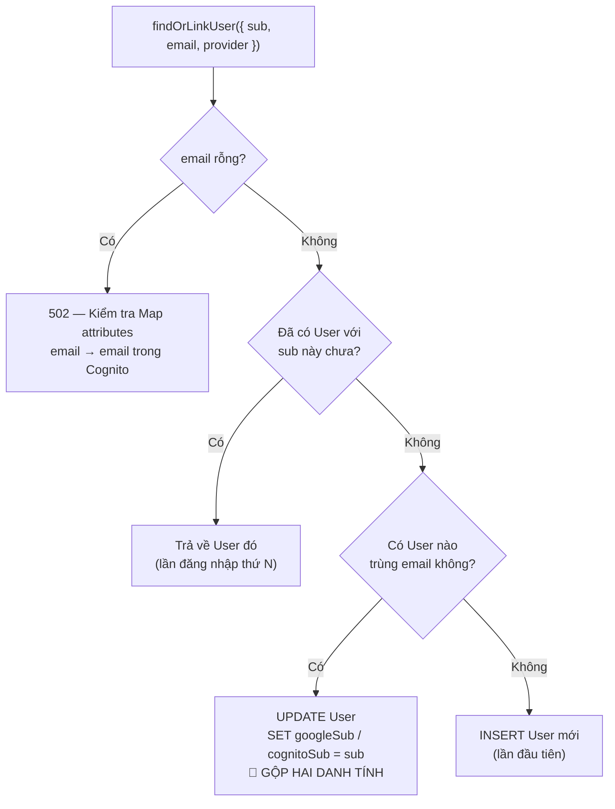

Kịch bản gộp, kể theo thứ tự thời gian:

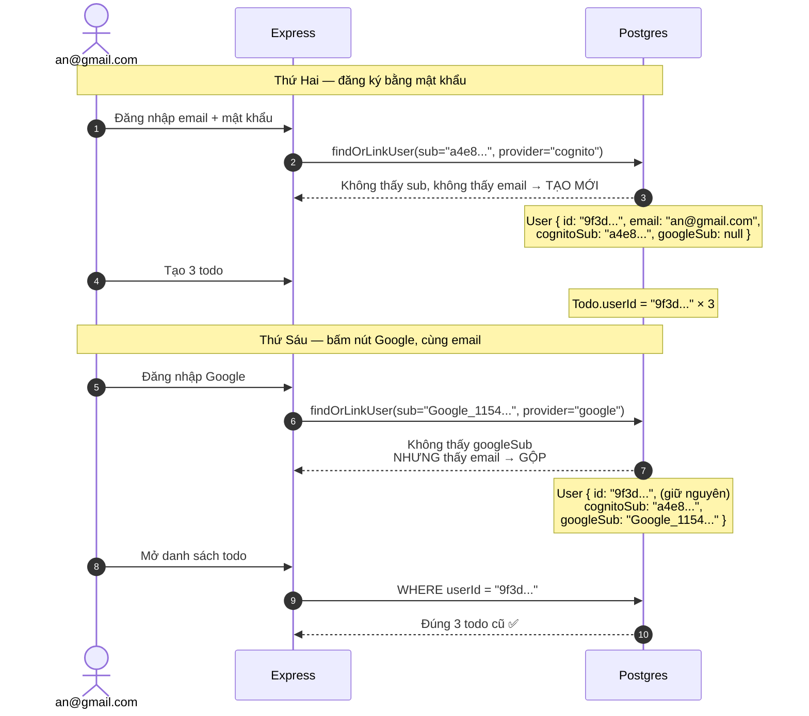

**Liên kết theo email có an toàn không?** Câu hỏi rất đáng đặt ra, vì "gộp tài khoản theo email" chính là chỗ đẻ ra vô số lỗ hổng chiếm tài khoản trong thực tế.

Ở app này thì an toàn, vì **cả hai luồng đều đã bắt người dùng chứng minh họ sở hữu email đó**:

- **Luồng mật khẩu** — Cognito gửi mã 6 số về hộp thư. Chưa nhập đúng mã thì tài khoản còn `UNCONFIRMED` và không đăng nhập được. Mà hàng `User` chỉ tạo lúc **đăng nhập thành công**.
- **Luồng Google** — Google chỉ cấp những địa chỉ mà chính nó sở hữu, hoặc tên miền đã được xác minh.

> ⚠️ Lập luận này **sụp đổ** nếu sau này thêm một nhà cung cấp không xác thực email. Khi đó phải kiểm thêm claim `email_verified` trước khi cho phép liên kết.

---

## 9. Luồng đăng xuất

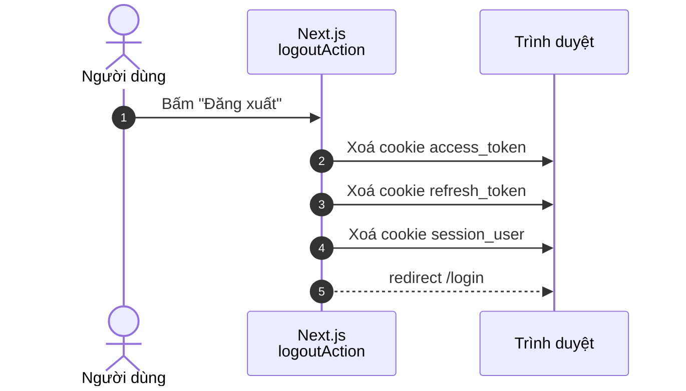

Chỉ có vậy — **không gọi backend, không gọi Cognito**. Hai hệ quả cần biết:

1. **Access token vẫn còn hiệu lực** tới hết 1 giờ của nó. Ai đó chép được token trước lúc đăng xuất thì vẫn dùng được. Đây là đánh đổi cố hữu của JWT: token tự chứng minh tính hợp lệ, server không giữ danh sách token đang sống nên cũng không thu hồi được.
2. **Phiên Hosted UI của Cognito không bị xoá.** Bấm lại nút Google có thể vào thẳng, không hỏi chọn tài khoản. Muốn xoá hẳn thì phải chuyển hướng người dùng qua `/logout` của Hosted UI — dự án này chưa làm.

---

## 10. Tổng kết: một trang tra cứu

### Đường đi của từng thao tác

| Thao tác | Đi qua | Token gửi lên |
|---|---|---|
| Đăng ký | Server Action → Express → Cognito SDK | — |
| Nhập mã xác thực | Server Action → Express → Cognito SDK | — |
| Đăng nhập mật khẩu | Server Action → Express → Cognito SDK | — |
| Đăng nhập Google (nửa đầu) | Server Action → Express → **trình duyệt rời app** | — |
| Đăng nhập Google (nửa sau) | Route Handler → Express → Hosted UI `/oauth2/token` | — |
| Xem / thêm / sửa / xoá todo | Server Component hoặc Action → Express → Postgres | 🔑 access token |
| Tự động refresh | `proxy.ts` → Express → SDK **hoặc** Hosted UI | 🔄 refresh token |
| Đăng xuất | Server Action, xoá cookie tại chỗ | — |

### Đọc lỗi ngược về nguyên nhân

| Triệu chứng | Luồng nào hỏng | Xem thêm |
|---|---|---|
| `?error=google_denied` | Người dùng bấm Huỷ ở Google | Bình thường, không phải bug |
| `?error=google_state` | Cookie `oauth_state` hết hạn (>10 phút), hoặc F5 ở trang callback | Mục 5 |
| `?error=google_failed` + `invalid_scope` trong log | App client thiếu scope | [google-login-setup.md](./google-login-setup.md#bẫy-phone-và-profile) |
| `Phiên đăng nhập không còn hợp lệ` | `findUserBySub` không thấy hàng nào | Mục 6 |
| Đúng 1 giờ sau khi đăng nhập thì bị đá ra | Refresh chọn nhầm đường (sai `provider`) | Mục 7 |
| Đăng nhập Google xong, không thấy todo cũ | Email hai bên khác nhau nên không gộp được | Mục 8 |
| `Không đọc được email của tài khoản` | Quên Map attributes `email → email` | Mục 8 |

### Kiểm tra nhanh bằng dòng lệnh

```bash
# Backend có sống không?
curl -s http://localhost:3000/api/todos | head -c 200
# → mong đợi 401 "Bạn cần đăng nhập..."  (tức là requireAuth đang chạy đúng)

# Token trong cookie còn dùng được không?
# (chép giá trị access_token từ DevTools → Application → Cookies)
curl -s http://localhost:3000/api/auth/me \
  -H "Authorization: Bearer <access_token>"
# → mong đợi { success: true, data: { id, email, sub, username } }
```
