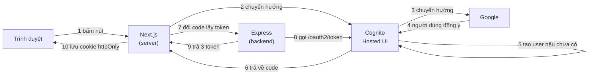

# Đăng nhập bằng Google — hướng dẫn từ số 0

Tài liệu này dẫn bạn đi hết quãng đường từ chỗ chưa có gì, tới chỗ bấm nút **"Đăng nhập bằng Google"** trên `http://localhost:3001/login` là vào được app — và người dùng mới **tự động được tạo trong AWS Cognito**.

- **Thời gian:** khoảng 20–30 phút
- **Chi phí:** 0 đồng (cả Google lẫn Cognito đều miễn phí ở mức này)
- **Điều kiện cần:** đã làm xong [cognito-setup.md](cognito-setup.md) và đăng nhập bằng email + mật khẩu chạy được

> Nếu bạn chưa có User Pool, hãy quay lại [cognito-setup.md](cognito-setup.md) trước. Tài liệu này xây tiếp lên trên cái đó chứ không thay thế nó.

---

## 0. Chuyện gì thật sự xảy ra khi bấm nút?

Đọc phần này trước khi bấm bất cứ nút nào trong Console. Hiểu bức tranh rồi thì mọi bước cấu hình phía sau đều có lý do rõ ràng, thay vì làm theo một cách máy móc.

### Điều bất ngờ số 1: backend của bạn KHÔNG nói chuyện với Google

Nghe rất phản trực giác. "Đăng nhập bằng Google" mà code không hề gọi tới Google?

Đúng vậy. Ta khai báo Google làm **Identity Provider** (nhà cung cấp danh tính) ngay bên trong Cognito User Pool. Từ đó **Cognito đứng ra làm người trung gian**: nó đi hỏi Google, nhận câu trả lời, rồi phát ra token của chính nó cho app bạn.

Backend của bạn từ đầu đến cuối chỉ biết một cái tên duy nhất: Cognito.



Chú ý **bước 5** — đó chính là thứ bạn muốn: Cognito tra trong User Pool, không thấy ai ứng với tài khoản Google này thì **tự tạo mới**. Bạn không phải viết một dòng code "đăng ký" nào.

### Điều bất ngờ số 2: người dùng rời khỏi website của bạn

Ở luồng email + mật khẩu, mọi thứ xảy ra trong một request. Ở đây thì khác hẳn: giữa lúc bấm nút và lúc đăng nhập xong, người dùng **đi hẳn sang website khác** (Amazon rồi Google) rồi mới quay về.

Server của bạn trong lúc đó **không nhớ gì cả**. Thứ duy nhất nối hai đầu là một cookie tạm tên `oauth_state` — xem phần 8 để hiểu vì sao nó tồn tại.

### Ba mã số bạn sắp phải đi lấy

| Giá trị | Lấy ở đâu | Dán vào đâu |
|---|---|---|
| **Google Client ID** | Google Cloud Console | AWS Cognito Console (không phải `.env`) |
| **Google Client secret** | Google Cloud Console | AWS Cognito Console (không phải `.env`) |
| **Cognito domain** | AWS Cognito Console | `backend/.env` → `COGNITO_DOMAIN` |

> 💡 Điểm hay bị nhầm: **Client ID và secret của Google KHÔNG đi vào file `.env` của bạn.** Chúng được dán vào AWS Console, vì chính Cognito mới là bên nói chuyện với Google. App của bạn không cần biết chúng.

### Thứ tự làm — không đảo được

Ba bước dưới đây phụ thuộc lẫn nhau như một vòng tròn, nên phải làm đúng thứ tự này:

1. **Tạo Cognito domain trước** → vì Google cần biết địa chỉ để trả kết quả về
2. **Lấy key ở Google** → vì Cognito cần cặp key đó để hỏi Google
3. **Nối hai bên lại trong Cognito** → và bật đăng nhập Google cho app client

---

## 1. Tạo Cognito Hosted UI domain

**Hosted UI** là trang đăng nhập do AWS dựng sẵn. Ở luồng email + mật khẩu ta không dùng nó (tự làm form đẹp hơn), nhưng với Google thì **bắt buộc**: OAuth đòi một địa chỉ cố định đã đăng ký trước để Google trả kết quả về, và địa chỉ đó chính là Hosted UI.

### Các bước

1. Vào [AWS Console](https://console.aws.amazon.com/) → gõ `Cognito` → **User pools** → chọn pool của bạn

   > ⚠️ Kiểm tra **Region** ở góc trên bên phải trước. Sai region là danh sách trống trơn.

2. Tìm mục **Domain**. Tuỳ phiên bản Console, nó nằm ở một trong hai chỗ:
   - Tab **App integration** → phần **Domain** (giao diện phổ biến hiện nay)
   - Hoặc tab **Branding** → **Domain**

3. Bấm **Actions** → **Create Cognito domain**

4. Nhập một **domain prefix** — phần tên bạn tự đặt:

   ```
   todo-app-demo-2026
   ```

   > 🔴 Prefix này phải **độc nhất trên toàn cầu**, dùng chung với tất cả khách hàng AWS trong region đó. Tên đẹp như `todo-app` hay `my-app` chắc chắn đã có người lấy. Cứ thêm số hoặc tên bạn vào cho khỏi trùng. Nếu Console báo *"already exists"*, đổi tên khác.
   >
   > Prefix chỉ được dùng chữ thường, số và dấu gạch ngang. Không dấu cách, không viết hoa. Và **không được chứa chuỗi `aws`, `amazon`, hay `cognito`** — AWS chặn.

5. Bấm **Create**

6. Console sẽ hiện domain đầy đủ, dạng:

   ```
   https://todo-app-demo-2026.auth.ap-southeast-1.amazoncognito.com
   ```

   **📋 Copy lại.** Đây là giá trị bạn sẽ điền vào `COGNITO_DOMAIN` ở bước 5, và cũng là gốc của địa chỉ bạn phải dán vào Google ở bước tiếp theo.

### Một địa chỉ cực kỳ quan trọng

Ghép domain vừa tạo với đuôi `/oauth2/idpresponse`:

```
https://todo-app-demo-2026.auth.ap-southeast-1.amazoncognito.com/oauth2/idpresponse
```

**Đây là chuỗi bạn sắp phải dán vào Google Cloud Console.** Nó là địa chỉ mà Google sẽ gửi kết quả xác thực về cho Cognito. Copy để sẵn ở đâu đó.

---

## 2. Lấy key trong Google Cloud Console

Đây là phần dài nhất. Cứ bình tĩnh làm từng bước.

> 📌 Giao diện Google Cloud Console thay đổi khá thường xuyên. Gần đây phần OAuth được gom lại thành **"Google Auth Platform"**, trước kia gọi là **"APIs & Services → OAuth consent screen"**. Dưới đây tôi mô tả theo **tên của từng thiết lập** để bạn tìm được dù nó nằm ở menu nào.

### 2.1. Tạo project

1. Vào <https://console.cloud.google.com/>
2. Đăng nhập bằng tài khoản Google bất kỳ (không cần thẻ tín dụng cho việc này)
3. Ở thanh trên cùng, bấm vào ô chọn project (bên cạnh chữ "Google Cloud") → **New Project**
4. Đặt tên, ví dụ `todo-app-login`, rồi bấm **Create**
5. Chờ vài giây, rồi **chọn project vừa tạo** ở ô chọn project

> 🔴 Bước cuối rất hay bị quên. Google Cloud mặc định vẫn đứng ở project cũ sau khi tạo project mới. Làm tiếp mà không chuyển sang project mới thì bạn sẽ tạo key trong nhầm project và loay hoay không hiểu vì sao không thấy nó đâu. **Luôn nhìn tên project ở thanh trên cùng trước khi làm bước tiếp theo.**

### 2.2. Cấu hình màn hình xin phép (OAuth consent screen)

Đây là màn hình người dùng nhìn thấy khi Google hỏi *"Ứng dụng ABC muốn xem địa chỉ email của bạn — Cho phép?"*. Google bắt cấu hình cái này **trước** khi cho tạo key.

1. Menu bên trái → **APIs & Services** → **OAuth consent screen**
   *(hoặc **Google Auth Platform** → **Branding** ở giao diện mới)*

2. Nếu được hỏi **User Type** / **Audience**, chọn **External**

   | Lựa chọn | Nghĩa là gì |
   |---|---|
   | **Internal** | Chỉ tài khoản trong tổ chức Google Workspace của bạn mới đăng nhập được. Chỉ hiện ra nếu bạn dùng Workspace. |
   | **External** ✅ | Mọi tài khoản Google đều đăng nhập được. Đây là cái ta cần. |

3. Điền phần **Branding** / **App information**:

   | Trường | Điền gì |
   |---|---|
   | **App name** | Tên hiện trên màn hình xin phép, ví dụ `Todo App` |
   | **User support email** | Chọn email của bạn từ danh sách |
   | **Developer contact email** | Gõ lại email của bạn |

   Logo, trang chủ, chính sách bảo mật... đều **bỏ trống được** khi đang học.

4. Ở phần **Data Access** / **Scopes**: **không cần thêm gì cả.** Cứ bấm qua.

   > Vì sao? Vì ba scope ta dùng (`openid`, `email`, `profile`) là loại "không nhạy cảm" — Google cho dùng mặc định, không cần khai báo và không cần xét duyệt. Chỉ khi bạn muốn đọc Gmail hay Drive của người dùng thì mới phải khai và chờ Google duyệt (mất hàng tuần).

5. Ở phần **Audience** / **Test users**, tìm mục **Publishing status**:

   - Khi mới tạo, app ở trạng thái **Testing**
   - Ở trạng thái này, **chỉ những email bạn thêm vào danh sách Test users mới đăng nhập được**

   👉 Bấm **+ Add users** và thêm **chính email Google bạn sẽ dùng để thử**. Không thêm thì lúc đăng nhập Google sẽ chặn với thông báo *"Access blocked: has not completed the Google verification process"* — và đây là lỗi số 1 mà người mới gặp ở bước này.

   > Muốn ai cũng đăng nhập được thì bấm **Publish app**. Với ba scope không nhạy cảm, Google cho publish ngay, không cần xét duyệt. Nhưng khi đang học thì cứ để **Testing** và thêm email của mình cho gọn.

### 2.3. Tạo OAuth Client ID — bước quan trọng nhất

1. Menu bên trái → **APIs & Services** → **Credentials**
   *(hoặc **Google Auth Platform** → **Clients**)*

2. Bấm **+ Create Credentials** → **OAuth client ID**

3. **Application type**: chọn **Web application**

   > 🔴 Bắt buộc là **Web application**. Chọn nhầm "Desktop app" hay "Android" thì Google **không cho nhập redirect URI** — mà đó lại chính là thứ quan trọng nhất ở đây. Chọn sai thì phải xoá đi tạo lại.

4. **Name**: đặt gì cũng được, ví dụ `Cognito - todo app`. Tên này chỉ để bạn dễ nhận ra trong danh sách.

5. **Authorized JavaScript origins** — bấm **+ Add URI** và dán **domain Cognito** (phần gốc, không có đuôi):

   ```
   https://todo-app-demo-2026.auth.ap-southeast-1.amazoncognito.com
   ```

6. **Authorized redirect URIs** — bấm **+ Add URI** và dán địa chỉ có đuôi `/oauth2/idpresponse`:

   ```
   https://todo-app-demo-2026.auth.ap-southeast-1.amazoncognito.com/oauth2/idpresponse
   ```

   > 🔴 **ĐÂY LÀ CHỖ SAI NHIỀU NHẤT CỦA TOÀN BỘ TÀI LIỆU NÀY.** Ba điều phải nhớ:
   >
   > 1. Địa chỉ này là của **Cognito**, KHÔNG phải của app Next.js. Đừng dán `http://localhost:3001/...` vào đây — Google không bao giờ nói chuyện trực tiếp với app của bạn.
   > 2. Phải có đủ đuôi `/oauth2/idpresponse`. Thiếu là hỏng.
   > 3. Phải **trùng từng ký tự**. Thừa một dấu `/` ở cuối cũng bị từ chối, với thông báo `Error 400: redirect_uri_mismatch`.

7. Bấm **Create**

8. Một hộp thoại hiện ra với **hai giá trị**. Copy cả hai:

   | Giá trị | Hình dạng |
   |---|---|
   | **Client ID** | `123456789012-abcdefg....apps.googleusercontent.com` |
   | **Client secret** | `GOCSPX-xxxxxxxxxxxxxxxxxxxx` |

   > 🔒 **Client secret là mật khẩu.** Đừng commit lên Git, đừng dán vào chat công khai. Trong dự án này nó thậm chí không nằm trong file nào của bạn — nó đi thẳng vào AWS Console ở bước sau.
   >
   > Lỡ đóng hộp thoại chưa kịp copy? Không sao: vào lại **Credentials**, bấm vào client vừa tạo, secret vẫn xem lại được (hoặc tạo secret mới).

---

## 3. Thêm Google làm Identity Provider trong Cognito

Giờ nối hai bên lại.

1. Quay về **AWS Console** → **Cognito** → **User pools** → chọn pool của bạn

2. Tìm mục **Identity providers**. Tuỳ giao diện, nó nằm ở:
   - Tab **Sign-in** → phần **Social and external providers**
   - Hoặc tab **Sign-in experience** → **Federated identity provider sign-in**

3. Bấm **Add identity provider** → chọn **Google**

4. Điền hai giá trị vừa lấy từ Google:

   | Trường trong Cognito | Dán giá trị nào |
   |---|---|
   | **Client ID** | Client ID của Google (`...apps.googleusercontent.com`) |
   | **Client secret** | Client secret của Google (`GOCSPX-...`) |

5. **Authorized scopes** — gõ đúng ba chữ, **cách nhau bằng dấu cách**:

   ```
   profile email openid
   ```

   > ⚠️ Dấu **cách**, không phải dấu phẩy. Viết `profile,email,openid` là sai và Google sẽ từ chối.
   >
   > Ý nghĩa: `openid` để nhận danh tính, `email` để lấy địa chỉ email, `profile` để lấy tên và ảnh.

6. **Map attributes** — phần này **quyết định app của bạn có biết email người dùng hay không**:

   | User pool attribute | Google attribute |
   |---|---|
   | `email` | `email` |

   > 🔴 **Quên bước này là lỗi khó chịu nhất của cả bài.** Vì sao khó chịu? Vì đăng nhập vẫn **thành công**, app vẫn vào được — chỉ có ô "Đang đăng nhập" hiện trống trơn. Không có lỗi nào để tra, không có thông báo nào để tìm. Bạn sẽ ngồi đọc lại code frontend hàng giờ trong khi nguyên nhân nằm ở một dòng cấu hình bên AWS.
   >
   > Nếu pool của bạn đặt `email` là thuộc tính **bắt buộc** (đúng theo `cognito-setup.md`) mà không ánh xạ, Cognito còn có thể từ chối thẳng lúc tạo user với lỗi `Required attribute email is missing`.

7. Bấm **Add identity provider**

---

## 4. Bật đăng nhập Google cho App client

Thêm provider vào pool thôi thì chưa đủ — còn phải cho phép **app client của bạn** dùng nó.

1. Vẫn trong User Pool → tab **App integration** (hoặc **App clients**) → bấm vào app client của bạn

2. Tìm khối **Hosted UI** / **Login pages** → bấm **Edit**

3. Đặt bốn thứ sau:

   ### a) Allowed callback URLs

   ```
   http://localhost:3001/api/auth/callback/google
   ```

   > 📌 Chú ý sự khác nhau — hai địa chỉ, hai nơi, đừng lẫn:
   >
   > | Dán ở đâu | Địa chỉ nào | Ai gọi tới |
   > |---|---|---|
   > | **Google Cloud Console** | `https://<domain>.auth.<region>.amazoncognito.com/oauth2/idpresponse` | Google → Cognito |
   > | **AWS Cognito Console** (chỗ này) | `http://localhost:3001/api/auth/callback/google` | Cognito → app của bạn |
   >
   > Địa chỉ ở đây phải khớp chính xác với `GOOGLE_REDIRECT_URI` mà code dựng ra (xem `frontend/src/lib/oauth.ts`). Khi triển khai thật, thêm cả `https://ten-mien-that.com/api/auth/callback/google` vào danh sách — Cognito cho phép khai nhiều URL.

   ### b) Allowed sign-out URLs

   ```
   http://localhost:3001/login
   ```

   Dự án này chưa dùng tới (nút Đăng xuất chỉ xoá cookie), nhưng Cognito thường bắt điền một giá trị.

   ### c) Identity providers

   ✅ Tick **cả hai**:
   - **Google**
   - **Cognito user pool** ← đừng bỏ tick cái này!

   > 🔴 Bỏ tick "Cognito user pool" thì **luồng đăng nhập bằng email + mật khẩu sẽ chết**. Bạn thêm một cách đăng nhập mà lại làm hỏng cách cũ — và triệu chứng xuất hiện ở nơi bạn không hề đụng tới, nên rất khó nghĩ tới nguyên nhân.

   ### d) OAuth 2.0 grant types

   ✅ Tick **Authorization code grant**

   ❌ **KHÔNG** tick `Implicit grant`

   > Vì sao không dùng implicit? Vì nó trả token thẳng lên thanh địa chỉ trình duyệt — nơi token bị ghi vào lịch sử duyệt web, vào log server, và vào header `Referer` khi người dùng bấm sang trang khác. Luồng này đã bị chuẩn OAuth khuyến cáo **loại bỏ**. Nếu bạn đọc bài hướng dẫn nào bảo dùng `response_type=token`, đó là kiến thức đã lỗi thời.

   ### e) OpenID Connect scopes

   ✅ Tick: **openid**, **email**, **profile**

4. Bấm **Save changes**

---

## 5. Điền biến môi trường

Chỉ có **hai dòng** phải thêm, và không dòng nào là bí mật của Google.

### `backend/.env`

```bash
# Hosted UI domain — dán prefix hoặc cả URL đều được
COGNITO_DOMAIN=todo-app-demo-2026
```

Cả ba dạng dưới đây đều chạy, code tự chuẩn hoá (xem `readHostedUiOrigin` trong `backend/src/lib/cognito.ts`):

```bash
COGNITO_DOMAIN=todo-app-demo-2026
COGNITO_DOMAIN=todo-app-demo-2026.auth.ap-southeast-1.amazoncognito.com
COGNITO_DOMAIN=https://todo-app-demo-2026.auth.ap-southeast-1.amazoncognito.com
```

### `frontend/.env.local`

```bash
# Địa chỉ gốc của chính app Next.js này
APP_BASE_URL=http://localhost:3001
```

> Vì sao phải khai báo mà không tự đoán từ request? Vì `redirect_uri` phải khớp tuyệt đối với "Allowed callback URLs" — mà header `Host` của request thì đổi tuỳ cách truy cập (`localhost` hay `127.0.0.1`, sau proxy thì thành tên miền nội bộ) và lại là dữ liệu **do trình duyệt gửi lên**, tức là sửa được. Khai tường minh vừa ổn định vừa an toàn.

### Khởi động lại cả hai server

Biến môi trường chỉ được đọc **lúc khởi động**. Sửa `.env` mà không restart thì không có gì thay đổi cả.

```bash
# terminal 1
cd backend && npm run dev

# terminal 2
cd frontend && npm run dev
```

---

## 6. Chạy thử

1. Mở <http://localhost:3001/login>
2. Thấy nút **"Đăng nhập bằng Google"** dưới vạch ngăn có chữ *hoặc*
3. Bấm vào → trình duyệt nhảy sang màn hình chọn tài khoản Google
4. Chọn tài khoản (nhớ là email đã thêm vào **Test users** ở bước 2.2)
5. Google hỏi cho phép → bấm **Continue**
6. Quay về `http://localhost:3001` với danh sách todo trống, góc trên hiện email Google của bạn

### Kiểm chứng: người dùng ĐÃ được tạo trong Cognito

Đây là bước đáng làm nhất, vì nó cho bạn nhìn tận mắt cái mà tài liệu này hứa từ đầu.

1. Vào **AWS Console** → **Cognito** → User pool của bạn → tab **Users**
2. Bạn sẽ thấy một user **mới toanh** vừa xuất hiện:

   | Cột | Giá trị |
   |---|---|
   | **Username** | `Google_115482938475...` |
   | **Email** | email Google của bạn |
   | **Identity provider** | `Google` |
   | **Confirmation status** | `External provider` |

**Bạn không viết một dòng code nào để tạo user này.** Cognito tự làm ở lần đăng nhập đầu tiên. Lần thứ hai bấm nút, nó dùng lại đúng user đó chứ không tạo thêm.

### Kiểm chứng: todo được phân tách đúng chủ

1. Thêm vài todo bằng tài khoản Google
2. Đăng xuất, đăng nhập bằng tài khoản email + mật khẩu cũ
3. Danh sách **trống** — không thấy todo của tài khoản Google

Nguyên nhân: cột `Todo.userId` lưu `sub` của Cognito, mà hai tài khoản có hai `sub` khác nhau. Xem tận mắt bằng `cd backend && npm run prisma:studio`.

---

## 7. ⚠️ Email trùng nhau nhưng vẫn là hai tài khoản khác nhau

Đây là hành vi khiến nhiều người tưởng là bug, nên nói rõ luôn:

> Nếu bạn từng đăng ký bằng `an@gmail.com` theo luồng email + mật khẩu, rồi hôm sau bấm đăng nhập bằng Google **cũng với `an@gmail.com`**, Cognito coi đó là **hai người khác nhau**: hai user riêng, hai `sub` riêng, hai danh sách todo riêng.

Đó không phải lỗi, mà là mặc định **có chủ đích** — và là mặc định đúng.

Vì sao? Vì tự động gộp hai tài khoản chỉ vì trùng email sẽ mở ra một lỗ hổng chiếm tài khoản: kẻ xấu tạo một tài khoản ở nhà cung cấp lỏng lẻo nào đó với email trùng email của bạn, đăng nhập vào app, và được gộp thẳng vào tài khoản thật của bạn. Cognito không dám làm vậy, và nó đúng.

Muốn gộp thì phải làm **có chủ ý** bằng API `AdminLinkProviderForUser`, sau khi tự mình xác minh rằng việc gộp là an toàn. Việc đó cần AWS credentials và vượt ngoài phạm vi dự án học này.

---

## 8. Code chạy ra sao — bản đồ file

Nếu bạn muốn đọc code, đây là thứ tự nên đọc:

| # | File | Vai trò |
|---|---|---|
| 1 | `frontend/src/components/GoogleLoginButton.tsx` | Nút bấm. Là một `<form>` gọi Server Action, không phải `onClick`. |
| 2 | `frontend/src/lib/auth-actions.ts` → `loginWithGoogleAction` | **Nửa đầu**: sinh `state`, cất cookie, xin URL, chuyển hướng đi. |
| 3 | `backend/src/services/auth.service.ts` → `buildGoogleAuthorizeUrl` | Dựng URL Hosted UI. Giải thích từng tham số OAuth. |
| 4 | `frontend/src/app/api/auth/callback/google/route.ts` | **Nửa sau**: nhận `code`, đối chiếu `state`, lưu phiên. |
| 5 | `backend/src/services/auth.service.ts` → `loginWithGoogle` | Đổi `code` lấy 3 token qua endpoint `/oauth2/token`. |
| 6 | `backend/src/services/auth.service.ts` → `refreshTokensWithHostedUi` | Gia hạn phiên Google (đường khác với phiên email + mật khẩu). |
| 7 | `frontend/src/lib/auth.ts` | Cookie `oauth_state`: ghi, đọc, xoá. |

### Vì sao có cookie `oauth_state`?

Vì giữa **nửa đầu** và **nửa sau**, người dùng đã rời khỏi website của bạn hoàn toàn. Hai nửa đó là hai request HTTP tách biệt, không dùng chung biến nào, không dùng chung bộ nhớ nào. Server không có cách nào biết request quay về là phần tiếp theo của cú bấm nút lúc nãy.

Nên ta gửi kèm một "vé giữ chỗ" theo trình duyệt. Lúc quay về, so vé là biết ngay chuyến đi này có phải do chính ta khởi xướng không.

Không có bước so vé đó, bất kỳ ai cũng có thể lừa bạn bấm vào một link callback chứa `code` của **họ**, và bạn sẽ bị đăng nhập vào tài khoản của họ mà không hề biết — đòn tấn công gọi là **login CSRF**.

### Vì sao phiên Google gia hạn token theo đường khác?

| | Phiên email + mật khẩu | Phiên Google |
|---|---|---|
| API dùng | `InitiateAuth` (AWS SDK) | `POST /oauth2/token` (HTTP thuần) |
| Cần `username`? | **Có** — để tính `SECRET_HASH` | Không |
| Xác thực app bằng | `SECRET_HASH` trong body | Header `Authorization: Basic` |

Vì hai đường khác nhau, mỗi phiên phải nhớ mình thuộc loại nào. Đó là lý do cookie phiên có thêm trường `provider` (`"cognito"` hoặc `"google"`). Chọn nhầm đường thì đúng **một giờ sau** khi đăng nhập, người dùng bị đá ra ngoài — loại bug rất khó lần vì nó không xảy ra ngay.

---

## 9. Bảng tra lỗi

### Lỗi phía Google

| Thông báo | Nguyên nhân | Cách sửa |
|---|---|---|
| `Error 400: redirect_uri_mismatch` | **Authorized redirect URIs** bên Google không khớp | Phải là `https://<domain>.auth.<region>.amazoncognito.com/oauth2/idpresponse`, đủ đuôi, không thừa dấu `/` |
| `Access blocked: ... has not completed the Google verification process` | App đang ở trạng thái **Testing** mà email của bạn chưa nằm trong Test users | Google Auth Platform → **Audience** → **+ Add users** → thêm email của bạn |
| `Error 401: invalid_client` | Client ID / secret dán vào Cognito bị sai hoặc thiếu ký tự | Copy lại cả hai từ Google Credentials, dán lại vào Cognito |
| Không thấy ô nhập redirect URI khi tạo client | Chọn nhầm **Application type** | Xoá client, tạo lại với type **Web application** |

### Lỗi phía Cognito

| Thông báo | Nguyên nhân | Cách sửa |
|---|---|---|
| `redirect_mismatch` | **Allowed callback URLs** trong Cognito không khớp | Phải đúng `http://localhost:3001/api/auth/callback/google` |
| `Identity provider not supported` / `invalid_request` | Chưa tick **Google** trong Identity providers của app client | App client → Login pages → Edit → tick Google |
| `unauthorized_client` | Chưa tick **Authorization code grant** | App client → Login pages → Edit → tick Authorization code grant |
| `An error was encountered with the requested page` | Domain đúng nhưng Hosted UI chưa được cấu hình đủ | Kiểm tra đã lưu đủ callback URL, identity providers, grant types, scopes |
| Đăng nhập bằng **email + mật khẩu** đột nhiên hỏng | Vô tình bỏ tick **Cognito user pool** ở Identity providers | Tick lại |

### Lỗi phía app

| Hiện tượng | Nguyên nhân | Cách sửa |
|---|---|---|
| `Chưa bật đăng nhập bằng Google: thiếu biến COGNITO_DOMAIN` | Chưa điền `COGNITO_DOMAIN` hoặc chưa restart backend | Điền vào `backend/.env` rồi chạy lại `npm run dev` |
| `Không kết nối được tới Cognito Hosted UI` | `COGNITO_DOMAIN` gõ sai, hoặc domain chưa được tạo | Copy lại domain từ AWS Console |
| `Phiên đăng nhập Google không hợp lệ hoặc đã quá hạn` | Cookie `state` hết hạn (>10 phút), hoặc bấm F5 ở trang callback | Bấm đăng nhập lại từ đầu |
| **Đăng nhập xong nhưng ô email trống** | Quên **Map attributes** `email → email` | Cognito → Identity providers → Google → sửa attribute mapping, rồi **xoá user Google đã tạo** trong tab Users và đăng nhập lại |
| Bấm nút Google, đi một vòng, quay về đúng trang login, không lỗi gì | Proxy đã chặn route callback | Kiểm tra `matcher` trong `frontend/src/proxy.ts` có loại trừ `api/` không |
| `Phiên đăng nhập Google đã hết hạn hoặc mã đã được dùng rồi` ngay lần đầu | `code` chỉ dùng được **một lần** — thường do F5 ở trang callback | Bấm đăng nhập lại, đừng F5 ở trang callback |

---

## 10. Trước khi đưa lên production

Danh sách này không cần làm khi đang học, nhưng ghi lại để sau khỏi quên:

- [ ] Thêm URL thật vào **Allowed callback URLs** của Cognito: `https://ten-mien-that.com/api/auth/callback/google`
- [ ] Đổi `APP_BASE_URL` trong biến môi trường production
- [ ] Bấm **Publish app** ở Google Auth Platform (nếu không, chỉ Test users đăng nhập được)
- [ ] Điền đầy đủ **Branding**: logo, trang chủ, chính sách bảo mật — người dùng thật sẽ nhìn thấy màn hình xin phép này
- [ ] Đảm bảo chạy **HTTPS** (cookie `secure` chỉ được gửi qua HTTPS — code đã tự bật theo `NODE_ENV`)
- [ ] Cân nhắc dùng **custom domain** cho Hosted UI (`auth.ten-mien-that.com`) thay vì domain `.amazoncognito.com`, để người dùng không thấy tên miền lạ giữa chừng

---

## 11. Tóm tắt siêu ngắn

Nếu bạn đã làm quen rồi và chỉ cần checklist:

```
1. AWS Cognito → App integration → Domain → Create Cognito domain
   → copy: https://<prefix>.auth.<region>.amazoncognito.com

2. Google Cloud Console → New Project → OAuth consent screen (External)
   → thêm email của mình vào Test users
   → Credentials → Create OAuth client ID → Web application
      • JavaScript origins:  https://<prefix>.auth.<region>.amazoncognito.com
      • Redirect URIs:       https://<prefix>.auth.<region>.amazoncognito.com/oauth2/idpresponse
   → copy Client ID + Client secret

3. AWS Cognito → Identity providers → Add → Google
      • dán Client ID + secret
      • scopes:  profile email openid
      • map:     email → email      ← ĐỪNG QUÊN

4. AWS Cognito → App client → Login pages → Edit
      • Callback URL:      http://localhost:3001/api/auth/callback/google
      • Sign-out URL:      http://localhost:3001/login
      • Identity providers: ✅ Google  ✅ Cognito user pool
      • Grant type:        ✅ Authorization code grant
      • Scopes:            ✅ openid  ✅ email  ✅ profile

5. backend/.env         → COGNITO_DOMAIN=<prefix>
   frontend/.env.local  → APP_BASE_URL=http://localhost:3001
   → restart cả hai server

6. http://localhost:3001/login → bấm "Đăng nhập bằng Google"
```
