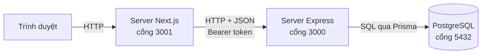

# Todo List — Next.js + Express

Một ứng dụng todo-list có đăng nhập, viết để **học Next.js và Express**.

Không phải một bộ ví dụ rời rạc — mà là một hệ thống hoàn chỉnh, chạy được, có đủ
database, xác thực, và những đánh đổi thật mà bạn sẽ gặp ngoài đời. Mọi file đều
có comment giải thích không chỉ *làm gì* mà cả *vì sao làm vậy* và *làm cách khác
thì hỏng thế nào*.

```
├── backend/     Express 5 + Prisma + PostgreSQL   → cổng 3000
├── frontend/    Next.js 16 (App Router)           → cổng 3001
└── docs/        tài liệu học, đọc theo thứ tự
```

## Chạy nhanh

```bash
# Backend
cd backend
cp .env.example .env            # điền DATABASE_URL và JWT_SECRET
docker compose up -d
npm install && npm run prisma:migrate && npm run dev

# Frontend (terminal khác)
cd frontend
cp .env.example .env.local
npm install && npm run dev
```

Mở <http://localhost:3001>. Hướng dẫn đầy đủ:
[docs/01-cai-dat-va-chay.md](docs/01-cai-dat-va-chay.md).

> `JWT_SECRET` phải tự sinh: `openssl rand -base64 48`

## Có gì trong này

| Chủ đề | Học ở đâu |
|---|---|
| Express: routing, middleware, phân tầng | `backend/src/` |
| Prisma: schema, migration, quan hệ bảng | `backend/prisma/` |
| Đăng nhập bằng mật khẩu: bcrypt, JWT, refresh token xoay vòng | `backend/src/lib/`, `backend/src/services/auth.service.ts` |
| Next.js: Server Component, Server Action | `frontend/src/app/`, `frontend/src/features/` |
| Cất token an toàn bằng cookie `httpOnly` | `frontend/src/shared/lib/session.ts` |
| Tổ chức thư mục theo nghiệp vụ | `frontend/src/features/` |

## Tài liệu

Đọc theo thứ tự:

1. [Cài đặt và chạy](docs/01-cai-dat-va-chay.md)
2. [Kiến trúc tổng quan](docs/02-kien-truc-tong-quan.md)
3. [Luồng xác thực](docs/03-luong-xac-thuc.md)
4. [Cấu trúc thư mục](docs/04-cau-truc-thu-muc.md)

Sau đó đi sâu vào từng phía: [backend/LEARN.md](backend/LEARN.md) và
[frontend/LEARN.md](frontend/LEARN.md).

## Kiến trúc trong một hình



Trình duyệt **không bao giờ** gọi thẳng Express. Chặng giữa đó là thứ cho phép
cất token trong cookie `httpOnly` — điều mà một ứng dụng React thuần không làm
được. Xem [chương 2](docs/02-kien-truc-tong-quan.md).
