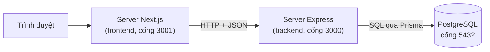
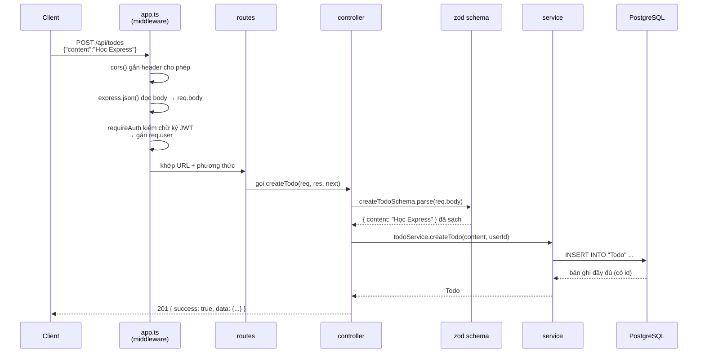
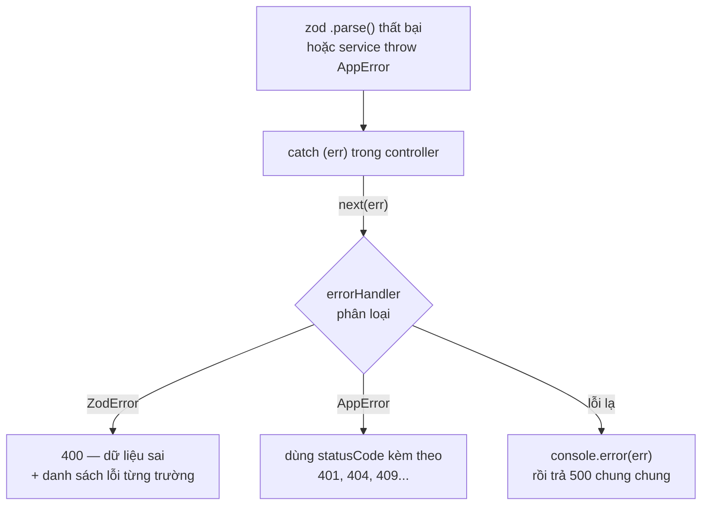
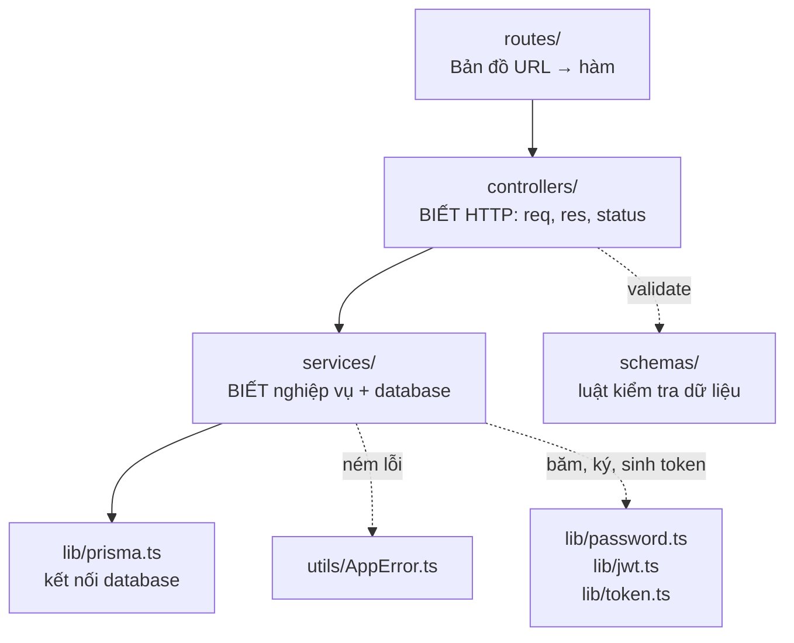
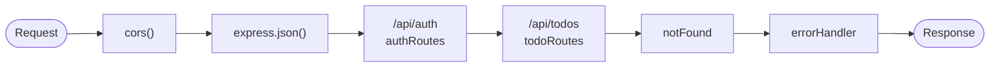
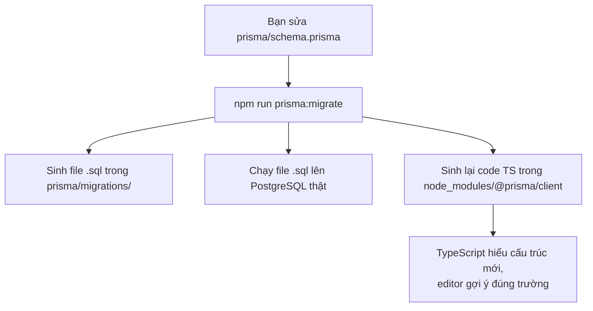
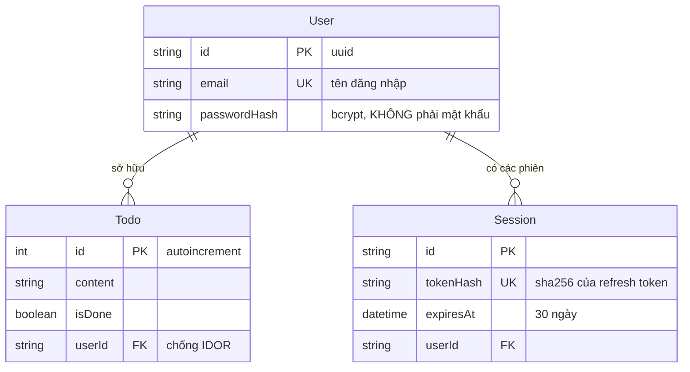
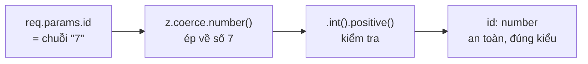
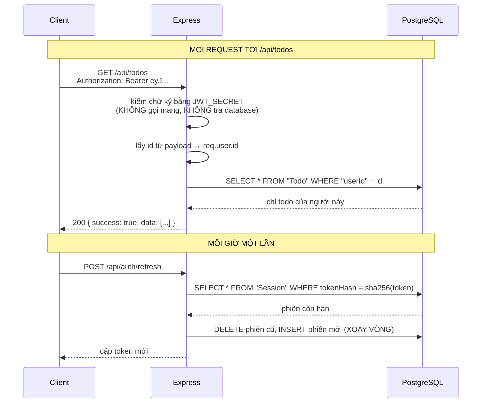

# Học Express + Prisma qua chính dự án này

Tài liệu này giải thích **bức tranh lớn** — những thứ khó nhét vừa vào comment trong code. Đọc file này trước, rồi mở code đọc comment sẽ dễ hiểu hơn nhiều.

Backend này làm đúng một việc: cung cấp API quản lý danh sách công việc (todo) cho frontend Next.js ở thư mục bên cạnh, kèm một hệ thống đăng nhập bằng email và mật khẩu do chính nó quản lý.

> Nếu bạn chưa đọc [`docs/`](../docs/README.md), hãy đọc bốn chương ở đó trước. Tài liệu này đi sâu vào riêng phía backend.

---

## 1. Backend này là cái gì?

Nó là một **API server**: một chương trình chạy liên tục, lắng nghe ở cổng 3000, nhận request HTTP và trả về **JSON** (không trả về HTML — việc dựng giao diện là của frontend).

Toàn cảnh hệ thống:



Điều đáng chú ý: **trình duyệt không gọi thẳng Express**. Nó nói chuyện với server Next.js, và server Next.js mới gọi Express. Nhờ vậy địa chỉ backend không bị lộ ra ngoài, và token xác thực giấu được ở tầng giữa — trong một cookie mà JavaScript phía trình duyệt không đọc được.

---

## 2. Vòng đời một request — phần quan trọng nhất

Hãy theo dõi đúng một lần bấm nút "thêm task", đi từ đầu tới cuối:



Nhìn kỹ sẽ thấy mỗi trạm chỉ làm **đúng một việc** và không lấn sân trạm khác. Đó là toàn bộ triết lý của kiến trúc này.

### Khi có lỗi thì luồng đi đường khác



Điểm mấu chốt: `next(err)` khiến Express **nhảy cóc** qua toàn bộ middleware thường còn lại, đi thẳng tới middleware xử lý lỗi. Nhờ vậy không controller nào phải tự viết code trả lỗi.

---

## 3. Bốn tầng và ranh giới giữa chúng



Quy tắc để nhớ ranh giới:

| Tầng | Được phép biết | KHÔNG được biết |
|---|---|---|
| `controllers/` | `req`, `res`, mã status HTTP | database là Postgres hay MongoDB |
| `services/` | Prisma, bcrypt, JWT, nghiệp vụ | HTTP là gì (không có `req`, `res`) |

Cách kiểm tra nhanh xem mình có viết sai tầng không: mở file trong `services/` và tìm chữ `res.` — nếu thấy, tức là logic HTTP đã lọt xuống nhầm chỗ.

**Vì sao đáng công chia tầng như vậy?**

- Đổi database sang thứ khác → chỉ sửa `services/`.
- Viết script nhập liệu hàng loạt → gọi thẳng `services/`, không cần dựng server.
- Viết test cho nghiệp vụ → test hàm thuần, dễ hơn nhiều so với phải giả lập request.

---

## 4. Middleware — khái niệm cốt lõi của Express

Một request đi qua **dây chuyền** các hàm, xếp đúng theo thứ tự bạn viết `app.use(...)` trong [src/app.ts](src/app.ts):



Mỗi middleware có dạng `(req, res, next)` và chỉ có **hai lựa chọn**:

1. **Trả lời luôn** — gọi `res.json(...)`. Dây chuyền dừng tại đó.
2. **Đi tiếp** — gọi `next()`.

Quên cả hai là lỗi kinh điển: request treo lơ lửng cho tới khi trình duyệt bỏ cuộc.

**Thứ tự là tất cả.** Đảo `app.use(notFound)` lên trước `todoRoutes` thì mọi request đều thành 404, vì bị chặn ngay từ cửa đầu.

Nguyên tắc tương tự áp dụng cho `requireAuth`: nó chỉ ảnh hưởng tới những route khai báo **sau** nó. Đó là lý do `todo.routes.ts` đặt `router.use(requireAuth)` ở ngay đầu file — để mọi route trong đó, kể cả route thêm sau này, tự động được bảo vệ.

---

## 5. Prisma hoạt động ra sao?

Prisma là **ORM** — cầu nối giữa object trong JavaScript và bảng trong database. Bạn viết `prisma.todo.findMany()`, nó dịch thành `SELECT * FROM "Todo"`.

### Vòng đời khi bạn sửa cấu trúc bảng



**Phép màu của Prisma đến từ bước sinh code**, không phải từ phép thuật lúc chạy. `prisma.todo` tồn tại là vì bạn đã khai `model Todo` và đã chạy generate. Đây cũng chính là chỗ vấp phổ biến nhất: sửa schema mà quên chạy lại lệnh, rồi ngồi nhìn lỗi "Property does not exist" mà không hiểu vì sao.

### Ba lệnh cần phân biệt

| Lệnh | Làm gì | Chạy khi nào |
|---|---|---|
| `npm run prisma:generate` | Chỉ sinh code TypeScript, **không** đụng database | Vừa clone dự án về, vừa `npm install` |
| `npm run prisma:migrate` | Sinh SQL + chạy lên database + generate luôn | Vừa sửa `schema.prisma` |
| `npm run prisma:studio` | Mở giao diện web xem/sửa dữ liệu | Khi muốn nhìn dữ liệu thật |

### Ba bảng của dự án



Hai cột đáng chú ý nhất là `User.passwordHash` và `Session.tokenHash` — cả hai đều chứa **hash**, không chứa giá trị gốc. Lý do đầy đủ nằm trong comment của [prisma/schema.prisma](prisma/schema.prisma).

### Vì sao Prisma an toàn hơn viết SQL tay

Prisma luôn tách dữ liệu khỏi câu lệnh, nên kể cả khi người dùng gõ nội dung todo là `'; DROP TABLE "Todo"; --` thì đó vẫn chỉ là một chuỗi văn bản vô hại được lưu vào cột `content`. Lỗ hổng SQL injection không có đất sống.

---

## 6. Validate — vì sao TypeScript không đủ?

Câu cần nhớ:

> **TypeScript chỉ tồn tại lúc bạn viết code. Lúc chạy thật, nó biến mất.**

Mọi khai báo kiểu bị xoá sạch khi biên dịch sang JavaScript. Nên `req.body.content as string` chỉ là một lời hứa suông — lúc chạy nó có thể là số, là `null`, hoặc không tồn tại.

Mà dữ liệu thì đến từ **bên ngoài**: bất kỳ ai cũng có thể mở terminal gõ `curl` gửi thẳng bất cứ thứ gì. Frontend kiểm tra kỹ đến đâu cũng vô nghĩa, vì kẻ gửi request không bắt buộc phải dùng frontend của bạn.

**zod** lấp đúng khoảng trống đó: kiểm tra thật lúc chạy, đồng thời cho TypeScript biết kiểu dữ liệu sau kiểm tra.



Nguyên tắc: **validate ở biên**. Chỉ kiểm tra một lần duy nhất tại cửa vào (controller). Từ sau ranh giới đó, mọi tầng bên trong tin tưởng tuyệt đối — đó là lý do tầng service sạch sẽ, không có dòng `if (!content)` nào.

zod cũng làm luôn việc **chuẩn hoá**, không chỉ kiểm tra. `emailSchema` trong [src/schemas/auth.schema.ts](src/schemas/auth.schema.ts) cắt khoảng trắng và hạ về chữ thường trước khi kiểm định dạng — nên mọi tầng phía sau chắc chắn nhận được email đã sạch. Thứ tự các bước ở đó rất quan trọng, xem comment trong file.

---

## 7. Cấu trúc thư mục và thứ tự đọc code

Đọc theo đúng thứ tự này, mỗi file đều được chuẩn bị bởi file trước đó:

1. **[src/index.ts](src/index.ts)** — điểm khởi động, `dotenv`, `app.listen`.
2. **[src/app.ts](src/app.ts)** — dây chuyền middleware. **File quan trọng nhất.**
3. **[src/routes/todo.routes.ts](src/routes/todo.routes.ts)** — bản đồ URL, đọc 30 giây là nắm hết API.
4. **[src/controllers/todo.controller.ts](src/controllers/todo.controller.ts)** — `req`/`res`/`next`, khuôn `try/catch → next(err)`.
5. **[src/schemas/todo.schema.ts](src/schemas/todo.schema.ts)** — luật validate với zod.
6. **[src/services/todo.service.ts](src/services/todo.service.ts)** — Prisma và nghiệp vụ.
7. **[prisma/schema.prisma](prisma/schema.prisma)** — cấu trúc bảng.
8. **[src/lib/prisma.ts](src/lib/prisma.ts)** — vì sao chỉ tạo một `PrismaClient` duy nhất.
9. **[src/middlewares/errorHandler.ts](src/middlewares/errorHandler.ts)** — quy ước 4 tham số.
10. **[src/utils/AppError.ts](src/utils/AppError.ts)** — lỗi mang theo mã status.

Phần xác thực đọc sau, khi đã nắm được mười file trên. Thứ tự riêng của nó:

11. **[src/lib/password.ts](src/lib/password.ts)** — bcrypt, salt, vì sao cố tình chậm. Đọc đầu tiên trong nhóm này.
12. **[src/lib/jwt.ts](src/lib/jwt.ts)** — ký và kiểm access token, vì sao JWT không thu hồi được.
13. **[src/lib/token.ts](src/lib/token.ts)** — refresh token, và vì sao ở đây SHA-256 lại đúng.
14. **[src/lib/constants.ts](src/lib/constants.ts)** — các con số và lý do chọn chúng.
15. **[src/schemas/auth.schema.ts](src/schemas/auth.schema.ts)** — luật cho email và mật khẩu.
16. **[src/services/auth.service.ts](src/services/auth.service.ts)** — bốn luồng: đăng ký, đăng nhập, gia hạn, đăng xuất.
17. **[src/middlewares/requireAuth.ts](src/middlewares/requireAuth.ts)** — người gác cổng, chỗ `req.user` sinh ra.
18. **[src/types/express.d.ts](src/types/express.d.ts)** — cách khai báo thêm `req.user` cho TypeScript.

---

## 8. Bảng API đầy đủ

**Toàn bộ route `/api/todos` đều yêu cầu header `Authorization: Bearer <accessToken>`.** Thiếu header là nhận 401 ngay, không có ngoại lệ.

Và mọi kết quả đều đã được lọc theo người đang gọi: "mảng todo" dưới đây nghĩa là *todo của riêng bạn*, không phải toàn bộ bảng.

| Phương thức | Đường dẫn | Body | Trả về |
|---|---|---|---|
| GET | `/api/todos` | — | Mảng todo **của bạn**, mới nhất trước |
| GET | `/api/todos/:id` | — | Một todo của bạn, hoặc 404 |
| POST | `/api/todos` | `{ "content": "..." }` | 201 + todo vừa tạo (gắn sẵn `userId` của bạn) |
| PUT | `/api/todos/:id` | `{ "content": "..." }` | Todo sau khi sửa |
| PATCH | `/api/todos/:id/done` | — | Todo đã đánh dấu xong |
| PATCH | `/api/todos/:id/undone` | — | Todo đã bỏ đánh dấu |
| DELETE | `/api/todos/:id` | — | `{ success, message }` |

Todo của người khác luôn trả về **404**, không phải 403 — cố ý như vậy, lý do ở mục 10.

### API xác thực

| Method | Đường dẫn | Cần token? | Việc |
|---|---|---|---|
| POST | `/api/auth/register` | Không | Tạo tài khoản mới |
| POST | `/api/auth/login` | Không | Đổi email + mật khẩu lấy cặp token |
| POST | `/api/auth/refresh` | Không* | Đổi refresh token lấy cặp token mới |
| POST | `/api/auth/logout` | Không* | Xoá phiên khỏi bảng `Session` |
| GET | `/api/auth/me` | **Có** | Trả về danh tính đọc từ token |

\* Không cần *access* token (chúng được gọi đúng lúc access token đã hết hạn), nhưng vẫn phải có refresh token hợp lệ — không có thì không tìm thấy hàng nào trong `Session` và nhận 401 ngay.

Mọi phản hồi đều được gói trong một "phong bì" cố định:

```json
{ "success": true,  "data": ... }
{ "success": false, "message": "..." }
```

Nhờ vậy frontend chỉ cần viết **một** hàm bóc phong bì dùng chung cho mọi lời gọi.

---

## 9. Chạy thử bằng dòng lệnh

Không cần frontend, `curl` là đủ. Nhưng phải lấy token trước.

**Bước 1 — tạo tài khoản và đăng nhập:**

```bash
curl -s -X POST http://localhost:3000/api/auth/register \
  -H "Content-Type: application/json" \
  -d '{"email":"ban@example.com","password":"MatKhau123"}'
```

Để đỡ phải copy chuỗi token dài loằng ngoằng, cất luôn vào biến shell:

```bash
TOKEN=$(curl -s -X POST http://localhost:3000/api/auth/login \
  -H "Content-Type: application/json" \
  -d '{"email":"ban@example.com","password":"MatKhau123"}' \
  | python3 -c 'import sys,json; print(json.load(sys.stdin)["data"]["accessToken"])')

echo "${TOKEN:0:40}..."   # in 40 ký tự đầu để chắc là đã lấy được
```

**Bước 2 — gọi API kèm token:**

```bash
# Lấy danh sách (chỉ todo của bạn)
curl -H "Authorization: Bearer $TOKEN" http://localhost:3000/api/todos

# Tạo mới
curl -X POST http://localhost:3000/api/todos \
  -H "Authorization: Bearer $TOKEN" \
  -H "Content-Type: application/json" \
  -d '{"content":"Học Express"}'

# Đánh dấu xong
curl -X PATCH -H "Authorization: Bearer $TOKEN" \
  http://localhost:3000/api/todos/1/done

# Xoá
curl -X DELETE -H "Authorization: Bearer $TOKEN" \
  http://localhost:3000/api/todos/1
```

**Thử bỏ token đi** để thấy người gác cổng làm việc:

```bash
curl -i http://localhost:3000/api/todos
# HTTP/1.1 401 Unauthorized
# {"success":false,"message":"Bạn cần đăng nhập để thực hiện thao tác này."}
```

**Xem bên trong access token** — nó không hề được mã hoá:

```bash
echo "$TOKEN" | cut -d'.' -f2 | base64 -d 2>/dev/null; echo
# {"id":"9f3d...","email":"ban@example.com","iat":1789...,"exp":1789...}
```

Đây là bằng chứng trực tiếp cho điều quan trọng nhất về JWT: **ai cũng đọc được payload.** Đừng bao giờ đặt thông tin nhạy cảm vào đó.

Lưu ý: access token chỉ sống **1 giờ**. Hết hạn thì chạy lại Bước 1, hoặc dùng refresh token:

```bash
curl -s -X POST http://localhost:3000/api/auth/refresh \
  -H "Content-Type: application/json" \
  -d '{"refreshToken":"<chuỗi refresh token>"}'
```

---

## 10. Xác thực — "chỉ thấy ghi chú của mình"

Phần này là thứ đáng đọc nhất trong dự án. Trước khi đọc code, hãy nắm ba ý sau — chúng là toàn bộ câu chuyện.

> Phần giải thích đầy đủ về từng luồng nằm ở [docs/03-luong-xac-thuc.md](../docs/03-luong-xac-thuc.md). Ở đây chỉ tóm tắt những gì thuộc riêng về backend.

### Ý 1 — Backend tự quản mật khẩu, và không bao giờ biết mật khẩu

Cột `User.passwordHash` chứa kết quả của bcrypt, không chứa mật khẩu. Lúc đăng nhập ta **không giải mã hash ngược lại** — ta băm lại mật khẩu vừa nhập rồi so sánh hai chuỗi.

bcrypt cố tình **chậm** (~250ms mỗi lần). Đó không phải nhược điểm mà là toàn bộ điểm mạnh: nó khiến việc dò cạn từ điển mật khẩu trở nên bất khả thi về mặt thời gian, trong khi người dùng thật chỉ chịu 250ms mỗi lần đăng nhập.

Xem [src/lib/password.ts](src/lib/password.ts).

### Ý 2 — Hai loại token, và backend tự kiểm access token tại chỗ



Access token là JWT có chữ ký. Backend kiểm chữ ký bằng `JWT_SECRET` ngay trong RAM — không gọi mạng, không tra database. Nhờ vậy API chạy nhanh và vẫn kiểm được token kể cả khi database đang quá tải.

Cái giá: **JWT đã cấp thì không thu hồi được**. Ta chấp nhận bằng cách cho nó sống ngắn (1 giờ), và bù lại bằng refresh token có tra bảng `Session` — thứ thu hồi được ngay bằng một câu `DELETE`.

Xem [src/lib/jwt.ts](src/lib/jwt.ts) và [src/lib/token.ts](src/lib/token.ts).

### Ý 3 — `userId` đến từ chữ ký, không đến từ client

Đây là ý quan trọng nhất về mặt bảo mật.

`requireAuth` đọc `id` **từ bên trong token đã kiểm chữ ký** rồi gắn vào `req.user`. Client không có cách nào ảnh hưởng tới giá trị đó. Nếu thay vào đó ta cho client gửi `userId` trong body, thì ai cũng sửa được một giá trị trong DevTools để đọc todo của người khác.

Và mọi câu query trong `todo.service.ts` đều kèm `userId`:

```ts
// SAI — ai đoán đúng id là đọc được todo người khác (lỗ hổng IDOR)
prisma.todo.findUnique({ where: { id } })

// ĐÚNG — phải thoả cả hai điều kiện
prisma.todo.findFirst({ where: { id, userId } })
```

> **Nguyên tắc đáng mang theo suốt nghề:** danh tính không bao giờ được đến từ tham số do client gửi. Nó phải được server tự suy ra từ một thứ đã được kiểm chứng.

### Các file liên quan, theo thứ tự nên đọc

| Thứ tự | File | Vai trò |
|---|---|---|
| 1 | `src/lib/password.ts` | bcrypt, salt, vì sao cố tình chậm. **Đọc file này trước** |
| 2 | `src/lib/jwt.ts` | Ký/kiểm access token, ba phần của một JWT |
| 3 | `src/lib/token.ts` | Refresh token ngẫu nhiên và SHA-256 |
| 4 | `src/services/auth.service.ts` | Bốn luồng chính, và các đánh đổi ở mỗi luồng |
| 5 | `src/middlewares/requireAuth.ts` | Người gác cổng: đọc header, kiểm token, gắn `req.user` |
| 6 | `src/services/todo.service.ts` | Mọi query đều kèm `userId` — phần chống IDOR |
| 7 | `src/routes/todo.routes.ts` | Một dòng `router.use(requireAuth)` bảo vệ toàn bộ |

### Bảng tra nhanh hai loại token

| | Access token | Refresh token |
|---|---|---|
| Là gì | JWT có chữ ký | 64 byte ngẫu nhiên |
| Sống | 1 giờ | 30 ngày |
| Gửi khi nào | Mọi request tới API | Chỉ khi cần gia hạn |
| Kiểm bằng cách | Chữ ký, trong RAM | Tra bảng `Session` |
| Lưu ở database? | Không | Có — nhưng chỉ lưu SHA-256 |
| Thu hồi được? | ❌ Không | ✅ Có |
| Xoay vòng? | — | ✅ Mỗi lần dùng |

---

## 11. Những cái bẫy hay gặp

1. **`req.body` là `undefined`** → quên `app.use(express.json())`, hoặc client không gửi header `Content-Type: application/json`.
2. **Middleware lỗi không bao giờ chạy** → thiếu tham số thứ tư. Express nhận diện middleware lỗi bằng cách **đếm số tham số**; phải đủ `(err, req, res, next)` dù không dùng tới `next`.
3. **`req.params.id` là chuỗi, không phải số** → mọi thứ lấy từ URL đều là văn bản. Phải `z.coerce.number()` trước khi đưa xuống database.
4. **Sửa `schema.prisma` mà quên `npm run prisma:migrate`** → TypeScript vẫn nhìn thấy cấu trúc cũ, báo lỗi khó hiểu.
5. **`return prisma.todo.delete(...)` thay vì `return await ...` trong khối `try`** → thiếu `await` thì Promise thoát ra ngoài rồi mới lỗi, lúc đó `try/catch` đã kết thúc và không bắt được gì.
6. **Lỗi CORS** → đó là luật của **trình duyệt**, không phải của server. Gọi bằng `curl` hay Postman không bao giờ dính. Và request vẫn tới được backend, vẫn chạy thật — trình duyệt chỉ chặn ở bước cuối, không cho JavaScript đọc kết quả.
7. **`import "dotenv/config"` không nằm ở dòng đầu `index.ts`** → Prisma và `lib/jwt.ts` khởi tạo trước khi `.env` được nạp, báo lỗi thiếu `DATABASE_URL` hoặc `JWT_SECRET`.
8. **Đảo thứ tự `.trim()` và `.min(1)` trong zod** → chuỗi toàn dấu cách `"   "` sẽ lọt qua.
9. **Đảo thứ tự `.toLowerCase()` và `.email()`** → chuỗi `" An@Gmail.com "` bị từ chối oan vì thừa dấu cách. Chuẩn hoá trước, kiểm tra sau.
10. **Nhầm đơn vị mili-giây và giây** → `Date.now()` cho mili-giây, còn JWT `exp` và cookie `Max-Age` dùng giây. Quên nhân 1000 thì phiên hết hạn sau 30 *giây* thay vì 30 *ngày*.
11. **Dùng `jwt.decode()` thay cho `jwt.verify()`** → `decode` không kiểm chữ ký, nên ai cũng tự chế được token giả. Đây là một lỗ hổng nghiêm trọng có thật, xuất hiện đủ thường xuyên để đáng nhắc riêng.
12. **Trả `passwordHash` về cho client** → quên `select` trong `prisma.user.create/findUnique` là chuỗi hash đi thẳng ra mạng qua `res.json()`.

---

## 12. Thử nghịch để hiểu sâu hơn

Vài thí nghiệm nhỏ, làm xong nhớ hoàn tác:

1. **Xoá `app.use(express.json())` trong `app.ts`** → gửi POST và xem `req.body` thành `undefined`.
2. **Đổi `app.use(notFound)` lên trước `app.use("/api/todos", ...)`** → mọi request thành 404. Bằng chứng thứ tự middleware quyết định tất cả.
3. **Xoá tham số `next` khỏi `errorHandler`** → gây một lỗi bất kỳ, xem request treo thay vì trả 500.
4. **Thêm `console.log(req.method, req.url)` vào đầu `app.ts` dưới dạng `app.use((req,res,next)=>{...; next()})`** → tự viết một middleware ghi log đầu tiên trong đời.
5. **Gọi `curl http://localhost:3000/api/todos/abc`** → xem zod chặn lại và trả 400 kèm mô tả, chứ không phải 500.
6. **Tắt Postgres (`docker compose stop`) rồi gọi API** → xem nhánh 500 của `errorHandler` hoạt động, và stack trace hiện trong terminal chứ không lộ ra cho khách.
7. **Xoá dòng `router.use(requireAuth)` trong `todo.routes.ts`** → gọi `curl http://localhost:3000/api/todos` không kèm token. Bạn sẽ thấy lỗi 401 từ `getUserId()` trong controller thay vì dữ liệu — đó là lớp phòng thủ thứ hai đang làm việc.
8. **Đăng ký hai tài khoản, mỗi tài khoản tạo vài todo, rồi lấy `id` todo của tài khoản A đem gọi bằng token của tài khoản B** → nhận 404 chứ không phải 403. Đọc lại phần giải thích trong `todo.service.ts` để hiểu vì sao 404 mới là câu trả lời đúng.
9. **Trong `todo.service.ts`, đổi `findFirst({ where: { id, userId } })` thành `findUnique({ where: { id } })`** → làm lại thí nghiệm 8 và xem lỗ hổng IDOR xuất hiện ngay trước mắt. Nhớ hoàn tác.
10. **Trong `auth.service.ts`, đổi thông báo lỗi khi không tìm thấy user thành `"Email không tồn tại"`** → giờ API này đã thành công cụ dò danh sách người dùng. Nhớ hoàn tác, và đọc lại phần giải thích tại đó.
11. **Hạ `BCRYPT_COST` từ 12 xuống 4** → đo thời gian đăng nhập bằng `time curl ...`. Nhanh hơn hẳn, và kém an toàn hơn đúng 256 lần. Đây là đánh đổi được thể hiện bằng con số.
12. **Đổi `JWT_SECRET` trong `.env` rồi khởi động lại backend** → mọi access token đang lưu hành lập tức vô hiệu. Đây là "nút tắt khẩn cấp" duy nhất bạn có với JWT.
13. **Đăng nhập, ghi lại refresh token, gọi `/api/auth/refresh` hai lần với cùng chuỗi đó** → lần đầu thành công, lần hai nhận 401. Đó là xoay vòng token.

---

## 13. Đọc thêm

- Express: <https://expressjs.com/en/guide/routing.html> và trang "Writing middleware" — hai trang đủ để nắm 90% Express.
- Prisma: <https://www.prisma.io/docs/orm/prisma-client/queries/crud> — danh sách đầy đủ `findMany`, `create`, `update`...
- Zod: <https://zod.dev> — trang chủ chính là tài liệu.
- JWT: <https://jwt.io> — dán token vào để xem nội dung. Rất đáng thử một lần.
- OWASP Password Storage Cheat Sheet — khuyến nghị hiện hành về lưu mật khẩu, ngắn và rất thực dụng.

Lưu ý khi tra Google: rất nhiều bài viết cũ dành cho **Express 4**. Dự án này dùng **Express 5**, khác biệt lớn nhất là Express 5 tự động bắt lỗi từ hàm `async` — nhưng code ở đây vẫn viết `try/catch` tường minh để ý đồ hiện rõ và để bạn quen với khuôn phổ biến ngoài kia.
