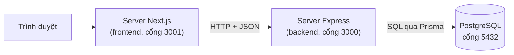
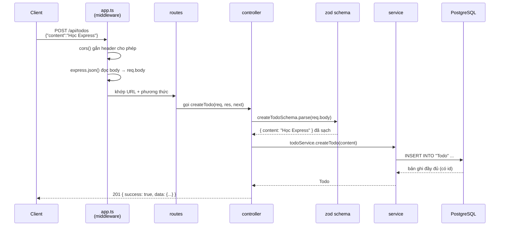
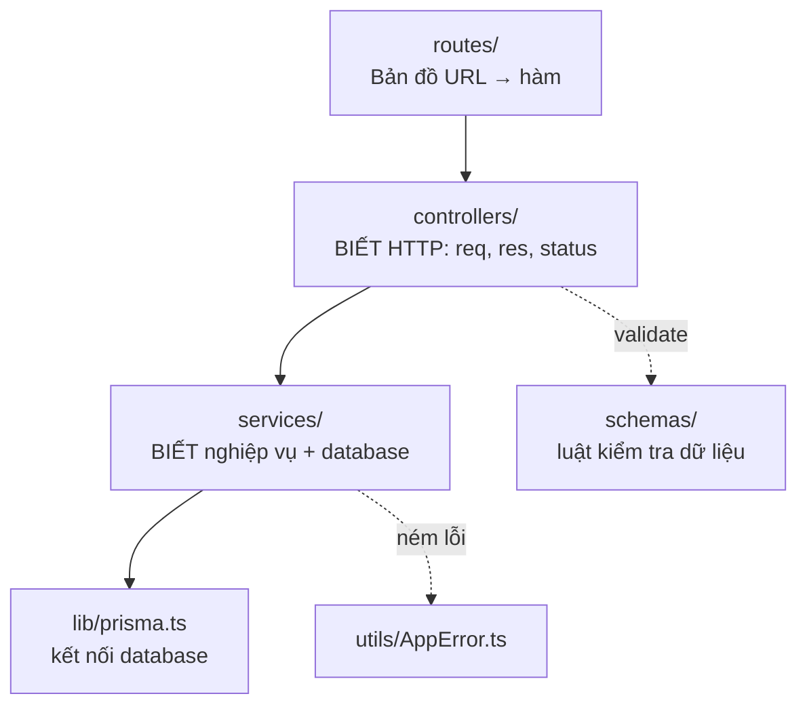
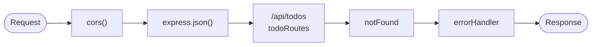
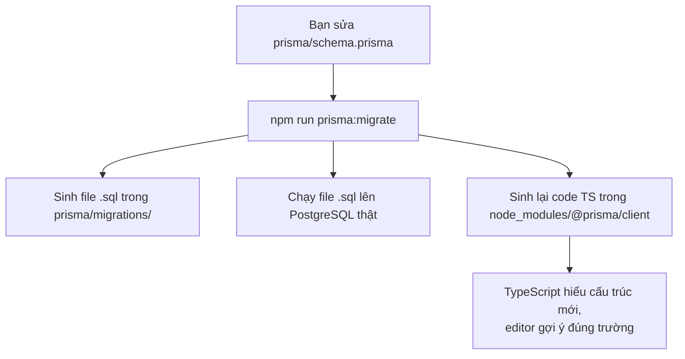
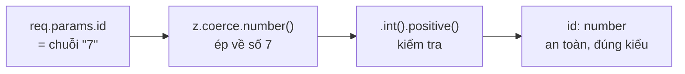

# Học Express + Prisma qua chính dự án này

Tài liệu này giải thích **bức tranh lớn** — những thứ khó nhét vừa vào comment trong code. Đọc file này trước, rồi mở code đọc comment sẽ dễ hiểu hơn nhiều.

Backend này làm đúng một việc: cung cấp API quản lý danh sách công việc (todo) cho frontend Next.js ở thư mục bên cạnh.

---

## 1. Backend này là cái gì?

Nó là một **API server**: một chương trình chạy liên tục, lắng nghe ở cổng 3000, nhận request HTTP và trả về **JSON** (không trả về HTML — việc dựng giao diện là của frontend).

Toàn cảnh hệ thống:



Điều đáng chú ý: **trình duyệt không gọi thẳng Express**. Nó nói chuyện với server Next.js, và server Next.js mới gọi Express. Nhờ vậy địa chỉ backend không bị lộ ra ngoài, và sau này muốn thêm token xác thực thì giấu ở tầng giữa được.

---

## 2. Vòng đời một request — phần quan trọng nhất

Hãy theo dõi đúng một lần bấm nút "thêm task", đi từ đầu tới cuối:



Nhìn kỹ sẽ thấy mỗi trạm chỉ làm **đúng một việc** và không lấn sân trạm khác. Đó là toàn bộ triết lý của kiến trúc này.

### Khi có lỗi thì luồng đi đường khác


Điểm mấu chốt: `next(err)` khiến Express **nhảy cóc** qua toàn bộ middleware thường còn lại, đi thẳng tới middleware xử lý lỗi. Nhờ vậy không controller nào phải tự viết code trả lỗi.

---

## 3. Bốn tầng và ranh giới giữa chúng



Quy tắc để nhớ ranh giới:

| Tầng | Được phép biết | KHÔNG được biết |
|---|---|---|
| `controllers/` | `req`, `res`, mã status HTTP | database là Postgres hay MongoDB |
| `services/` | Prisma, nghiệp vụ | HTTP là gì (không có `req`, `res`) |

Cách kiểm tra nhanh xem mình có viết sai tầng không: mở file trong `services/` và tìm chữ `res.` — nếu thấy, tức là logic HTTP đã lọt xuống nhầm chỗ.

**Vì sao đáng công chia tầng như vậy?**

- Đổi database sang thứ khác → chỉ sửa `services/`.
- Viết script nhập liệu hàng loạt → gọi thẳng `services/`, không cần dựng server.
- Viết test cho nghiệp vụ → test hàm thuần, dễ hơn nhiều so với phải giả lập request.

---

## 4. Middleware — khái niệm cốt lõi của Express

Một request đi qua **dây chuyền** các hàm, xếp đúng theo thứ tự bạn viết `app.use(...)` trong [src/app.ts](src/app.ts):



Mỗi middleware có dạng `(req, res, next)` và chỉ có **hai lựa chọn**:

1. **Trả lời luôn** — gọi `res.json(...)`. Dây chuyền dừng tại đó.
2. **Đi tiếp** — gọi `next()`.

Quên cả hai là lỗi kinh điển: request treo lơ lửng cho tới khi trình duyệt bỏ cuộc.

**Thứ tự là tất cả.** Đảo `app.use(notFound)` lên trước `todoRoutes` thì mọi request đều thành 404, vì bị chặn ngay từ cửa đầu.

---

## 5. Prisma hoạt động ra sao?

Prisma là **ORM** — cầu nối giữa object trong JavaScript và bảng trong database. Bạn viết `prisma.todo.findMany()`, nó dịch thành `SELECT * FROM "Todo"`.

### Vòng đời khi bạn sửa cấu trúc bảng



**Phép màu của Prisma đến từ bước sinh code**, không phải từ phép thuật lúc chạy. `prisma.todo` tồn tại là vì bạn đã khai `model Todo` và đã chạy generate. Đây cũng chính là chỗ vấp phổ biến nhất: sửa schema mà quên chạy lại lệnh, rồi ngồi nhìn lỗi "Property does not exist" mà không hiểu vì sao.

### Ba lệnh cần phân biệt

| Lệnh | Làm gì | Chạy khi nào |
|---|---|---|
| `npm run prisma:generate` | Chỉ sinh code TypeScript, **không** đụng database | Vừa clone dự án về, vừa `npm install` |
| `npm run prisma:migrate` | Sinh SQL + chạy lên database + generate luôn | Vừa sửa `schema.prisma` |
| `npm run prisma:studio` | Mở giao diện web xem/sửa dữ liệu | Khi muốn nhìn dữ liệu thật |

### Vì sao Prisma an toàn hơn viết SQL tay

Prisma luôn tách dữ liệu khỏi câu lệnh, nên kể cả khi người dùng gõ nội dung todo là `'; DROP TABLE "Todo"; --` thì đó vẫn chỉ là một chuỗi văn bản vô hại được lưu vào cột `content`. Lỗ hổng SQL injection không có đất sống.

---

## 6. Validate — vì sao TypeScript không đủ?

Câu cần nhớ:

> **TypeScript chỉ tồn tại lúc bạn viết code. Lúc chạy thật, nó biến mất.**

Mọi khai báo kiểu bị xoá sạch khi biên dịch sang JavaScript. Nên `req.body.content as string` chỉ là một lời hứa suông — lúc chạy nó có thể là số, là `null`, hoặc không tồn tại.

Mà dữ liệu thì đến từ **bên ngoài**: bất kỳ ai cũng có thể mở terminal gõ `curl` gửi thẳng bất cứ thứ gì. Frontend kiểm tra kỹ đến đâu cũng vô nghĩa, vì kẻ gửi request không bắt buộc phải dùng frontend của bạn.

**zod** lấp đúng khoảng trống đó: kiểm tra thật lúc chạy, đồng thời cho TypeScript biết kiểu dữ liệu sau kiểm tra.



Nguyên tắc: **validate ở biên**. Chỉ kiểm tra một lần duy nhất tại cửa vào (controller). Từ sau ranh giới đó, mọi tầng bên trong tin tưởng tuyệt đối — đó là lý do tầng service sạch sẽ, không có dòng `if (!content)` nào.

---

## 7. Cấu trúc thư mục và thứ tự đọc code

Đọc theo đúng thứ tự này, mỗi file đều được chuẩn bị bởi file trước đó:

1. **[src/index.ts](src/index.ts)** — điểm khởi động, `dotenv`, `app.listen`.
2. **[src/app.ts](src/app.ts)** — dây chuyền middleware. **File quan trọng nhất.**
3. **[src/routes/todo.routes.ts](src/routes/todo.routes.ts)** — bản đồ URL, đọc 30 giây là nắm hết API.
4. **[src/controllers/todo.controller.ts](src/controllers/todo.controller.ts)** — `req`/`res`/`next`, khuôn `try/catch → next(err)`.
5. **[src/schemas/todo.schema.ts](src/schemas/todo.schema.ts)** — luật validate với zod.
6. **[src/services/todo.service.ts](src/services/todo.service.ts)** — Prisma và nghiệp vụ.
7. **[prisma/schema.prisma](prisma/schema.prisma)** — cấu trúc bảng.
8. **[src/lib/prisma.ts](src/lib/prisma.ts)** — vì sao chỉ tạo một `PrismaClient` duy nhất.
9. **[src/middlewares/errorHandler.ts](src/middlewares/errorHandler.ts)** — quy ước 4 tham số.
10. **[src/utils/AppError.ts](src/utils/AppError.ts)** — lỗi mang theo mã status.

---

## 8. Bảng API đầy đủ

| Phương thức | Đường dẫn | Body | Trả về |
|---|---|---|---|
| GET | `/api/todos` | — | Mảng todo, mới nhất trước |
| GET | `/api/todos/:id` | — | Một todo, hoặc 404 |
| POST | `/api/todos` | `{ "content": "..." }` | 201 + todo vừa tạo |
| PUT | `/api/todos/:id` | `{ "content": "..." }` | Todo sau khi sửa |
| PATCH | `/api/todos/:id/done` | — | Todo đã đánh dấu xong |
| PATCH | `/api/todos/:id/undone` | — | Todo đã bỏ đánh dấu |
| DELETE | `/api/todos/:id` | — | `{ success, message }` |

Mọi phản hồi đều được gói trong một "phong bì" cố định:

```json
{ "success": true,  "data": ... }
{ "success": false, "message": "..." }
```

Nhờ vậy frontend chỉ cần viết **một** hàm bóc phong bì dùng chung cho mọi lời gọi.

---

## 9. Chạy thử bằng dòng lệnh

Không cần frontend, `curl` là đủ:

```bash
# Lấy danh sách
curl http://localhost:3000/api/todos

# Tạo mới
curl -X POST http://localhost:3000/api/todos \
  -H "Content-Type: application/json" \
  -d '{"content":"Học Express"}'

# Đánh dấu xong
curl -X PATCH http://localhost:3000/api/todos/1/done

# Xoá
curl -X DELETE http://localhost:3000/api/todos/1
```

---

## 10. Những cái bẫy hay gặp

1. **`req.body` là `undefined`** → quên `app.use(express.json())`, hoặc client không gửi header `Content-Type: application/json`.
2. **Middleware lỗi không bao giờ chạy** → thiếu tham số thứ tư. Express nhận diện middleware lỗi bằng cách **đếm số tham số**; phải đủ `(err, req, res, next)` dù không dùng tới `next`.
3. **`req.params.id` là chuỗi, không phải số** → mọi thứ lấy từ URL đều là văn bản. Phải `z.coerce.number()` trước khi đưa xuống database.
4. **Sửa `schema.prisma` mà quên `npm run prisma:migrate`** → TypeScript vẫn nhìn thấy cấu trúc cũ, báo lỗi khó hiểu.
5. **`return prisma.todo.delete(...)` thay vì `return await ...` trong khối `try`** → thiếu `await` thì Promise thoát ra ngoài rồi mới lỗi, lúc đó `try/catch` đã kết thúc và không bắt được gì.
6. **Lỗi CORS** → đó là luật của **trình duyệt**, không phải của server. Gọi bằng `curl` hay Postman không bao giờ dính. Và request vẫn tới được backend, vẫn chạy thật — trình duyệt chỉ chặn ở bước cuối, không cho JavaScript đọc kết quả.
7. **`import "dotenv/config"` không nằm ở dòng đầu `index.ts`** → Prisma khởi tạo trước khi `.env` được nạp, báo lỗi thiếu `DATABASE_URL`.
8. **Đảo thứ tự `.trim()` và `.min(1)` trong zod** → chuỗi toàn dấu cách `"   "` sẽ lọt qua.

---

## 11. Thử nghịch để hiểu sâu hơn

Vài thí nghiệm nhỏ, làm xong nhớ hoàn tác:

1. **Xoá `app.use(express.json())` trong `app.ts`** → gửi POST và xem `req.body` thành `undefined`.
2. **Đổi `app.use(notFound)` lên trước `app.use("/api/todos", ...)`** → mọi request thành 404. Bằng chứng thứ tự middleware quyết định tất cả.
3. **Xoá tham số `next` khỏi `errorHandler`** → gây một lỗi bất kỳ, xem request treo thay vì trả 500.
4. **Thêm `console.log(req.method, req.url)` vào đầu `app.ts` dưới dạng `app.use((req,res,next)=>{...; next()})`** → tự viết một middleware ghi log đầu tiên trong đời.
5. **Gọi `curl http://localhost:3000/api/todos/abc`** → xem zod chặn lại và trả 400 kèm mô tả, chứ không phải 500.
6. **Tắt Postgres (`docker compose stop`) rồi gọi API** → xem nhánh 500 của `errorHandler` hoạt động, và stack trace hiện trong terminal chứ không lộ ra cho khách.

---

## 12. Đọc thêm

- Express: <https://expressjs.com/en/guide/routing.html> và trang "Writing middleware" — hai trang đủ để nắm 90% Express.
- Prisma: <https://www.prisma.io/docs/orm/prisma-client/queries/crud> — danh sách đầy đủ `findMany`, `create`, `update`...
- Zod: <https://zod.dev> — trang chủ chính là tài liệu.

Lưu ý khi tra Google: rất nhiều bài viết cũ dành cho **Express 4**. Dự án này dùng **Express 5**, khác biệt lớn nhất là Express 5 tự động bắt lỗi từ hàm `async` — nhưng code ở đây vẫn viết `try/catch` tường minh để ý đồ hiện rõ và để bạn quen với khuôn phổ biến ngoài kia.
