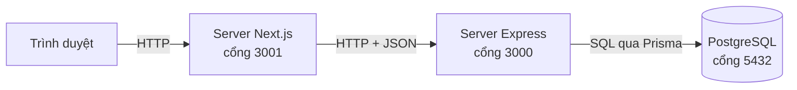
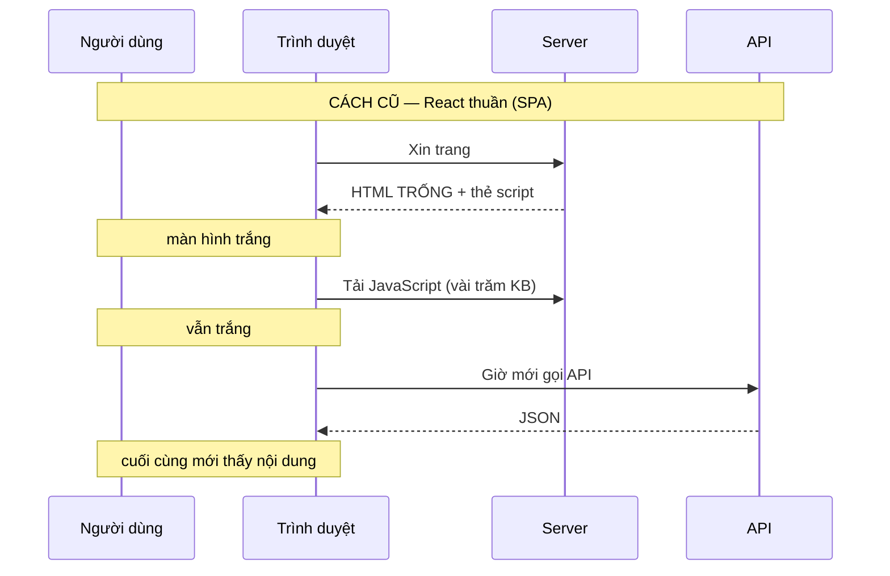
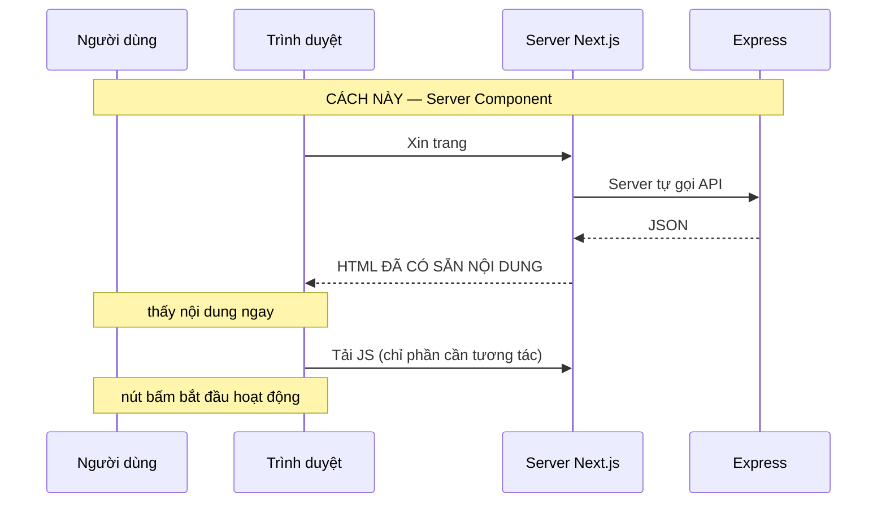
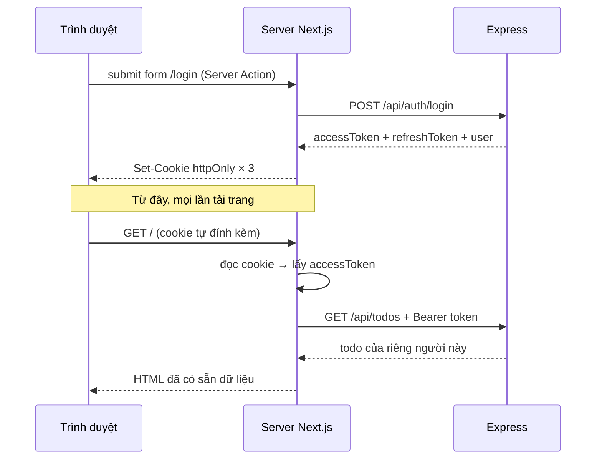
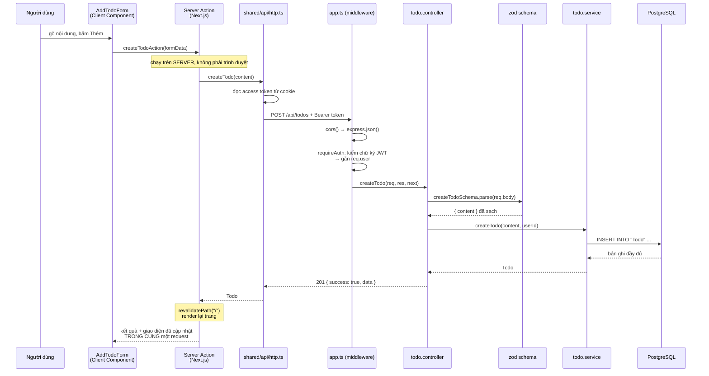
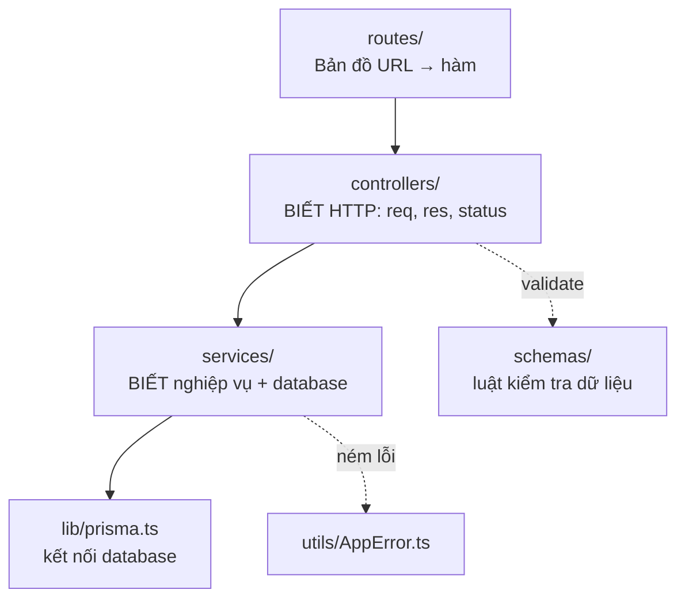

# 2. Kiến trúc tổng quan

Chương này trả lời câu hỏi lớn nhất: **ba chương trình này nói chuyện với nhau
như thế nào, và vì sao lại chia làm ba?**

---

## 2.1. Ba tiến trình



Điều đáng chú ý nhất, và là quyết định kiến trúc quan trọng nhất của cả dự án:

> **Trình duyệt KHÔNG BAO GIỜ gọi thẳng Express.**

Nó chỉ nói chuyện với server Next.js. Chính server Next.js mới gọi Express.

Nghe như thêm một chặng vô ích — mỗi request phải đi qua hai server thay vì một.
Nhưng cái chặng đó mua được ba thứ, và thứ thứ ba là thứ khiến nó đáng giá.

---

## 2.2. Chặng giữa mua được gì

### Lợi ích 1 — Backend không lộ ra Internet

Địa chỉ `http://localhost:3000` chỉ tồn tại trong biến môi trường `API_BASE_URL`
của server Next.js, không có trong bất kỳ dòng JavaScript nào gửi xuống trình
duyệt.

Trên production, Express có thể nằm trong mạng nội bộ, không mở cổng nào ra
ngoài. Người dùng không biết nó ở đâu, và cũng không gọi tới được.

### Lợi ích 2 — Nội dung hiện ra ngay ở phản hồi đầu tiên

Hãy so sánh cách React truyền thống (SPA) với cách của Next.js:





Ba lần chờ nối tiếp nhau rút xuống còn một. Và bot tìm kiếm nhận về một trang có
nội dung thật thay vì một trang rỗng.

### Lợi ích 3 — Có một chỗ an toàn để cất token ⭐

Đây là lợi ích quan trọng nhất, và là thứ mà một ứng dụng React thuần **không có
cách nào** đạt được.

Sau khi đăng nhập, token phải được cất ở đâu đó. Có ba lựa chọn:

| Chỗ cất | JavaScript đọc được? | Sống qua F5? | Chống XSS? |
|---|---|---|---|
| `localStorage` | ✅ Có | ✅ | ❌ **Không** |
| Biến trong React state | ❌ | ❌ Mất | ✅ |
| Cookie `httpOnly` | ❌ | ✅ | ✅ |

Chỉ dòng thứ ba đạt cả hai tiêu chí. Nhưng cookie `httpOnly` chỉ dùng được khi có
một **server của chính bạn** đứng giữa để đọc nó — vì theo định nghĩa,
JavaScript trong trình duyệt không nhìn thấy nó.

Một SPA thuần không có server nào như vậy. Nó buộc phải cất token ở nơi
JavaScript đọc được, và vì thế buộc phải chấp nhận rủi ro XSS.



Nhìn kỹ: **token chưa từng đi vào tầng JavaScript của trình duyệt.** Nó đi từ
Express → server Next.js → cookie, và mỗi lần dùng thì server Next.js đọc lại từ
cookie. Code chạy trong trình duyệt không có cách nào chạm tới.

---

## 2.3. Vòng đời một request, từ đầu tới cuối

Theo dõi đúng một lần bấm nút "thêm việc":



Hai điểm đáng rút ra:

**Mỗi trạm làm đúng một việc.** Controller biết HTTP nhưng không biết SQL;
service biết SQL nhưng không biết HTTP. Đó là toàn bộ triết lý phân tầng.

**Một vòng gửi/nhận cho cả việc ghi lẫn việc cập nhật giao diện.** `revalidatePath`
khiến Next.js render lại trang ngay trong cùng request với Server Action. Đây là
lý do trong dự án này **không có `useState` nào giữ danh sách todo** — server là
nguồn sự thật duy nhất.

---

## 2.4. Bốn tầng của backend



| Tầng | Được phép biết | KHÔNG được biết |
|---|---|---|
| `controllers/` | `req`, `res`, mã status HTTP | database là Postgres hay MongoDB |
| `services/` | Prisma, nghiệp vụ | HTTP là gì (không có `req`, `res`) |

**Cách kiểm tra nhanh xem mình có viết sai tầng không:** mở một file trong
`services/` và tìm chữ `res.`. Nếu thấy, tức là logic HTTP đã lọt xuống nhầm chỗ.

Vì sao đáng công chia tầng như vậy? Ba lợi ích cụ thể:

- Đổi database sang thứ khác → chỉ sửa `services/`
- Viết script nhập liệu hàng loạt → gọi thẳng `services/`, không cần dựng server
- Viết test cho nghiệp vụ → test hàm thuần, dễ hơn nhiều so với phải giả lập request

---

## 2.5. Phòng thủ nhiều lớp

Đây là ý quan trọng nhất về bảo mật trong cả dự án. Ứng dụng có **ba lớp**, và
chúng không ngang hàng nhau:

| Lớp | Ở đâu | Việc | Qua mặt được không? |
|---|---|---|---|
| Trải nghiệm | `frontend/src/proxy.ts` | Đưa người chưa đăng nhập tới form đăng nhập | **Được**, và không sao cả |
| **Bảo mật** | `backend/.../requireAuth.ts` | Kiểm chữ ký JWT | **Không** — cần `JWT_SECRET` |
| **Bảo mật** | `backend/.../todo.service.ts` | Mọi query kèm `WHERE userId` | **Không** |

Bạn tự kiểm chứng được ngay:

```bash
curl -H 'Cookie: access_token=toi-tu-bia-ra' http://localhost:3001/
```

Proxy cho qua (HTTP 200) — nó chỉ nhìn xem cookie có tồn tại không, nó không kiểm
chữ ký. Nhưng trang hiện ra hộp lỗi *"Phiên đăng nhập không hợp lệ hoặc đã hết
hạn"*, và câu đó đến từ `requireAuth` bên Express.

**Nguyên tắc rút ra:** mọi thứ chạy gần người dùng đều có thể bị giả mạo. Chỉ
những gì server tự kiểm chứng mới đáng tin. Kiểm tra ở frontend là để trải
nghiệm tốt hơn, không bao giờ là để bảo mật.

---

## 2.6. IDOR — lỗ hổng phổ biến nhất, và cách chặn

Lớp bảo vệ thứ ba trong bảng trên đáng nói riêng, vì nó chặn một lỗ hổng có tên:
**IDOR** (*Insecure Direct Object Reference*).

Kịch bản: An đăng nhập, thấy todo id 5 của mình. An mở DevTools và sửa request
thành id 6 — todo của Bình. Nếu câu query chỉ có `where: { id: 6 }` thì server
vui vẻ trả về todo của Bình. An không cần kỹ thuật gì cao siêu, chỉ cần đổi một
con số.

```ts
// SAI — ai đoán đúng id là đọc được todo người khác
prisma.todo.findUnique({ where: { id } })

// ĐÚNG — phải thoả cả hai điều kiện
prisma.todo.findFirst({ where: { id, userId } })
```

Và `userId` đó **không đến từ client**. Nó do `requireAuth` đọc ra từ bên trong
access token đã kiểm chữ ký. Client không có cách nào can thiệp.

> **Đây là nguyên tắc đáng mang theo suốt nghề:** danh tính không bao giờ được
> đến từ tham số do client gửi. Nó phải được server tự suy ra từ một thứ đã được
> kiểm chứng.

Thử nghiệm để thấy tận mắt: tạo hai tài khoản, mỗi tài khoản vài todo, rồi lấy
`id` todo của tài khoản A đem gọi bằng token của tài khoản B. Bạn sẽ nhận **404**
chứ không phải 403 — cố ý như vậy, vì 403 ("bị cấm") đã ngầm xác nhận rằng todo
đó tồn tại. 404 thì không tiết lộ gì cả.

---

## 2.7. Phong bì response

Mọi phản hồi từ Express đều được gói trong một hình dạng cố định:

```json
{ "success": true,  "data": ... }
{ "success": false, "message": "..." }
```

Nhờ vậy frontend chỉ cần viết **một** hàm bóc phong bì dùng chung cho mọi lời gọi
— xem [`shared/api/http.ts`](../frontend/src/shared/api/http.ts).

Ở phía TypeScript, hai hình dạng đó được mô tả bằng một "discriminated union", và
điều đó khiến trình biên dịch tự bảo vệ bạn: sau `if (body.success)` nó biết chắc
có `body.data`, còn trong nhánh `else` nó biết chắc có `body.message`. Bạn không
thể quên kiểm tra — code sẽ không biên dịch được.

---

**Tiếp theo:** [3. Luồng xác thực](03-luong-xac-thuc.md)
