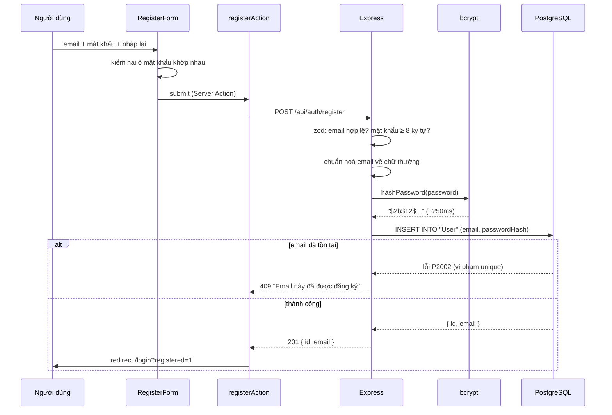
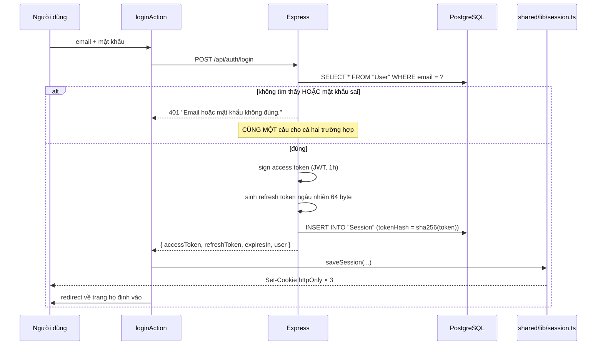
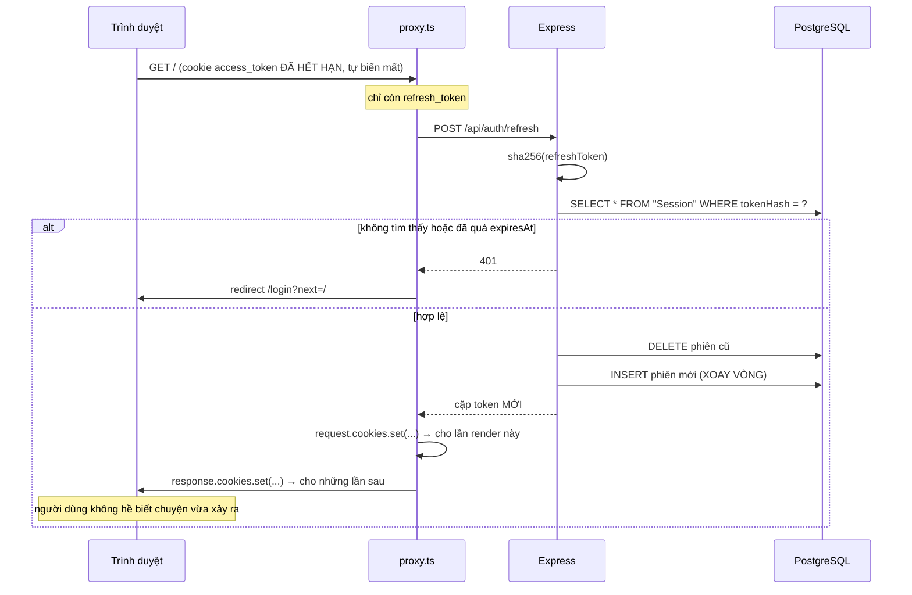
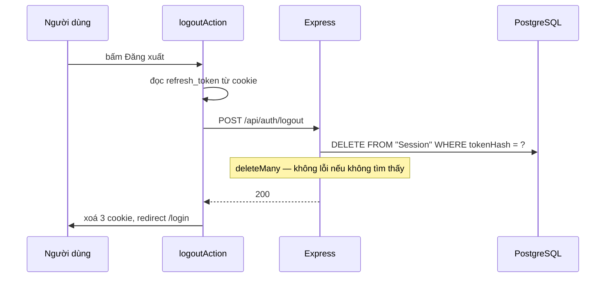

# 3. Luồng xác thực

Đây là chương dài nhất và cũng đáng đọc nhất. Xác thực là phần dễ làm sai nhất
của một ứng dụng web, và mỗi chỗ làm sai đều có một cái giá cụ thể.

Trước khi đi vào từng luồng, hãy nắm ba ý nền tảng.

---

## 3.1. Ba ý nền tảng

### Ý 1 — Mật khẩu không bao giờ được lưu dưới dạng chữ thật

Hãy giả định điều tệ nhất: một ngày nào đó database bị lộ. Chuyện đó xảy ra
thường xuyên hơn bạn tưởng — một bản backup để nhầm chỗ, một câu SQL injection,
một nhân viên cũ còn quyền truy cập.

Nếu cột mật khẩu chứa chữ thật, kẻ lấy được file dump có ngay danh sách email +
mật khẩu. Và vì đa số người dùng **dùng lại** mật khẩu ở nhiều nơi, thiệt hại lan
sang cả hộp thư, ngân hàng, mạng xã hội của họ. Bạn làm hỏng cả những tài khoản
không thuộc hệ thống của mình.

Nên ta lưu một **hash** — kết quả của một phép biến đổi một chiều:

```
"MatKhau123!"  ──bcrypt──▶  "$2b$12$Ot3k...w9Qe"   (dễ)
"$2b$12$Ot3k...w9Qe"  ──?──▶  "MatKhau123!"        (bất khả thi)
```

Lúc đăng nhập ta **không giải mã hash ngược lại**. Ta băm mật khẩu vừa nhập rồi
so sánh hai chuỗi hash.

Hệ quả: hệ thống này **không bao giờ biết mật khẩu thật** của người dùng — kể cả
bạn, người viết ra nó. Đó là một tính năng, không phải hạn chế.

> Nếu một website nào đó email lại đúng mật khẩu cũ của bạn — hãy đổi mật khẩu ở
> mọi nơi khác dùng chung mật khẩu đó. Họ đang lưu chữ thật.

**Chi tiết:** [`backend/src/lib/password.ts`](../backend/src/lib/password.ts)

### Ý 2 — bcrypt cố tình CHẬM, và đó là điểm mạnh

SHA-256 là hàm băm một chiều, nghe rất "bảo mật". Nhưng nó được thiết kế để
**nhanh** — một CPU thường băm hàng trăm triệu chuỗi mỗi giây, một card đồ hoạ
thì hàng chục tỷ.

Nhanh là đúng đắn khi bạn băm một file 2GB để kiểm tra toàn vẹn. Nhưng với mật
khẩu, nhanh chính là lỗ hổng:

| Hàm băm | Thời gian một lần | Kẻ tấn công thử được | Dò cạn 1 triệu mật khẩu phổ biến |
|---|---|---|---|
| SHA-256 | ~1 µs | 1.000.000 / giây | vài giây |
| bcrypt cost 12 | ~250 ms | 4 / giây | ~3 ngày |

Còn người dùng thật thì chỉ băm **đúng một lần** mỗi lần đăng nhập. 250ms với họ
là không cảm nhận được.

Đó là toàn bộ ý tưởng: **cái giá không đáng kể với một lần, nhưng không thể trả
nổi với vài triệu lần.**

Quy tắc chung, và nó giải thích vì sao dự án này dùng cả hai hàm băm:

| Dữ liệu | Đoán được không? | Dùng hàm băm nào |
|---|---|---|
| Mật khẩu (con người nghĩ ra) | ĐƯỢC — "123456" | bcrypt (chậm) |
| Refresh token (64 byte ngẫu nhiên) | 2⁵¹² khả năng | SHA-256 (nhanh) |

Chọn theo **độ khó đoán của dữ liệu đầu vào**, không chọn theo cảm giác "cái nào
nghe an toàn hơn".

### Ý 3 — Hai loại token, hai mục đích trái ngược

```
ACCESS TOKEN                      REFRESH TOKEN
JWT có chữ ký                     64 byte ngẫu nhiên
sống 1 giờ                        sống 30 ngày
gửi kèm MỌI request tới API       chỉ gửi khi cần gia hạn
KHÔNG tra database khi kiểm       CÓ tra bảng Session khi kiểm
không thu hồi được                thu hồi được (xoá hàng là xong)
```

Vì sao phải chia đôi? Vì JWT có một điểm yếu không khắc phục được:

> **JWT đã cấp ra thì không thu hồi được.**

Nó hợp lệ cho tới đúng giây hết hạn ghi bên trong, kể cả khi người dùng đã bấm
"đăng xuất", kể cả khi bạn đã xoá tài khoản họ. Không có nút tắt, vì backend có
hỏi ai đâu mà biết.

Cách xử lý là một đánh đổi hai tầng:

- **Access token** — không thu hồi được, nhưng tự chết sau một giờ. Đổi lại:
  kiểm cực nhanh, không tra database, chịu tải tốt.
- **Refresh token** — tra database nên chậm hơn, đổi lại thu hồi được ngay. Và
  nó hiếm khi được gửi đi (mỗi giờ một lần thay vì mỗi request), nên cái giá đó
  gần như không đáng kể.

Mỗi loại token được tối ưu cho đúng tần suất sử dụng của nó.

**Chi tiết:** [`backend/src/lib/jwt.ts`](../backend/src/lib/jwt.ts),
[`model Session`](../backend/prisma/schema.prisma)

---

## 3.2. JWT trông như thế nào

```
eyJhbGciOiJIUzI1NiIsInR5cCI6IkpXVCJ9.eyJpZCI6IjlmM2QiLCJlbWFpbCI6...  .  4Xk2p...
└──────────────┬──────────────────┘ └──────────────┬─────────┘        └───┬──┘
       HEADER (base64)                   PAYLOAD (base64)              CHỮ KÝ
   {"alg":"HS256","typ":"JWT"}     {"id":"9f3d","email":"..."}
```

> ⚠️ **Hiểu lầm lớn nhất về JWT: nó KHÔNG được mã hoá. Nó chỉ được KÝ.**

base64 không phải mã hoá — nó chỉ là một cách viết lại dữ liệu cho an toàn khi
truyền qua mạng. Bất kỳ ai cầm token cũng đọc được payload trong 5 giây. Thử ngay:

```bash
echo 'eyJpZCI6ImFiYyIsImVtYWlsIjoiYW5AZXhhbXBsZS5jb20ifQ==' | base64 -d
```

Hoặc dán một token thật vào <https://jwt.io> và xem nội dung hiện ra.

**Hệ quả bắt buộc phải nhớ:** không bao giờ đặt thông tin nhạy cảm vào payload.
Không mật khẩu, không số thẻ, không số căn cước.

Vậy chữ ký để làm gì? Để **chống sửa**. Kẻ tấn công đọc được `{"id":"user-7"}`
nhưng không thể đổi thành `{"id":"user-1"}` rồi dùng tiếp, vì hắn không có
`JWT_SECRET` để ký lại.

Tóm lại: JWT đảm bảo **tính toàn vẹn** (không ai sửa được), **không** đảm bảo
tính bí mật (ai cũng đọc được).

---

## 3.3. Luồng đăng ký



### Ba chi tiết đáng chú ý

**1. Băm mật khẩu TRƯỚC khi chạm database.** Thứ tự này đáng thành thói quen: mật
khẩu dạng chữ thật chỉ tồn tại trong RAM, trong đúng vài dòng code, rồi biến mất
cùng lời gọi hàm. Nó không bao giờ được `console.log`, không bao giờ được gửi vào
công cụ theo dõi lỗi. *Rất nhiều vụ lộ mật khẩu lớn không đến từ database bị
hack, mà đến từ một dòng log bị bỏ quên.*

**2. Để database phát hiện email trùng, đừng tự kiểm trước.** Tự kiểm bằng
`findUnique` rồi mới `create` là **không an toàn**:

```
Request A: findUnique("an@x.com") → null   ┐
Request B: findUnique("an@x.com") → null   ┤ cả hai đều thấy trống
Request A: create(...)            → OK     │
Request B: create(...)            → ???    ┘
```

Khe hở giữa lúc kiểm và lúc ghi có tên riêng: **TOCTOU** (*time-of-check to
time-of-use*). Không có cách nào đóng nó lại ở tầng code. Chỉ ràng buộc `@unique`
ở database mới có cái nhìn cuối cùng.

> **Cách nghĩ đáng mang theo:** *thử và xử lý thất bại* thường đúng đắn hơn *kiểm
> tra rồi mới làm*, mỗi khi giữa hai bước đó có người khác chen vào được.

**3. Chuẩn hoá email ngay tại cửa vào.** Postgres phân biệt hoa thường, nên
`"An@Gmail.com"` và `"an@gmail.com"` là hai giá trị khác nhau. Không chuẩn hoá
thì cùng một người đăng ký được hai tài khoản, và tệ hơn: hôm nay gõ chữ hoa đăng
ký, mai gõ chữ thường thì không đăng nhập được — mà họ chẳng hiểu vì sao vì mắt
thường nhìn hai chuỗi đó là một.

Thứ tự các bước zod quan trọng: `.trim()` → `.toLowerCase()` → `.email()`. Kiểm
định dạng phải đứng **cuối**, nếu không thì `" an@gmail.com"` bị từ chối oan chỉ
vì thừa một dấu cách người dùng vô tình copy vào.

---

## 3.4. Luồng đăng nhập



### Chi tiết bảo mật quan trọng nhất của cả dự án

Để ý là **hai trường hợp thất bại trả về cùng một thông báo**:

- email không tồn tại
- email có, nhưng mật khẩu sai

Vì sao không nói rõ ra cho người dùng dễ hiểu? Vì nếu phân biệt, API này biến
thành một công cụ dò danh sách người dùng. Kẻ tấn công thử lần lượt vài triệu
email với mật khẩu bậy:

```
"Email không tồn tại"  → địa chỉ này KHÔNG dùng dịch vụ của bạn
"Mật khẩu không đúng"  → địa chỉ này CÓ tài khoản ở đây ✓
```

Hắn thu được một danh sách email có thật. Danh sách đó đáng giá: để gửi thư lừa
đảo nhắm đúng đối tượng, để thử lại mật khẩu lộ từ vụ rò rỉ của trang khác (rất
hiệu quả vì người ta dùng lại mật khẩu), hoặc chỉ để bán.

Và với một số dịch vụ, riêng việc "ai đó có tài khoản ở đây" đã là thông tin nhạy
cảm — hãy nghĩ tới một ứng dụng sức khoẻ hay hẹn hò.

> ⚠️ **Cái bẫy rất dễ sập:** thông báo giống nhau là **chưa đủ**. Thời gian phản
> hồi cũng phải giống nhau. Nếu email không tồn tại thì server trả lời ngay lập
> tức (không chạy bcrypt), còn email có thật thì mất ~250ms để băm — kẻ tấn công
> chỉ cần bấm giờ là phân biệt được, dù đọc thấy cùng một câu chữ.
>
> Lỗ hổng đó có tên: **timing attack**. Dự án này **không** bịt nó (để code còn
> dễ đọc), nhưng bạn cần biết nó tồn tại. Cách bịt: luôn chạy bcrypt kể cả khi
> không tìm thấy user, bằng cách so với một chuỗi hash giả.

---

## 3.5. Luồng gia hạn — phần đáng học nhất

Access token sống một giờ. Không có gia hạn thì đúng một tiếng sau khi đăng nhập,
người dùng bị đá ra giữa chừng, kể cả khi đang gõ dở.



### Vì sao gia hạn phải nằm ở `proxy.ts`?

Vì gia hạn xong thì phải **lưu** token mới vào cookie, mà Next.js chỉ cho ghi
cookie ở ba nơi:

| Nơi | Ghi cookie được? |
|---|---|
| Server Component (`page.tsx`) | ❌ Không |
| Server Action | ✅ Có |
| Route Handler | ✅ Có |
| `proxy.ts` | ✅ Có |

Lý do rất vật lý: `Set-Cookie` là một HTTP header, mà header phải đi **trước** nội
dung. Tới lúc Server Component render thì header đã gửi đi rồi. Đây là cách HTTP
vận hành, không phải hạn chế do Next.js đặt ra.

Hiểu được điều đó thì bạn không phải học thuộc bảng trên — bạn tự suy ra được.

### Xoay vòng token (token rotation)

Mỗi refresh token chỉ dùng được **đúng một lần**. Dùng xong là bị xoá, và một
token mới được cấp.

Vì sao không giữ nguyên cho đơn giản? Vì refresh token sống 30 ngày. Nếu nó bị lộ
mà không bao giờ đổi, kẻ tấn công dùng được suốt 30 ngày mà không ai hay biết —
người dùng thật vẫn đăng nhập bình thường, không có dấu hiệu gì bất thường.

Có xoay vòng thì cửa sổ đó thu hẹp lại còn tới lần gia hạn kế tiếp.

Và có một hệ quả đẹp hơn nữa: **xoay vòng khiến việc dùng trộm trở nên phát hiện
được.** Nếu kẻ tấn công gia hạn trước, người dùng thật sẽ cầm một token đã bị xoá
và bị đá ra giữa phiên một cách khó hiểu. Hệ thống thật tận dụng tín hiệu đó: hễ
thấy ai dùng lại một token cũ thì xoá sạch mọi phiên của người dùng đó — vì chắc
chắn có hai bên đang cùng giữ token, và ta không biết bên nào là thật.

Kỹ thuật đó có tên: **refresh token reuse detection**. Dự án này dừng ở mức xoay
vòng đơn giản, để lại phần phát hiện như một bài tập.

### Cái bẫy phải nhớ

Vì token xoay vòng, `proxy.ts` **bắt buộc** phải ghi đè cookie `refresh_token`
bằng giá trị mới. Quên dòng đó thì hiện tượng rất khó hiểu:

> Mọi thứ chạy tốt trong một giờ đầu, rồi lần gia hạn **thứ hai** thất bại và
> người dùng bị đá ra.

Một bug chỉ xuất hiện sau hai tiếng đồng hồ — đúng loại bug không bao giờ bị phát
hiện lúc bạn ngồi test bằng tay.

---

## 3.6. Luồng đăng xuất



### Một sự thật về đăng xuất mà ít người nói rõ

Xoá cookie **không** làm access token hết hiệu lực. Nó vẫn là một JWT có chữ ký
hợp lệ cho tới khi hết một giờ.

Nhưng phần refresh token thì **khác**: xoá hàng trong bảng `Session` là thu hồi
được thật. Sau một giờ, khi access token chết, người dùng không còn cách nào gia
hạn nữa.

Nói cách khác: đăng xuất có hiệu lực **ngay** với trình duyệt (cookie mất), và
hiệu lực **hoàn toàn** sau tối đa một giờ.

Khi nào một giờ là quá lâu? Khi làm ngân hàng, y tế, hoặc bất cứ đâu mà "đăng
xuất" phải có hiệu lực tức thì. Lúc đó bạn phải đánh đổi: hoặc rút tuổi thọ access
token xuống rất ngắn (5 phút), hoặc giữ một danh sách token bị thu hồi và tra nó
ở mỗi request — tức là từ bỏ chính cái lợi "không cần tra database" đã khiến ta
chọn JWT ngay từ đầu.

**Không có phương án nào miễn phí.** Chọn theo cái giá bạn sẵn sàng trả.

### Vì sao `logout` không nằm sau `requireAuth`?

Vì tình huống cần đăng xuất nhất thường lại là tình huống access token đã hết
hạn. Bắt phải có token hợp lệ mới cho đăng xuất thì đúng lúc cần nhất lại không
dùng được.

Có sơ hở không? Rất ít. Thứ bảo vệ route này là chính refresh token. Kịch bản xấu
nhất là ai đó cầm được refresh token của bạn và... đăng xuất hộ bạn.

> **Nguyên tắc rút ra:** "cần đăng nhập" không phải lúc nào cũng là câu trả lời an
> toàn hơn. Hãy hỏi cụ thể: route này bảo vệ cái gì, và ai bị thiệt nếu nó mở?

---

## 3.7. Bảng API xác thực

| Method | Đường dẫn | Cần token? | Việc |
|---|---|---|---|
| POST | `/api/auth/register` | Không | Tạo tài khoản |
| POST | `/api/auth/login` | Không | Đổi email + mật khẩu lấy cặp token |
| POST | `/api/auth/refresh` | Không* | Đổi refresh token lấy cặp token mới |
| POST | `/api/auth/logout` | Không* | Xoá phiên khỏi database |
| GET | `/api/auth/me` | **Có** | Trả về danh tính đọc từ token |

\* Không cần *access* token, nhưng vẫn phải có refresh token hợp lệ.

---

## 3.8. Thí nghiệm để hiểu sâu hơn

Làm thật, đừng chỉ đọc. Làm xong nhớ hoàn tác.

1. **Đăng nhập, mở DevTools → Application → Cookies.** Thấy ba cookie, cột
   `HttpOnly` đều tick. Giờ gõ `document.cookie` vào Console: chuỗi trả về
   **không** chứa token. Đó là `httpOnly` đang làm việc.

2. **Mở Prisma Studio, xem cột `passwordHash`.** Đăng ký thêm một tài khoản với
   **đúng mật khẩu đó**. Hai chuỗi hash hoàn toàn khác nhau — đó là salt.

3. **Xoá cookie `access_token` (giữ hai cookie kia) rồi F5.** Trang vẫn hiện bình
   thường. Bạn vừa chứng kiến `proxy.ts` tự gia hạn. Kiểm tra lại bảng `Session`
   trong Prisma Studio: `tokenHash` đã đổi — đó là xoay vòng.

4. **Xoá cả ba cookie rồi F5.** Bị đá về `/login?next=/`. Đăng nhập lại sẽ quay
   đúng về trang cũ.

5. **Đổi `JWT_SECRET` trong `backend/.env` rồi khởi động lại backend.** Mọi
   access token đang lưu hành lập tức thành vô hiệu. Đây là "nút tắt khẩn cấp"
   duy nhất bạn có với JWT — và nó đá **tất cả** người dùng ra cùng lúc.

6. **Trong `todo.service.ts`, đổi `findFirst({ where: { id, userId } })` thành
   `findUnique({ where: { id } })`.** Tạo hai tài khoản, lấy id todo của tài khoản
   A gọi bằng token của B. Lỗ hổng IDOR xuất hiện ngay trước mắt. **Nhớ hoàn tác.**

7. **Gửi thẳng token bịa vào backend:**
   ```bash
   curl -H "Authorization: Bearer toi.tu.bia.ra" http://localhost:3000/api/todos
   ```
   Nhận 401. Giờ thử lấy một token thật, dán vào jwt.io, sửa `id` thành chuỗi
   khác rồi gửi lại — cũng 401, vì chữ ký không còn khớp.

---

**Tiếp theo:** [4. Cấu trúc thư mục](04-cau-truc-thu-muc.md)
