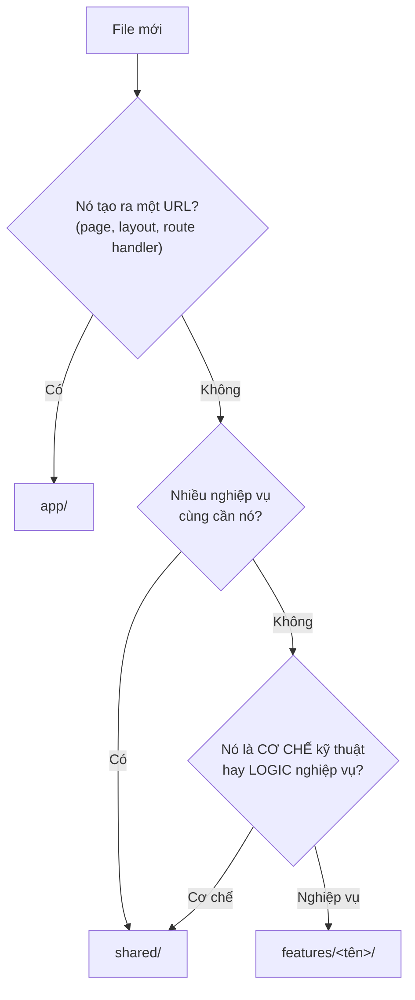

# 4. Cấu trúc thư mục

Hai phía của dự án tổ chức theo hai cách khác nhau, và sự khác nhau đó có lý do.

- **Backend** chia theo **tầng kỹ thuật** (routes / controllers / services)
- **Frontend** chia theo **nghiệp vụ** (features/auth, features/todos)

Chương này giải thích cả hai, và quan trọng hơn: dạy bạn cách quyết định một file
mới nên nằm ở đâu.

---

## 4.1. Backend — chia theo tầng

```
backend/
├── prisma/
│   ├── schema.prisma          bản thiết kế database
│   └── migrations/            lịch sử thay đổi cấu trúc, PHẢI commit lên git
├── src/
│   ├── index.ts               điểm khởi động, app.listen
│   ├── app.ts                 dây chuyền middleware — FILE QUAN TRỌNG NHẤT
│   ├── routes/                bản đồ URL → hàm
│   ├── controllers/           biết HTTP: req, res, status
│   ├── services/              biết nghiệp vụ + database
│   ├── schemas/               luật validate (zod)
│   ├── middlewares/           requireAuth, errorHandler, notFound
│   ├── lib/                   prisma, jwt, password, token, constants
│   ├── utils/                 AppError
│   └── types/                 mở rộng kiểu của Express
└── docker-compose.yml
```

### Vì sao backend không chia theo feature?

Một API server ở quy mô này có ranh giới tầng rất rõ và rất ổn định: mọi request
đều đi qua đúng một đường routes → controller → service → database. Chia theo tầng
thì đường đi đó hiện ra ngay trên cây thư mục.

Khi dự án lớn lên (hàng chục nghiệp vụ), cách này bắt đầu đuối: thư mục
`services/` phình ra với 40 file chẳng liên quan gì nhau. Lúc đó người ta chuyển
sang chia theo module — `modules/todo/{routes,controller,service}.ts` — tức là
chính cách frontend đang làm.

> **Bài học:** cấu trúc thư mục là công cụ phục vụ quy mô hiện tại, không phải
> chân lý. Chọn cái làm cho việc tìm code dễ nhất ở quy mô bạn đang có.

### Thứ tự đọc code backend

Đọc theo đúng thứ tự này, mỗi file đều được chuẩn bị bởi file trước đó:

1. [`src/index.ts`](../backend/src/index.ts) — điểm khởi động, `dotenv`, `app.listen`
2. [`src/app.ts`](../backend/src/app.ts) — dây chuyền middleware. **Quan trọng nhất**
3. [`src/routes/todo.routes.ts`](../backend/src/routes/todo.routes.ts) — bản đồ URL
4. [`src/controllers/todo.controller.ts`](../backend/src/controllers/todo.controller.ts) — khuôn `try/catch → next(err)`
5. [`src/schemas/todo.schema.ts`](../backend/src/schemas/todo.schema.ts) — validate với zod
6. [`src/services/todo.service.ts`](../backend/src/services/todo.service.ts) — Prisma và chống IDOR
7. [`prisma/schema.prisma`](../backend/prisma/schema.prisma) — cấu trúc bảng
8. [`src/middlewares/errorHandler.ts`](../backend/src/middlewares/errorHandler.ts) — quy ước 4 tham số

Phần xác thực đọc sau, khi đã nắm tám file trên:

9. [`src/lib/password.ts`](../backend/src/lib/password.ts) — bcrypt, salt. Đọc đầu tiên trong nhóm này
10. [`src/lib/jwt.ts`](../backend/src/lib/jwt.ts) — ký và kiểm token
11. [`src/lib/token.ts`](../backend/src/lib/token.ts) — refresh token và vì sao SHA-256
12. [`src/services/auth.service.ts`](../backend/src/services/auth.service.ts) — bốn luồng chính
13. [`src/middlewares/requireAuth.ts`](../backend/src/middlewares/requireAuth.ts) — nơi `req.user` sinh ra

---

## 4.2. Frontend — chia theo nghiệp vụ

```
frontend/src/
├── app/                       CHỈ routing — không có business logic
│   ├── layout.tsx
│   ├── page.tsx               → URL "/"
│   ├── loading.tsx
│   ├── login/page.tsx         → URL "/login"
│   ├── register/page.tsx      → URL "/register"
│   └── todos/[id]/            → URL "/todos/5"
│
├── features/                  NGHIỆP VỤ
│   ├── auth/
│   │   ├── actions.ts         Server Actions: đăng ký, đăng nhập, đăng xuất
│   │   ├── api.ts             gọi /api/auth/*
│   │   ├── types.ts
│   │   └── components/        LoginForm, RegisterForm, UserMenu
│   └── todos/
│       ├── actions.ts
│       ├── api.ts
│       ├── types.ts
│       └── components/        AddTodoForm, TodoItem, EditTodoForm, ...
│
├── shared/                    HẠ TẦNG dùng chung
│   ├── api/http.ts            ApiError, request, publicRequest
│   ├── lib/session.ts         đọc/ghi cookie phiên
│   ├── lib/format.ts
│   ├── config/constants.ts    ROUTES, COOKIE, PUBLIC_ROUTES
│   ├── types/api.ts           ApiResponse, FormState
│   └── components/            button.module.css, Skeleton.module.css
│
└── proxy.ts                   chặn cửa + tự gia hạn token
```

### Nguyên tắc 1 — `app/` chỉ dùng cho routing

Thư mục `app/` thuộc về Next.js. Nó chỉ nên chứa: page, layout, loading, error,
not-found, route handler, route group.

Nó **không** nên chứa: business logic, component nghiệp vụ, API client, service,
validation.

So sánh:

```
❌ Không tốt                    ✅ Tốt
app/                            app/
└── users/                      └── users/
    ├── page.tsx                    └── page.tsx
    ├── UserTable.tsx           features/
    ├── useUsers.ts             └── users/
    ├── user.service.ts             ├── components/
    └── user.schema.ts              ├── hooks/
                                    ├── services/
                                    └── schemas/
```

**Lợi ích cụ thể:** nếu mai này bạn chuyển dự án sang Pages Router, sang Vite +
React Router, hay React Native — bạn vứt bỏ thư mục `app/` và viết lại tầng
routing, còn `features/` giữ nguyên gần như toàn bộ.

> Next.js chỉ là framework. Business logic mới là tài sản của hệ thống.

Nhìn vào `app/login/page.tsx` sẽ thấy nguyên tắc này rõ nhất: nó chỉ đọc tham số
URL rồi giao hết cho `<LoginForm />`. Chưa tới 20 dòng code thật.

### Nguyên tắc 2 — Tổ chức theo nghiệp vụ, không theo loại kỹ thuật

```
❌ Không tốt                    ✅ Tốt
src/                            src/
├── components/                 └── features/
├── hooks/                          ├── auth/
├── services/                       ├── todos/
├── validators/                     ├── reports/
└── types/                          └── settings/
```

Chỉ cần nhìn cây thư mục là hiểu hệ thống đang có những nghiệp vụ gì.

Lợi ích khác, cụ thể hơn: khi sửa một tính năng, mọi file liên quan nằm cạnh
nhau. Với cách chia theo loại, sửa tính năng đăng nhập nghĩa là mở bốn thư mục
khác nhau và mỗi thư mục lại đầy những file chẳng liên quan.

### Nguyên tắc 3 — Chiều phụ thuộc chỉ đi MỘT hướng ⭐

Đây là luật quan trọng nhất, quan trọng hơn cả việc chia thư mục thế nào:

```
features/  ──được phép import──▶  shared/
shared/    ──KHÔNG BAO GIỜ────▶  features/
```

Và giữa các feature với nhau: **`features/auth/` không import từ
`features/todos/`** và ngược lại. Cần dùng chung thì đưa lên `shared/`.

Vì sao luật đó đáng giữ? Vì nếu `shared/` import ngược vào `features/`, bạn tạo ra
một vòng tròn: gỡ một feature ra thì `shared/` gãy, mà `shared/` gãy thì mọi
feature còn lại gãy theo. Lúc đó "chia theo feature" chỉ còn là hình thức — thực
chất mọi thứ vẫn dính chặt vào nhau.

Giữ đúng một chiều thì mỗi feature xoá đi được mà không ai hề hấn gì. **Đó mới là
thước đo thật của một cấu trúc thư mục tốt.**

---

## 4.3. Quyết định một file nên nằm ở đâu

Dùng cây câu hỏi này:



Câu hỏi kiểm chứng nhanh nhất:

> **"Nếu xoá feature này đi, file đó còn có ý nghĩa không?"**
>
> Còn → `shared/`. Không → `features/`.

### Một ví dụ thật từ chính dự án này

`shared/lib/session.ts` đọc và ghi cookie phiên đăng nhập. Nhìn qua thì nó rõ
ràng thuộc về nghiệp vụ auth. Vậy sao nó ở `shared/`?

Vì `shared/api/http.ts` cần đọc access token để gắn vào mỗi request — mà `http.ts`
là hạ tầng dùng chung cho **mọi** feature. Để `session.ts` trong `features/auth/`
sẽ tạo ra đúng cái chiều phụ thuộc bị cấm.

Ranh giới đúng ở đây là:

| File | Loại | Ở đâu |
|---|---|---|
| `shared/lib/session.ts` | **Cơ chế** — "token cất vào cookie ra sao" | `shared/` |
| `features/auth/actions.ts` | **Nghiệp vụ** — "đăng nhập, đăng ký, đăng xuất" | `features/` |

Cơ chế thì trung lập và ai cũng dùng được; nghiệp vụ thì thuộc về một feature.

Đây là một đánh đổi có ý thức, không phải sự tuỳ tiện — và nó minh hoạ một điều
quan trọng: **quy tắc về cấu trúc là công cụ, không phải luật thiêng liêng.** Khi
hai quy tắc mâu thuẫn, hãy chọn cái giữ cho việc làm đúng trở thành việc dễ.

---

## 4.4. Thêm một nghiệp vụ mới — ví dụ "nhãn" (tags)

Giả sử bạn muốn thêm tính năng gắn nhãn cho todo. Các bước, theo đúng thứ tự:

**Backend:**

```
1. prisma/schema.prisma          thêm model Tag
2. npm run prisma:migrate        sinh SQL + áp dụng
3. src/schemas/tag.schema.ts     luật validate
4. src/services/tag.service.ts   nghiệp vụ + query (NHỚ kèm userId!)
5. src/controllers/tag.controller.ts
6. src/routes/tag.routes.ts      nhớ router.use(requireAuth)
7. src/app.ts                    thêm app.use("/api/tags", tagRoutes)
```

**Frontend:**

```
1. features/tags/types.ts        kiểu Tag
2. features/tags/api.ts          gọi /api/tags
3. features/tags/actions.ts      Server Actions
4. features/tags/components/     TagList, TagPicker...
5. app/tags/page.tsx             chỉ dựng khung + gọi feature
6. shared/config/constants.ts    thêm ROUTES.tags
```

Để ý là bạn **không đụng tới `features/auth/` hay `features/todos/`**, và cũng
không phải sửa `shared/api/http.ts`. Đó chính là cái lợi mà cấu trúc này mua cho
bạn.

---

## 4.5. Thứ tự đọc code frontend

1. [`features/todos/types.ts`](../frontend/src/features/todos/types.ts) — hình dạng dữ liệu. Ngắn, dễ
2. [`shared/api/http.ts`](../frontend/src/shared/api/http.ts) — cách nói chuyện với backend
3. [`app/layout.tsx`](../frontend/src/app/layout.tsx) — khung bao ngoài, font, metadata
4. [`app/page.tsx`](../frontend/src/app/page.tsx) — Server Component đầu tiên. **Đọc kỹ**
5. [`features/todos/actions.ts`](../frontend/src/features/todos/actions.ts) — Server Action. Quan trọng nhất về khái niệm
6. [`features/todos/components/AddTodoForm.tsx`](../frontend/src/features/todos/components/AddTodoForm.tsx) — form + `useActionState`
7. [`features/todos/components/TodoItem.tsx`](../frontend/src/features/todos/components/TodoItem.tsx) — cách khác: sự kiện + `useTransition`
8. [`app/todos/[id]/page.tsx`](../frontend/src/app/todos/%5Bid%5D/page.tsx) — route động, `params`, `notFound()`

Phần đăng nhập đọc sau:

9. [`shared/lib/session.ts`](../frontend/src/shared/lib/session.ts) — đọc/ghi cookie. **Đọc file này trước**
10. [`features/auth/actions.ts`](../frontend/src/features/auth/actions.ts) — Server Actions xác thực
11. [`proxy.ts`](../frontend/src/proxy.ts) — chặn cửa + tự động gia hạn token
12. [`features/auth/components/LoginForm.tsx`](../frontend/src/features/auth/components/LoginForm.tsx) — form, `useActionState`

---

## 4.6. Đọc tiếp

Bốn chương của bộ tài liệu này đã hết. Đi sâu hơn ở hai file `LEARN.md`:

- **[backend/LEARN.md](../backend/LEARN.md)** — Express và Prisma: middleware,
  vòng đời request, bảng API đầy đủ, danh sách bẫy hay gặp
- **[frontend/LEARN.md](../frontend/LEARN.md)** — Next.js: Server Component và
  Client Component, Server Action, cache, file convention

Và rồi là chính code. Mọi file đều có comment giải thích không chỉ "làm gì" mà cả
"vì sao làm vậy" và "làm cách khác thì hỏng thế nào".
