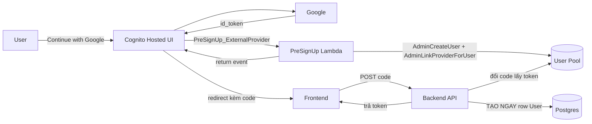
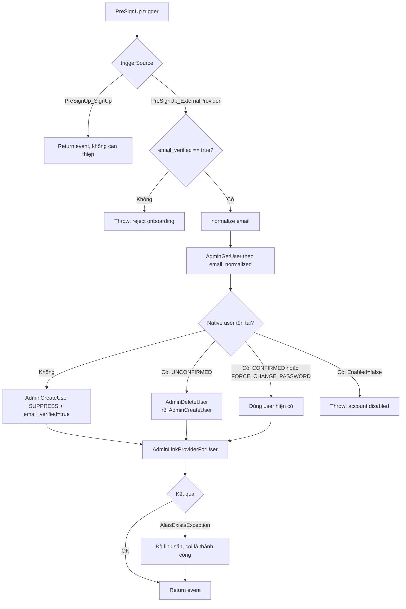
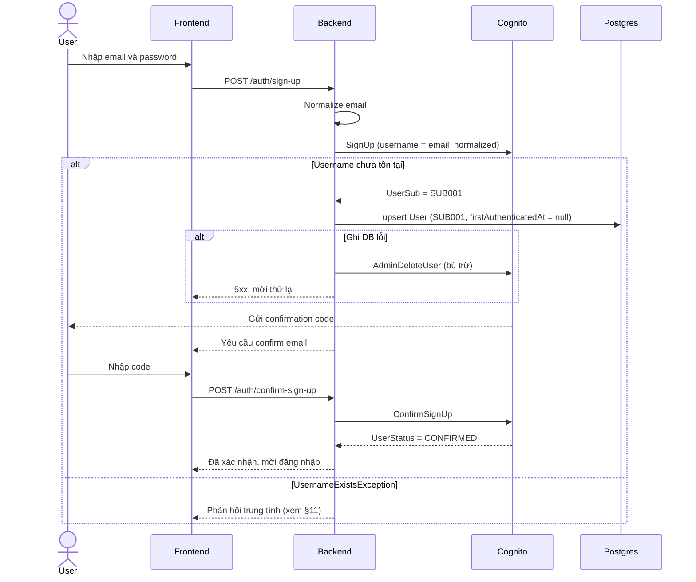
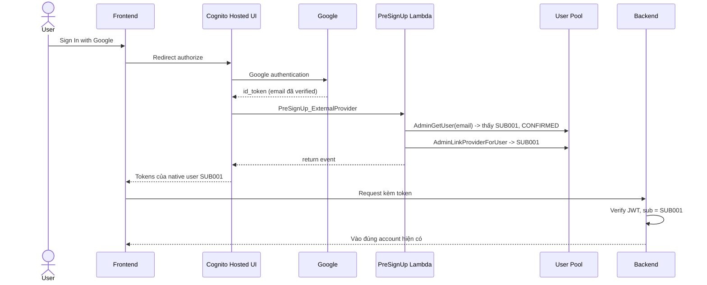
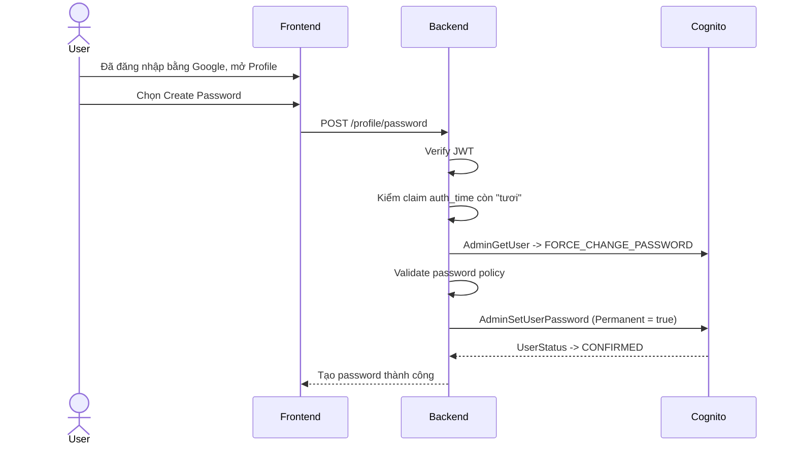
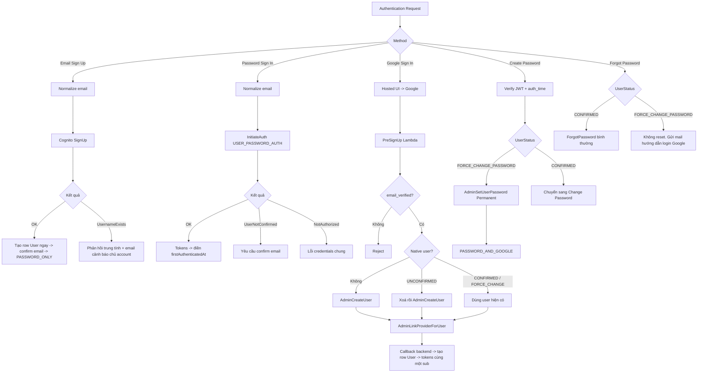

# AWS Cognito Authentication Flow — v2

> Bản v2 của `.note/aws cognito note.md`. Viết cho **một ứng dụng mới hoàn toàn** (greenfield), không kế thừa user pool hay dữ liệu nào có sẵn.
>
> Thay đổi lớn so với v1:
> 1. **PreSignUp Lambda trigger** trở thành component hạng nhất — đây là chỗ duy nhất account-linking thực sự chạy được.
> 2. **Bảng `User` trong Postgres luôn tồn tại và row được tạo ngay (eager)** trong chính luồng đăng ký / onboarding, không tạo lazy. Kèm cơ chế bù trừ và tự lành ở §5.5.
> 3. **Bỏ `INCOMPLETE_GOOGLE_ONBOARDING`**: trạng thái onboarding dở dang được biểu diễn bằng `firstAuthenticatedAt = null` — một sự thật do database sở hữu, không phải bản sao trạng thái của Cognito.
> 4. **Cognito là nguồn sự thật duy nhất về trạng thái auth**; Postgres giữ định danh, vòng đời row và dữ liệu nghiệp vụ. Bỏ enum `AccountState` và bảng `AuthProvider`.
> 5. **Native user `UNCONFIRMED` bị xoá** khi Google verified email trùng — vá lỗ hổng email squatting của v1 §5.2.
> 6. Thêm thứ tự lookup, cấu hình user pool bắt buộc, chính sách chống email enumeration, và mục "cần verify trong sandbox".

---

## 1. Mục tiêu và Golden rule

Hệ thống hỗ trợ hai phương thức xác thực: **Email + Password** và **Google Sign-In**.

```text
Golden rule

Same normalized verified email
    => Same application account
    => Same native Cognito user
    => Same cognito_sub
```

Nguyên tắc nền:

- Native Cognito user là account chính. Google chỉ là một phương thức xác thực gắn vào nó.
- `email_normalized` là **định danh nghiệp vụ**. `cognito_sub` là **định danh kỹ thuật** dùng trong DB và JWT.
- `cognito_sub` không đổi trong suốt vòng đời account, kể cả khi thêm Google hay thêm password.
- Không bao giờ tạo account thứ hai hay `cognito_sub` thứ hai cho cùng một normalized email.
- Google email bắt buộc `email_verified = true`.
- User **không phải** thao tác "Link Account" thủ công. Việc link là kỹ thuật, do hệ thống tự làm.

---

## 2. Quyết định kiến trúc

### 2.1 Native-first, link trong PreSignUp Lambda

Cognito, khi để mặc định, sẽ **tự tạo một user riêng** (`Google_<sub>`) cho mỗi federated identity ở lần đăng nhập đầu tiên. User đó có `sub` riêng. Đây chính là thứ phá vỡ Golden rule.

`AdminLinkProviderForUser` gộp federated identity vào native user, nhưng có một **ràng buộc cứng**: phải gọi **trước** lần federated sign-in đầu tiên. Gọi sau khi user `Google_*` đã tồn tại thì hoặc lỗi `AliasExistsException`, hoặc để lại user rác.

Google callback đi về **Cognito**, không về backend. Nên chỗ duy nhất chen vào kịp là **PreSignUp Lambda trigger** với `triggerSource = "PreSignUp_ExternalProvider"`.



Điểm mấu chốt: **backend không tham gia vào việc link**. Backend chỉ verify JWT và tạo row DB. Mọi logic linking nằm trong Lambda.

### 2.2 Vì sao không phải cách khác

| Phương án | Vì sao loại |
|---|---|
| Backend nhận Google callback rồi tự link | Không khả thi. Callback về Cognito, backend chỉ thấy id_token *sau khi* sub thứ hai đã được tạo. Đây là lỗi thiết kế của v1. |
| Backend tự chạy OAuth với Google, không dùng Cognito IdP | Sau khi verify Google id_token vẫn không có cách phát Cognito token cho user đó, ngoài `CUSTOM_AUTH` — lại cần 3 Lambda trigger nữa, phức tạp hơn và dễ sai bảo mật hơn. |
| Giữ 2 Cognito user, chỉ gộp ở tầng application (bảng map N sub → 1 user) | Chạy được và không cần Lambda, nhưng bỏ vế "same `cognito_sub`" của Golden rule. Chọn phương án này nếu bạn thấy Lambda không đáng. |
| Managed auth provider (Auth0, Clerk, Supabase Auth, WorkOS) | Giải quyết "same email = same account" sẵn trong sản phẩm, không cần §5–§8 của tài liệu này. Nếu chưa bị ràng buộc phải dùng Cognito, hãy cân nhắc nghiêm túc trước khi bắt đầu. |

**Kết luận:** không có cách nào giữ "same `cognito_sub`" mà không cần ít nhất một Lambda trigger. Đây là quyết định **day-one**: launch mà thiếu trigger, user federate xong là bạn có sub trùng vĩnh viễn và một cuộc migration rất đau.

---

## 3. Điều kiện tiên quyết

### 3.1 Cấu hình User Pool

```yaml
username_attribute: email_normalized     # username CHÍNH LÀ email đã normalize
alias_attributes: none                   # không bật alias, tránh AliasExistsException
required_attributes:
  - email
email_verified: quản lý bởi backend/Lambda, không để user tự set
mfa: off ở v1 (xem §14 nếu cần bật sau)
lambda_triggers:
  pre_sign_up: <ARN của PreSignUp Lambda>
identity_providers:
  - Google
    attribute_mapping:
      email: email
      email_verified: email_verified
    scopes: openid, email, profile
app_client:
  auth_flows: [ALLOW_USER_PASSWORD_AUTH, ALLOW_REFRESH_TOKEN_AUTH]
  prevent_user_existence_errors: true    # xem §11
```

> **Đánh đổi của `username = email_normalized`:** username trong Cognito là **immutable**. Nghĩa là user không bao giờ đổi được email. Với thiết kế coi email là định danh nghiệp vụ thì đây là đánh đổi chấp nhận được và đổi lại được sự đơn giản lớn (`AdminGetUser(email)` chạy trực tiếp). Nếu sản phẩm cần cho đổi email, phải chuyển sang `username = UUID` + `email` là alias attribute, và khi đó mọi thao tác admin phải xử lý thêm `AliasExistsException`.

### 3.2 Gửi email

Cognito mặc định giới hạn khoảng **50 email/ngày** — chỉ đủ để dev. App thật phải cấu hình **SES ngay từ day one** (verify domain, ra khỏi SES sandbox, cấu hình DKIM/SPF). Đây là thứ hay chặn launch vào phút chót.

### 3.3 Hosted UI hay custom UI

- **Password sign-in / sign-up**: dùng custom UI + `InitiateAuth` từ backend. Toàn quyền kiểm soát giao diện.
- **Google sign-in**: bắt buộc redirect qua Hosted UI / OAuth endpoint của Cognito. Không tránh được.

Nghĩa là UX sẽ lai: form tự vẽ cho password, redirect cho Google. Cần thống nhất điều này với thiết kế từ đầu.

### 3.4 Quyền IAM của Lambda

```text
cognito-idp:AdminGetUser
cognito-idp:AdminCreateUser
cognito-idp:AdminDeleteUser
cognito-idp:AdminLinkProviderForUser
cognito-idp:AdminUpdateUserAttributes
```

Backend cần thêm `AdminSetUserPassword` (cho Create Password ở §9) và `AdminDisableUser` / `AdminEnableUser`.

Mọi Admin API **chỉ chạy ở backend hoặc Lambda**, không bao giờ lộ ra client.

---

## 4. Chuẩn hoá email và thứ tự lookup

### 4.1 Normalize

```text
Input email
    => trim khoảng trắng
    => lowercase
    => email_normalized

" User@Gmail.com "  =>  "user@gmail.com"
```

Không áp dụng biến đổi phụ thuộc provider (xoá dấu chấm, xoá `+alias`) trừ khi đó là yêu cầu nghiệp vụ riêng — chúng khác nhau giữa các nhà cung cấp email và sẽ gộp nhầm hai người khác nhau.

### 4.2 Thứ tự lookup — quan trọng

```text
1. Tìm theo provider subject (Google sub) trước.
2. Chỉ khi không thấy, mới tìm theo email_normalized.
3. Email chỉ được dùng cho lần LINK ĐẦU TIÊN.
```

**Lý do:** Google Workspace admin có thể đổi hoặc tái cấp phát địa chỉ email cho người khác. Nếu luôn match bằng email, chủ mới của địa chỉ đó sẽ thừa hưởng account của chủ cũ. Sau khi đã link, quan hệ Google-sub ↔ native-user là quan hệ bền vững, còn email thì không.

Trong kiến trúc này, bước 1 do chính Cognito lo (identity đã link → federated sign-in trả về native user). Lambda chỉ chạy khi Cognito chưa biết identity đó, tức đúng lúc cần lookup theo email.

---

## 5. Mô hình dữ liệu

### 5.1 Nguyên tắc: Cognito là nguồn sự thật về auth

v1 nhân đôi trạng thái auth sang Postgres (`AccountState`, bảng `AuthProvider`). Điều đó tạo ra hai nguồn sự thật và **drift là chuyện chắc chắn xảy ra**, không phải rủi ro.

v2: Postgres chỉ giữ định danh và dữ liệu nghiệp vụ. Trạng thái auth **suy ra từ Cognito** khi cần.

### 5.2 Bảng suy ra trạng thái

Đọc bằng `AdminGetUser` → `UserStatus`, `Enabled`, và attribute `identities`.

| `UserStatus` | có Google trong `identities` | `Enabled` | Trạng thái logic |
|---|---|---|---|
| `UNCONFIRMED` | không | true | `UNCONFIRMED_PASSWORD` |
| `CONFIRMED` | không | true | `PASSWORD_ONLY` |
| `FORCE_CHANGE_PASSWORD` | có | true | `GOOGLE_ONLY` |
| `CONFIRMED` | có | true | `PASSWORD_AND_GOOGLE` |
| bất kỳ | bất kỳ | **false** | `DISABLED` |

Cơ chế: `AdminCreateUser` để user ở `FORCE_CHANGE_PASSWORD`. Chỉ khi user thực sự tạo password (`AdminSetUserPassword` với `Permanent=true`) thì mới chuyển sang `CONFIRMED`. Nhờ vậy `FORCE_CHANGE_PASSWORD` mang đúng nghĩa "chưa từng có password".

> **Nếu không muốn phụ thuộc vào ngữ nghĩa ngầm của `FORCE_CHANGE_PASSWORD`**, thêm custom attribute `custom:has_password` (`"true"` / `"false"`) và set tường minh. Rõ ràng hơn, đổi lại phải nhớ cập nhật ở mọi chỗ đổi password. Cognito vẫn là nguồn sự thật duy nhất trong cả hai cách.

### 5.3 Prisma model

```prisma
model User {
  id                   String    @id @default(uuid())
  cognitoSub           String    @unique
  email                String                   // giữ nguyên dạng user nhập, để hiển thị
  emailNormalized      String    @unique
  firstAuthenticatedAt DateTime?                // null = đã đăng ký nhưng chưa từng đăng nhập thành công
  createdAt            DateTime  @default(now())
  updatedAt            DateTime  @updatedAt

  // ... quan hệ nghiệp vụ
}
```

Không `AccountState`, không `AuthProvider` — đó vẫn là bản sao trạng thái của Cognito và vẫn sẽ drift.

**`firstAuthenticatedAt` thì khác và được giữ lại.** Nó không phải bản sao của bất cứ thứ gì trong Cognito: nó là một sự kiện do backend quan sát được và **database sở hữu**, nên về nguyên tắc không thể drift. Nó trả lời câu hỏi nghiệp vụ mà mọi báo cáo đều cần: "row này đã là một người dùng thật chưa, hay mới chỉ là một lần đăng ký bỏ dở?"

```text
firstAuthenticatedAt = null       => đã đăng ký, chưa bao giờ đăng nhập được
firstAuthenticatedAt != null      => người dùng thật
```

Hai unique constraint là **hàng rào cuối cùng** chống duplicate khi có race condition, nên bắt buộc phải có ở tầng database chứ không chỉ ở tầng code.

### 5.4 Ví dụ dữ liệu

```text
# Password-first, sau đó Google Sign-In cùng email
User
  emailNormalized      = "an@gmail.com"
  cognitoSub           = "SUB001"
  firstAuthenticatedAt = 2026-03-01T09:12:00Z
Cognito: UserStatus=CONFIRMED, identities=[Google]  =>  PASSWORD_AND_GOOGLE
```

```text
# Google-first, chưa tạo password (LƯU Ý: email khác, đây là user khác)
User
  emailNormalized      = "binh@gmail.com"
  cognitoSub           = "SUB002"
  firstAuthenticatedAt = 2026-03-04T14:40:00Z
Cognito: UserStatus=FORCE_CHANGE_PASSWORD, identities=[Google]  =>  GOOGLE_ONLY
```

> v1 §10 dùng **cùng** `user@gmail.com` cho cả hai ví dụ với `SUB001` và `SUB002` — vi phạm trực tiếp Golden rule và `emailNormalized @unique`. Đã sửa.

### 5.5 Vòng đời của row `User` — luôn tạo ngay

**Nguyên tắc: hễ Cognito có một user thì Postgres phải có một row `User` tương ứng.** Row được tạo **ngay trong luồng đăng ký / onboarding**, không đợi tới request đã xác thực đầu tiên.

Lý do: nếu tạo lazy thì một người đăng ký xong nhưng chưa bao giờ đăng nhập sẽ **không tồn tại** trong database. Khi đó không đếm được số đăng ký, không dựng được trang admin, không gắn được dữ liệu nghiệp vụ hay bản ghi audit vào họ, và không có khoá ngoại để tham chiếu. Với hầu hết sản phẩm thì đó là cái giá quá đắt.

Đổi lại, cách này làm sống lại class lỗi "Cognito thành công nhưng ghi DB thất bại" — thứ mà bản nháp trước né được. Ba cơ chế dưới đây xử lý nó một cách có giới hạn, không cần tới reconciliation job kiểu v1.

#### Thứ tự thao tác

Luôn là **Cognito trước, Postgres sau**. Không làm ngược lại, vì `cognitoSub` chỉ tồn tại sau khi Cognito trả lời, và ta không muốn có row với `cognitoSub` null.

| Luồng | Ai tạo row | Tại thời điểm nào |
|---|---|---|
| Password-first | Backend, trong `POST /auth/sign-up` | Ngay sau khi `SignUp` trả về `UserSub` |
| Google-first | Backend, trong `POST /auth/google/callback` | Ngay sau khi đổi code lấy token và verify id_token |

**PreSignUp Lambda không bao giờ đụng tới database.** Đưa Prisma và credential DB vào một Cognito trigger nghĩa là phải cấu hình VPC, chịu cold start, và đối mặt với cạn connection pool — trong khi backend đã đứng sẵn ở `/auth/google/callback` và làm được việc đó rẻ hơn nhiều. Lambda chỉ nói chuyện với Cognito.

#### Cơ chế 1 — Ghi eager, dùng `upsert` theo `emailNormalized`

```ts
// Dùng chung cho cả hai luồng
await prisma.user.upsert({
  where:  { emailNormalized },
  update: { cognitoSub, email },          // ghi đè sub, xem ghi chú bên dưới
  create: { cognitoSub, email, emailNormalized },
});
```

Khoá `upsert` bắt buộc là **`emailNormalized`**, không phải `cognitoSub`. Lý do quan trọng: khi Lambda **xoá** một native user `UNCONFIRMED` rồi tạo lại (§6, chống email squatting), native user mới mang một `sub` **khác**, trong khi row `User` cũ vẫn còn đó với sub cũ. `upsert` theo `emailNormalized` sẽ trỏ lại row đó sang sub mới — đúng như mong muốn, và không tạo row thứ hai. Nếu khoá theo `cognitoSub` thì sẽ sinh ra hai row cùng email và vi phạm `emailNormalized @unique`.

`upsert` cũng idempotent trước race condition: hai request song song thì một cái thắng, cái kia đọc lại row đã có.

#### Cơ chế 2 — Bù trừ khi ghi DB thất bại

Nếu Cognito đã thành công mà `upsert` ném lỗi, **hoàn tác phía Cognito rồi báo lỗi cho user**:

```ts
const { UserSub } = await cognito.signUp({ ... });

try {
  await prisma.user.upsert({ ... });
} catch (err) {
  // User đang ở UNCONFIRMED và chưa có bất kỳ dữ liệu nghiệp vụ nào.
  // Xoá đi là an toàn tuyệt đối và giữ hai hệ thống khớp nhau.
  await adminDeleteUser(emailNormalized).catch(() => {
    // Bù trừ cũng hỏng nốt: ghi log mức cao, để cleanup job ở Cơ chế 3 dọn.
    logger.error({ emailNormalized, UserSub }, "ORPHAN_COGNITO_USER");
  });
  throw err;
}
```

Với luồng Google-first thì **không xoá** native user (nó đã link Google, có thể là account cũ đang hoạt động). Thay vào đó trả 5xx và **không giao token cho frontend**. User bấm "Continue with Google" lần nữa: phía Cognito đã đúng và idempotent, Hosted UI còn session nên redirect gần như tức thì, backend ghi DB lại. Tự lành trong một cú click.

#### Cơ chế 3 — Lưới an toàn

Hai lớp cuối, cả hai đều rẻ:

1. **`upsert` trong `requireAuth`.** Vẫn giữ nguyên đoạn upsert ở middleware, chạy trên mọi request đã xác thực. Nó gần như không bao giờ phải tạo row, nhưng nếu Cơ chế 1 và 2 đều trượt thì lần gọi API tiếp theo của user sẽ tự vá. Đây cũng là nơi set `firstAuthenticatedAt` lần đầu.

   ```ts
   const claims = await verifier.verify(accessToken);
   const user = await prisma.user.upsert({
     where:  { emailNormalized },
     update: { cognitoSub: claims.sub },
     create: { cognitoSub: claims.sub, email, emailNormalized },
   });
   if (!user.firstAuthenticatedAt) {
     await prisma.user.update({
       where: { id: user.id },
       data:  { firstAuthenticatedAt: new Date() },
     });
   }
   ```

2. **Cleanup job định kỳ**, dọn theo cả hai chiều. Chạy mỗi ngày là đủ:

   ```text
   Chiều A — Cognito thừa:
     user UNCONFIRMED, tạo cách đây > 7 ngày
     => AdminDeleteUser, xoá luôn row User tương ứng nếu firstAuthenticatedAt = null

   Chiều B — Postgres thừa:
     row User có firstAuthenticatedAt = null, tạo cách đây > 7 ngày
     => kiểm AdminGetUser; nếu Cognito không còn user đó thì xoá row
   ```

   An toàn vì cả hai chiều đều chỉ đụng tới bản ghi có `firstAuthenticatedAt = null`, tức chưa bao giờ đăng nhập được nên chắc chắn chưa có dữ liệu nghiệp vụ. Account đã link Google luôn có `firstAuthenticatedAt` khác null, nên không bao giờ bị dọn nhầm.

#### Bất biến cần kiểm trong test

```text
1. Sau khi POST /auth/sign-up trả 2xx        => tồn tại đúng 1 row User
2. Sau khi POST /auth/google/callback 2xx    => tồn tại đúng 1 row User
3. Mọi row User đều có cognitoSub không null
4. Không bao giờ có 2 row cùng emailNormalized
5. Lambda xoá rồi tạo lại native user        => vẫn đúng 1 row, cognitoSub được cập nhật
```

---

## 6. PreSignUp Lambda — đặc tả

### 6.1 Luồng



### 6.2 Pseudocode

```ts
export async function handler(event: PreSignUpTriggerEvent) {
  if (event.triggerSource !== "PreSignUp_ExternalProvider") {
    return event; // native sign-up, không đụng tới
  }

  const attrs = event.request.userAttributes;

  // 1. Bắt buộc email đã verified
  if (attrs.email_verified !== "true" && attrs.email_verified !== true) {
    throw new Error("AUTH_GOOGLE_EMAIL_NOT_VERIFIED");
  }

  const emailNormalized = attrs.email.trim().toLowerCase();

  // event.userName có dạng "Google_<googleSub>"
  const googleSub = event.userName.split("_").slice(1).join("_");

  // 2. Tìm native user
  let existing = await tryAdminGetUser(emailNormalized);

  if (existing && existing.Enabled === false) {
    throw new Error("AUTH_ACCOUNT_DISABLED");
  }

  // 3. Native user UNCONFIRMED = email squatting -> xoá, Google verified thắng
  if (existing && existing.UserStatus === "UNCONFIRMED") {
    await adminDeleteUser(emailNormalized);
    existing = null;
  }

  // 4. Chưa có thì tạo, ở trạng thái chưa có password
  if (!existing) {
    try {
      await adminCreateUser({
        Username: emailNormalized,
        MessageAction: "SUPPRESS",            // không gửi mail mời
        UserAttributes: [
          { Name: "email",          Value: emailNormalized },
          { Name: "email_verified", Value: "true" },       // Google đã verify hộ
        ],
      });
    } catch (e) {
      if (e.name !== "UsernameExistsException") throw e;   // race: request kia thắng
    }
  }

  // 5. Link Google identity vào native user
  try {
    await adminLinkProviderForUser({
      UserPoolId: POOL_ID,
      DestinationUser: {
        ProviderName:           "Cognito",
        ProviderAttributeValue: emailNormalized,
      },
      SourceUser: {
        ProviderName:           "Google",
        ProviderAttributeName:  "Cognito_Subject",   // KHÔNG phải "email"
        ProviderAttributeValue: googleSub,
      },
    });
  } catch (e) {
    if (e.name !== "AliasExistsException") throw e;  // đã link rồi = thành công
  }

  return event;
}
```

### 6.3 Ba lỗi sai kinh điển cần tránh

1. **`ProviderAttributeName` phải là `"Cognito_Subject"`** và value là Google `sub`, **không phải** `"email"` và email. Dùng email sẽ link sai hoặc tạo liên kết không ổn định.
2. **`MessageAction: "SUPPRESS"`** — nếu quên, Cognito gửi email "mời tham gia kèm mật khẩu tạm" cho một user vừa đăng nhập Google thành công. Rất khó hiểu với người dùng.
3. **Phải tự set `email_verified: "true"`** khi `AdminCreateUser`. Nếu không, native user ở trạng thái email chưa verify và các luồng sau (forgot password, đổi email) sẽ hành xử lạ.

### 6.4 Idempotency và concurrency

- `UsernameExistsException` từ `AdminCreateUser` → nuốt, đọc lại user hiện có.
- `AliasExistsException` từ `AdminLinkProviderForUser` → coi là **thành công** (đã link sẵn).
- Hai Google login đầu tiên chạy song song: cả hai đều chạy được tới cùng kết quả nhờ hai điều trên; hàng rào cuối là `emailNormalized @unique` và `cognitoSub @unique` ở Postgres, tại bước backend ghi row `User` (§5.5).
- Nếu Lambda throw sau khi đã `AdminCreateUser` nhưng trước khi link xong: để lại một native user chưa link. Lần thử lại tìm thấy user đó ở bước 3 (`FORCE_CHANGE_PASSWORD`, không phải `UNCONFIRMED`), dùng lại nó và link tiếp. Tự lành, **không tạo native user thứ hai**.

### 6.5 Lambda không đụng database

Lambda chỉ nói chuyện với Cognito. Việc tạo row `User` thuộc về backend (§5.5).

Một hệ quả cần nhớ: khi Lambda **xoá** native user `UNCONFIRMED` rồi tạo lại (bước 3 ở §6.2), row `User` cũ vẫn còn trong Postgres và đang trỏ tới `sub` cũ đã biến mất. Đây không phải lỗi — backend sẽ sửa nó ở `/auth/google/callback` bằng `upsert` theo `emailNormalized`, ghi đè sang `sub` mới. Chính vì tình huống này mà khoá `upsert` **bắt buộc** là `emailNormalized` chứ không phải `cognitoSub`.

Khoảng thời gian row trỏ tới sub đã chết chỉ dài bằng một vòng redirect, và trong khoảng đó không token nào mang sub cũ còn hợp lệ.

### 6.6 Rate limit

`AdminCreateUser` nằm trong nhóm quota "user creation" của Cognito với TPS khá thấp. Đủ cho lưu lượng thông thường, nhưng nếu dự kiến có đợt đăng ký dồn (launch, campaign) thì cần xin tăng quota trước và có backoff trong Lambda.

---

## 7. Case A — Password-first

### 7.1 Sign Up và confirm email



Kết quả: `PASSWORD_ONLY`, và **row `User` đã tồn tại trong Postgres ngay từ bước sign-up** với `firstAuthenticatedAt = null`. Giá trị này chỉ được điền ở lần đăng nhập thành công đầu tiên (§5.5, Cơ chế 3).

### 7.2 Password Sign-In

```mermaid
sequenceDiagram
    actor U as User
    participant FE as Frontend
    participant API as Backend
    participant C as Cognito
    participant DB as Postgres

    U->>FE: Nhập email và password
    FE->>API: POST /auth/sign-in/password
    API->>API: Normalize email
    API->>C: InitiateAuth USER_PASSWORD_AUTH
    C-->>API: Tokens hoặc NotAuthorizedException
    API-->>FE: Tokens
    FE->>API: Request kèm access token
    API->>API: Verify JWT
    API->>DB: Row đã có; điền firstAuthenticatedAt nếu còn null
    API-->>FE: Dữ liệu người dùng
```

Nếu account là `GOOGLE_ONLY` (`FORCE_CHANGE_PASSWORD`), Cognito tự trả `NotAuthorizedException` — backend **không cần** gọi `AdminGetUser` trước để chặn. Xem §11 về nội dung thông báo.

### 7.3 Sau đó Sign In with Google cùng email

User **không** phải vào Profile, **không** phải bấm Link Google.



Kết quả: `PASSWORD_AND_GOOGLE`, vẫn `SUB001`.

Không tạo: application account mới, native Cognito user mới, `cognito_sub` mới.

---

## 8. Case B — Google-first

```mermaid
sequenceDiagram
    actor U as User
    participant FE as Frontend
    participant HUI as Cognito Hosted UI
    participant G as Google
    participant L as PreSignUp Lambda
    participant C as User Pool
    participant API as Backend
    participant DB as Postgres

    U->>FE: Continue with Google
    FE->>HUI: Redirect authorize
    HUI->>G: Google authentication
    G-->>HUI: id_token + email_verified
    HUI->>L: PreSignUp_ExternalProvider
    L->>L: Kiểm email_verified, normalize
    L->>C: AdminGetUser -> không có
    L->>C: AdminCreateUser (SUPPRESS, email_verified=true)
    C-->>L: Native user SUB001, FORCE_CHANGE_PASSWORD
    L->>C: AdminLinkProviderForUser -> SUB001
    L-->>HUI: return event
    HUI-->>FE: Redirect kèm authorization code
    FE->>API: POST /auth/google/callback (code)
    API->>C: Đổi code lấy token, verify id_token
    API->>DB: upsert User theo emailNormalized (SUB001)
    alt Ghi DB lỗi
        API-->>FE: 5xx, KHÔNG giao token
        Note over FE,API: User bấm lại; Cognito đã đúng nên tự lành
    end
    API-->>FE: Tokens + đăng nhập thành công
```

Kết quả: `GOOGLE_ONLY`, `cognito_sub = SUB001`, chưa có password, và **row `User` đã tồn tại** với `firstAuthenticatedAt` được điền ngay (khác với password-first, ở đây user đã thực sự đăng nhập được).

Lưu ý: **không xoá native user để bù trừ** trong luồng này. Nó đã được link Google và có thể là account cũ đang hoạt động. Chỉ trả lỗi và để user thử lại — xem §5.5, Cơ chế 2.

---

## 9. Create Password trong Profile



Kết quả: `PASSWORD_AND_GOOGLE`. **`cognito_sub` không đổi.**

**Recent authentication:** Cognito không tự enforce điều này. Backend phải tự đọc claim **`auth_time`** trong id_token và từ chối nếu quá ngưỡng (ví dụ 5 phút), trả `AUTH_RECENT_LOGIN_REQUIRED` để frontend yêu cầu đăng nhập lại. v1 nêu yêu cầu này nhưng không nói cách thực hiện.

Gọi lại lần hai khi đã `CONFIRMED` → từ chối, hướng sang luồng Change Password (`PUT /profile/password`, yêu cầu password cũ).

---

## 10. Decision flow tổng hợp



---

## 11. Chính sách chống email enumeration

v1 có mâu thuẫn nội bộ: §7.3/§7.4/§7.5 đưa thông báo rất cụ thể ("Tài khoản này đã được tạo bằng Google"), trong khi checklist §13 lại yêu cầu không lộ thông tin nhạy cảm. Thông báo cụ thể nói cho một caller ẩn danh biết email đó **có tồn tại** và **đăng ký bằng cách nào**.

Phải chọn một cách có ý thức:

### Mode A — Enumeration-safe (mặc định khuyến nghị cho app public)

| Tình huống | Phản hồi HTTP | Hành động phụ |
|---|---|---|
| Sign Up với email đã tồn tại | Giống hệt trường hợp thành công: "Đã gửi mã xác nhận tới email của bạn" | Gửi email cho **chủ account thật**: "có người vừa thử đăng ký bằng email của bạn; nếu là bạn, hãy đăng nhập" |
| Password sign-in sai / account chưa có password | `AUTH_INVALID_CREDENTIALS` chung | — |
| Forgot password cho account `GOOGLE_ONLY` | "Nếu tài khoản tồn tại, chúng tôi đã gửi hướng dẫn" | Gửi email: "tài khoản của bạn đăng nhập bằng Google; hãy đăng nhập bằng Google rồi tạo mật khẩu trong Profile" |
| Google email chưa verified | Reject với thông báo rõ (không lộ gì về hệ thống) | — |

Điểm hay: **kênh email trở thành nơi nói sự thật**, vì chỉ chủ hộp thư đọc được. UX vẫn tốt mà không lộ thông tin cho người lạ. Bật `prevent_user_existence_errors: true` trên app client cho khớp.

### Mode B — Thông báo trực tiếp

Trả thẳng `AUTH_GOOGLE_LOGIN_REQUIRED`, `AUTH_PASSWORD_NOT_CONFIGURED`... như v1. UX mượt hơn rõ rệt.

Chỉ chọn khi: sản phẩm nội bộ / B2B có kiểm soát, **hoặc** đã có rate limit chặt theo IP và theo email trên mọi endpoint auth public, và đã chấp nhận rủi ro một cách tường minh.

**Không được trộn hai mode.** Rò rỉ ở một endpoint là đủ để enumerate.

---

## 12. Edge cases

Các case của v1 đã được kiểm lại. Nhiều case biến mất nhờ kiến trúc mới.

| Case | Xử lý | So với v1 |
|---|---|---|
| Google callback không có verified email | Lambda throw, không tạo native user, không lookup theo email chưa verify | Giữ nguyên |
| Native user `UNCONFIRMED`, Google verified cùng email | **Xoá native user đó**, tạo lại và link Google. Row `User` cũ được giữ nguyên và trỏ sang `sub` mới qua `upsert` theo `emailNormalized` | **Sửa lỗi bảo mật.** v1 reject → cho phép squat email của người khác vĩnh viễn. Còn nếu chỉ confirm user đó thì password của kẻ squat vẫn hiệu lực → chiếm quyền. Xoá là an toàn vì row đó có `firstAuthenticatedAt = null`, tức chưa có dữ liệu nghiệp vụ |
| Google identity đã thuộc account khác | `AliasExistsException` với destination khác → Lambda throw, ghi audit log, không chuyển ownership | Giữ nguyên |
| Hai Google callback song song | Nuốt `UsernameExistsException` + `AliasExistsException`; unique constraint DB là hàng rào cuối | Giữ nguyên, đơn giản hơn |
| Sign-up: Cognito xong nhưng ghi DB thất bại | Bù trừ bằng `AdminDeleteUser` (user đang `UNCONFIRMED`, chưa có gì để mất), trả lỗi cho user | Có cơ chế bù trừ rõ ràng thay cho reconciliation job mơ hồ của v1 |
| Google callback: Cognito xong nhưng ghi DB thất bại | **Không xoá native user.** Trả 5xx và không giao token. User bấm lại là tự lành trong một cú click | Thay §7.9 của v1 |
| Cả bù trừ cũng thất bại | Ghi log `ORPHAN_COGNITO_USER`; cleanup job hai chiều ở §5.5 dọn sau 7 ngày; `upsert` ở `requireAuth` vá ngay nếu user quay lại sớm hơn | Ba lớp, thay cho reconciliation job |
| Tạo native user xong nhưng link Google thất bại | Lần thử lại tìm thấy user `FORCE_CHANGE_PASSWORD` chưa link, dùng lại và link tiếp. Tự lành | **Bỏ** state `INCOMPLETE_GOOGLE_ONBOARDING` |
| Google-first user thử Sign Up bằng password | `UsernameExistsException` → theo Mode A hoặc B ở §11 | Sửa thông báo |
| Google-first user thử Sign In bằng password | Cognito trả `NotAuthorizedException` → theo §11 | Không cần chặn thủ công |
| Google-only user bấm Forgot Password | Backend kiểm `UserStatus`; `FORCE_CHANGE_PASSWORD` thì không gọi `ForgotPassword` (Cognito sẽ lỗi), xử lý theo §11 | Giữ nguyên, thêm cách làm |
| Create Password khi chưa đăng nhập | 401. Không bao giờ cho tạo password chỉ bằng email | Giữ nguyên |
| Create Password lần hai | `UserStatus = CONFIRMED` → chuyển sang Change Password | Giữ nguyên |
| User chưa confirm email quá lâu | Cleanup job xoá native user `UNCONFIRMED` quá hạn (ví dụ 7 ngày). An toàn vì trạng thái này không bao giờ có Google link | Đơn giản hơn: không còn nguy cơ xoá nhầm |
| Account bị `DISABLED` | `AdminDisableUser`. Lambda throw khi `Enabled = false`. Password sign-in tự fail. **Bật lại** bằng `AdminEnableUser`. Xoá vĩnh viễn: `AdminDeleteUser` + xoá row DB theo quy trình GDPR | **Bổ sung.** v1 có state này nhưng không có đường vào, đường ra, cũng không có trong decision flow |
| Google email đổi chủ (Workspace tái cấp phát) | Đã link theo Google `sub` nên vẫn về đúng native user cũ. Nếu đây là rủi ro thật với tệp khách hàng B2B, cần quy trình offboarding riêng | **Bổ sung**, xem §4.2 |

---

## 13. API surface

```text
POST /auth/sign-up                 Đăng ký bằng email + password
POST /auth/confirm-sign-up         Xác nhận bằng code
POST /auth/resend-confirmation     Gửi lại code
POST /auth/sign-in/password        Đăng nhập bằng password
POST /auth/refresh                 Làm mới token
POST /auth/sign-out                Global sign-out (revoke refresh token)

POST /auth/forgot-password         Bắt đầu reset (xem §11)
POST /auth/confirm-forgot-password Hoàn tất reset

GET  /auth/google/url              Trả URL authorize của Hosted UI
POST /auth/google/callback         Đổi code lấy token, tạo row User, trả token

GET  /profile/auth-methods         Trạng thái auth, suy ra từ Cognito (§5.2)
POST /profile/password             Tạo password lần đầu cho GOOGLE_ONLY
PUT  /profile/password             Đổi password (yêu cầu password cũ)
```

**Không có endpoint public để user tự Link Google.** Linking là kỹ thuật, do Lambda làm.

Mọi endpoint auth public phải có rate limit theo IP **và** theo email.

---

## 14. Những thứ chưa nằm trong phạm vi v1 nhưng phải quyết sớm

| Chủ đề | Ghi chú |
|---|---|
| **Token lifetime** | Access token 15–60 phút, ID token cùng mức, refresh token 30 ngày. Bật **refresh token rotation**. |
| **Sign-out** | `GlobalSignOut` / `RevokeToken`. Frontend xoá token cục bộ **không phải** là đăng xuất. Với Hosted UI cần gọi cả endpoint `/logout` để xoá session của Cognito, nếu không lần bấm "Continue with Google" tiếp theo sẽ vào thẳng account cũ. |
| **MFA** | Nếu có khả năng cần trong 12 tháng tới thì bật `optional` từ đầu — chuyển từ `off` sang `optional` về sau đơn giản hơn nhiều so với chuyển sang `required`. Lưu ý user `GOOGLE_ONLY` không có password để làm yếu tố thứ nhất theo cách thông thường. |
| **Xoá tài khoản / GDPR** | Cần quy trình: `AdminDeleteUser` + xoá hoặc ẩn danh hoá row Postgres + xử lý dữ liệu nghiệp vụ liên quan. Quyết định trước khi có dữ liệu thật. |
| **Audit log** | Bắt buộc log: mọi lần link provider, mọi xung đột (`AliasExists`, provider thuộc account khác), mọi lần xoá user `UNCONFIRMED`, mọi thao tác Admin API. Đây là bằng chứng khi có sự cố tranh chấp account. |
| **Cost** | Cognito tính theo MAU. Advanced Security Features tính phí riêng và không rẻ — quyết định có bật hay không từ đầu. |
| **Region / data residency** | User pool không di chuyển được giữa region. Chọn đúng ngay lần đầu. |

---

## 15. Error codes

```text
AUTH_INVALID_CREDENTIALS              Dùng chung cho mọi lỗi đăng nhập ở Mode A
AUTH_EMAIL_UNCONFIRMED
AUTH_GOOGLE_EMAIL_NOT_VERIFIED
AUTH_RECENT_LOGIN_REQUIRED
AUTH_PASSWORD_POLICY_VIOLATION
AUTH_ACCOUNT_DISABLED
AUTH_RATE_LIMITED

# Chỉ dùng ở Mode B (§11)
AUTH_ACCOUNT_ALREADY_EXISTS
AUTH_GOOGLE_LOGIN_REQUIRED
AUTH_PASSWORD_NOT_CONFIGURED

# Nội bộ, chỉ ghi log, không trả ra client
AUTH_PROVIDER_OWNED_BY_ANOTHER_ACCOUNT
AUTH_LINK_CONFLICT
```

Thông báo ở Mode A:

```yaml
AUTH_INVALID_CREDENTIALS:
  message: "Email hoặc mật khẩu không đúng."

AUTH_EMAIL_UNCONFIRMED:
  message: "Tài khoản chưa được xác minh. Vui lòng kiểm tra email."

AUTH_GOOGLE_EMAIL_NOT_VERIFIED:
  message: "Không thể xác minh email từ Google. Vui lòng dùng một tài khoản Google có email đã được xác minh."

AUTH_RECENT_LOGIN_REQUIRED:
  message: "Vui lòng đăng nhập lại để thực hiện thao tác này."
```

---

## 16. Quy tắc bắt buộc cho AI coding agent

```yaml
architecture:
  pattern: native_first_with_presignup_lambda
  linking_location: presignup_lambda_trigger      # KHÔNG phải backend API
  backend_never_handles_google_callback_linking: true
  lambda_never_touches_database: true

user_row:
  always_exists: true
  created: eagerly_in_signup_and_google_callback      # KHÔNG lazy
  created_by: backend                                 # KHÔNG phải Lambda
  order: cognito_first_then_postgres
  upsert_key: email_normalized                        # KHÔNG phải cognito_sub
  on_db_failure_signup: compensate_with_admin_delete_user
  on_db_failure_google_callback: return_5xx_without_tokens
  safety_net: [upsert_in_require_auth, daily_two_way_cleanup_job]
  lifecycle_field: firstAuthenticatedAt               # null = chưa từng đăng nhập được

identity:
  business_identity: email_normalized
  technical_identity: cognito_sub
  cognito_username: email_normalized
  lookup_order: [provider_subject, email_normalized]
  email_used_only_for_first_link: true
  same_email_same_account: true
  same_email_same_cognito_sub: true
  cognito_sub_immutable: true

email:
  normalize_trim: true
  normalize_lowercase: true
  no_provider_specific_transforms: true
  google_email_must_be_verified: true

state:
  source_of_truth: cognito
  never_duplicate_auth_state_in_postgres: true
  derive_from: [UserStatus, identities, Enabled]
  postgres_holds: [id, cognitoSub, email, emailNormalized, business_data]

lambda:
  trigger: pre_sign_up
  handles_only: PreSignUp_ExternalProvider
  admin_create_user:
    message_action: SUPPRESS
    set_email_verified: true
  admin_link_provider_for_user:
    provider_attribute_name: Cognito_Subject      # KHÔNG phải email
    provider_attribute_value: google_sub
  unconfirmed_native_user_with_same_email: delete_then_recreate
  swallow_exceptions: [UsernameExistsException, AliasExistsException]
  throw_on: [email_not_verified, account_disabled, link_conflict]

create_password:
  location: authenticated_profile_only
  require_fresh_auth_time: true
  max_auth_age_seconds: 300
  api: AdminSetUserPassword
  permanent: true
  keep_same_cognito_sub: true
  reject_if_user_status_confirmed: true           # đã có password -> Change Password

security:
  admin_cognito_operations_backend_or_lambda_only: true
  never_link_unverified_email: true
  enumeration_mode: A                             # xem §11
  rate_limit_all_public_auth_endpoints: true
  audit_linking_and_conflicts: true

reliability:
  signup_idempotent: true
  google_onboarding_idempotent: true
  concurrency_guard: unique_constraints_on_email_normalized_and_cognito_sub
  cleanup_job: two_way_daily                          # Cognito thừa + Postgres thừa
  cleanup_only_touches_rows_with_null_first_authenticated_at: true
  cleanup_unconfirmed_users_after_days: 7
```

---

## 17. Acceptance checklist

### Cấu hình

```text
[ ] username attribute = email_normalized, không bật alias attributes
[ ] PreSignUp Lambda đã gắn vào user pool
[ ] Lambda có đủ 5 quyền IAM ở §3.4
[ ] SES đã cấu hình, đã ra khỏi sandbox
[ ] prevent_user_existence_errors bật (nếu chọn Mode A)
[ ] Attribute mapping của Google IdP có cả email và email_verified
```

### Identity

```text
[ ] Email được trim và lowercase trước mọi thao tác
[ ] emailNormalized có unique constraint ở database
[ ] cognitoSub có unique constraint ở database
[ ] Cùng email luôn trả về cùng cognito_sub, qua mọi luồng
[ ] cognito_sub không đổi khi thêm Password hoặc Google
[ ] Không có bản sao trạng thái auth nào trong Postgres
```

### Password-first

```text
[ ] Sign Up tạo native user UNCONFIRMED
[ ] Chưa confirm thì không đăng nhập được
[ ] Resend confirmation hoạt động
[ ] Google Sign-In cùng email vào đúng account hiện có, cùng sub
[ ] User không phải thao tác Link Google thủ công
[ ] Không phát sinh account hay sub mới sau khi link
```

### Google-first

```text
[ ] Google email chưa verified bị reject ở Lambda
[ ] Native user được tạo với SUPPRESS và email_verified = true
[ ] Sau link, UserStatus = FORCE_CHANGE_PASSWORD (tức GOOGLE_ONLY)
[ ] Password sign-in trước khi tạo password bị từ chối
[ ] Forgot password trước khi tạo password không gọi Cognito ForgotPassword
[ ] Create Password đổi UserStatus sang CONFIRMED, sub giữ nguyên
[ ] Create Password lần hai chuyển sang Change Password
[ ] Create Password yêu cầu auth_time còn tươi
```

### Bảo mật

```text
[ ] Native user UNCONFIRMED bị XOÁ khi Google verified email trùng
[ ] Không endpoint public nào lộ sự tồn tại của email (nếu Mode A)
[ ] Rate limit trên mọi endpoint auth public
[ ] Admin API không bao giờ gọi được từ client
[ ] Mọi lần link và mọi xung đột đều có audit log
[ ] Google identity thuộc account khác bị từ chối, không chuyển ownership
[ ] Sign-out gọi cả GlobalSignOut và /logout của Hosted UI
```

### Độ tin cậy

```text
[ ] Sau mỗi sign-up thành công, tồn tại đúng 1 row User
[ ] Sau mỗi Google callback thành công, tồn tại đúng 1 row User
[ ] Mọi row User đều có cognitoSub không null
[ ] Sign-up ghi DB lỗi -> Cognito user bị xoá bù trừ, không để lại rác
[ ] Google callback ghi DB lỗi -> KHÔNG xoá native user, không giao token
[ ] Lambda xoá và tạo lại native user -> vẫn 1 row, cognitoSub được cập nhật sang sub mới
[ ] Hai Google login đầu tiên chạy song song không tạo duplicate
[ ] Lambda throw giữa chừng, thử lại thành công, không tạo native user thứ hai
[ ] upsert ở requireAuth vá được row thiếu mà không tạo row thứ hai
[ ] firstAuthenticatedAt chỉ được điền một lần, ở lần đăng nhập đầu tiên
[ ] Cleanup job hai chiều chỉ đụng row có firstAuthenticatedAt = null
[ ] Cleanup user UNCONFIRMED quá hạn không đụng tới account đã link Google
```

---

## 18. Cần verify trong sandbox trước khi code thật

Đây là những điểm tôi **không khẳng định chắc chắn**. Dựng một user pool nháp và kiểm chứng trước khi xây dựng lên trên:

1. **Federated sign-in trên user đang ở `FORCE_CHANGE_PASSWORD`.** Toàn bộ trạng thái `GOOGLE_ONLY` dựa vào giả định này chạy được. Kiểm tra ngay đầu tiên, vì nếu sai thì phải chuyển sang custom attribute `custom:has_password` và tạo user theo cách khác.
2. **Lần đăng nhập đầu sau khi link trong PreSignUp.** Có báo cáo rằng khi link ngay bên trong `PreSignUp_ExternalProvider`, lần đầu tiên user có thể nhận lỗi và phải đăng nhập lại một lần nữa mới vào được. Nếu tái hiện được, giảm thiểu bằng cách cho frontend tự retry redirect OAuth một lần và không hiển thị lỗi ở lần đầu.
3. **Nội dung `event.userName`** ở trigger external provider — xác nhận đúng dạng `Google_<sub>` và cách tách `sub` an toàn (Google `sub` là chuỗi số, nhưng đừng giả định điều đó cho provider khác sau này).
4. **Ngoại lệ chính xác** mà `AdminLinkProviderForUser` ném ra khi identity đã link vào một destination **khác**. Cần phân biệt được với trường hợp "đã link đúng vào chính user này" — hai tình huống này phải xử lý ngược nhau.
5. **Giá trị `UserStatus`** sau `AdminSetUserPassword(Permanent=true)` trên user đang `FORCE_CHANGE_PASSWORD` — xác nhận đúng là `CONFIRMED`, vì bảng suy ra ở §5.2 phụ thuộc vào nó.

---

## 19. Kết luận

```text
Password-first:
  Sign Up  =>  confirm email  =>  PASSWORD_ONLY
           =>  Google Sign-In cùng email
           =>  PreSignUp Lambda link vào native user
           =>  PASSWORD_AND_GOOGLE, cùng account, cùng cognito_sub
```

```text
Google-first:
  Google Sign-In
           =>  PreSignUp Lambda tạo native user + link
           =>  GOOGLE_ONLY (FORCE_CHANGE_PASSWORD)
           =>  login Google rồi Create Password trong Profile
           =>  PASSWORD_AND_GOOGLE, cùng account, cùng cognito_sub
```

Ba thứ quyết định thành bại của thiết kế này:

1. **PreSignUp Lambda phải có mặt từ ngày đầu tiên.** Không retrofit được rẻ.
2. **Cognito là nguồn sự thật duy nhất về trạng thái auth.** Đừng nhân đôi sang Postgres.
3. **Bảng `User` luôn có row, tạo ngay trong luồng đăng ký.** Đây là quyết định đắt hơn — nó làm sống lại class lỗi "Cognito xong, DB fail" — nên phải trả giá đầy đủ bằng ba cơ chế ở §5.5: ghi eager, bù trừ, và lưới an toàn. Bỏ qua bất kỳ cơ chế nào trong ba cái đó là để lại dữ liệu lệch giữa hai hệ thống.
