# AWS Cognito: Thiết kế Account với Email/Password + Google

> Tài liệu thiết kế cho website sử dụng **Amazon Cognito User Pool** làm authentication layer và **PostgreSQL `users`** làm application-user layer.
>
> Mục tiêu: một người dùng có thể đăng nhập bằng **email/password** và **Google**, nhưng trong hệ thống nghiệp vụ chỉ có **một account**.

---

## 1. Mục tiêu và nguyên tắc

### Mục tiêu

Hỗ trợ cả hai chiều:

1. Người dùng đăng ký `email + password` trước, sau đó connect Google.
2. Người dùng đăng ký bằng Google trước, sau đó tạo password.
3. Hai phương thức phải truy cập cùng một application account.
4. Không tạo duplicate `users` record.
5. Không dùng email làm foreign key/primary identity của user.

### Nguyên tắc chính

- **Cognito User Pool** là nguồn xác thực/identity.
- **`users.id`** là canonical application user ID.
- **`cognito_sub`** là bridge giữa JWT của Cognito và application user.
- Email chỉ là **attribute/contact identifier**, không phải identity key.
- Backend luôn verify JWT rồi lấy identity từ token; không tin `userId` do frontend gửi lên.
- Việc account linking phải được thực hiện ở backend bằng AWS admin API.
- Không tự động merge account chỉ vì hai email giống nhau.

AWS mô tả `AdminLinkProviderForUser` là API liên kết identity từ external IdP với user profile hiện có; một profile có thể có tối đa 5 federated identities.

---

## 2. Kiến trúc tổng thể

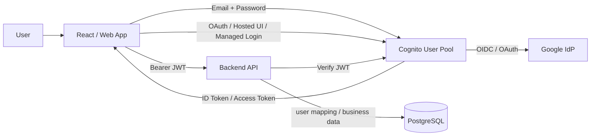

### Hai lớp dữ liệu

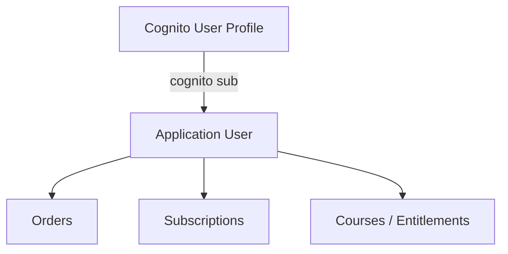

---

## 3. Database design

Khuyến nghị dùng **hai bảng** thay vì nhét mọi identity vào `users`.

### 3.1 `users`

```sql
CREATE TABLE users (
    id UUID PRIMARY KEY DEFAULT gen_random_uuid(),

    email VARCHAR(320),
    name VARCHAR(255),

    status VARCHAR(32) NOT NULL DEFAULT 'active',

    email_verified_at TIMESTAMPTZ,

    created_at TIMESTAMPTZ NOT NULL DEFAULT NOW(),
    updated_at TIMESTAMPTZ NOT NULL DEFAULT NOW()
);
```

> `email` có thể unique trong domain của bạn nếu business rule yêu cầu, nhưng không nên dùng nó làm identity key cho Cognito.

### 3.2 `user_identities`

```sql
CREATE TABLE user_identities (
    id UUID PRIMARY KEY DEFAULT gen_random_uuid(),

    user_id UUID NOT NULL REFERENCES users(id) ON DELETE CASCADE,

    provider VARCHAR(32) NOT NULL,
    provider_subject VARCHAR(255) NOT NULL,

    created_at TIMESTAMPTZ NOT NULL DEFAULT NOW(),
    updated_at TIMESTAMPTZ NOT NULL DEFAULT NOW(),

    CONSTRAINT uq_user_identity
        UNIQUE (provider, provider_subject)
);

CREATE INDEX idx_user_identities_user_id
    ON user_identities(user_id);
```

Ví dụ:

```text
users
--------------------------------------------------
id       = U100
email    = bao@gmail.com
name     = Nguyen Bao
status   = active

user_identities
--------------------------------------------------
user_id   provider      provider_subject
U100      cognito       abc-cognito-sub
U100      google        123456789012345678
```

### Tại sao cần `user_identities`?

Thiết kế này hỗ trợ mở rộng sau này:

```text
U100
 ├── cognito
 ├── google
 ├── apple
 ├── github
 └── microsoft
```

và application code chỉ cần dùng:

```text
users.id = U100
```

---

## 4. Cognito data model cần hiểu rõ

Cognito có thể có các profile được tạo theo những cách khác nhau.

### Local user

Được tạo bằng native Cognito signup:

```text
Username/email
Password
Status: CONFIRMED / UNCONFIRMED
```

### Federated user

Lần đầu user đăng nhập Google mà chưa có profile được link, Cognito có thể tạo một profile external/federated.

AWS mô tả các profile này thường có username theo dạng provider + identifier; JWT `identities` claim chứa thông tin provider liên quan.

### Quan trọng

Đừng coi:

```text
Local user
Federated user
```

là hai application accounts bắt buộc khác nhau.

Application account của bạn phải là:

```text
users.id
```

Cognito chỉ là identity/authentication layer.

---

# 5. Flow A — Password trước → Connect Google

Đây là flow đẹp nhất nếu user muốn có cả password và Google trên cùng một local profile.

## 5.1 Đăng ký password

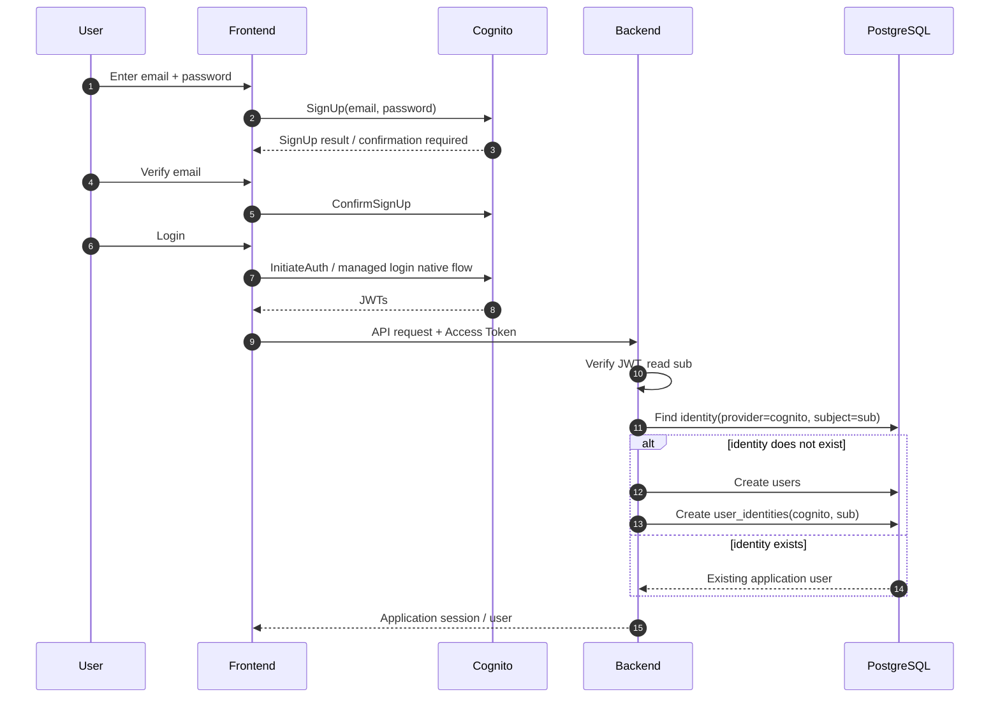

## 5.2 Connect Google sau khi đã đăng nhập

Điều kiện quan trọng: **user phải đang authenticated với account hiện tại**.

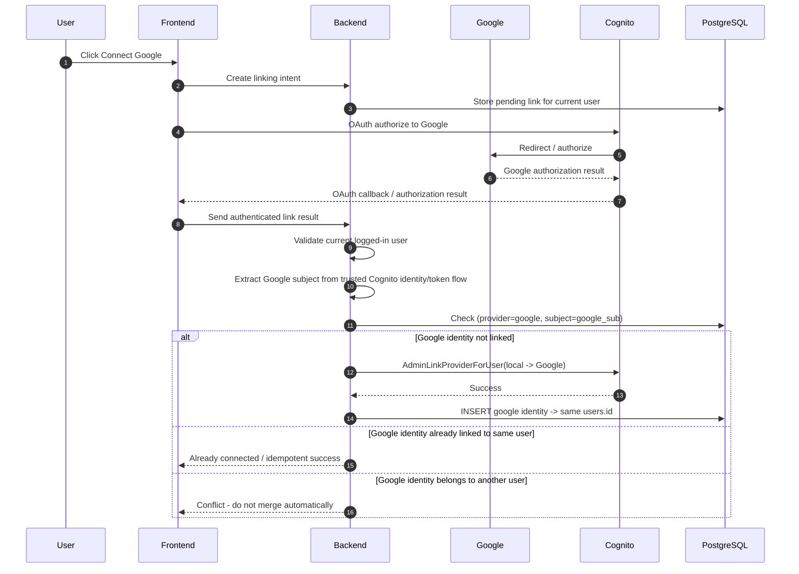

### Cognito API concept

```text
DestinationUser:
    ProviderName = Cognito
    ProviderAttributeValue = local_username

SourceUser:
    ProviderName = Google
    ProviderAttributeName = Cognito_Subject
    ProviderAttributeValue = google_sub
```

AWS xác nhận `AdminLinkProviderForUser` dùng để link external IdP identity vào existing user; với Google, ví dụ dùng `ProviderAttributeName=Cognito_Subject`.

### Kết quả

```text
Cognito User A
├── Local/native authentication
└── Google identity

Application User U100
└── user_identities
    ├── cognito / A-sub
    └── google  / google-sub
```

JWT sau Google login vẫn map về cùng application user.

---

# 6. Flow B — Google trước → Tạo password

Đây là flow **khác** Flow A.

## 6.1 Google signup trước

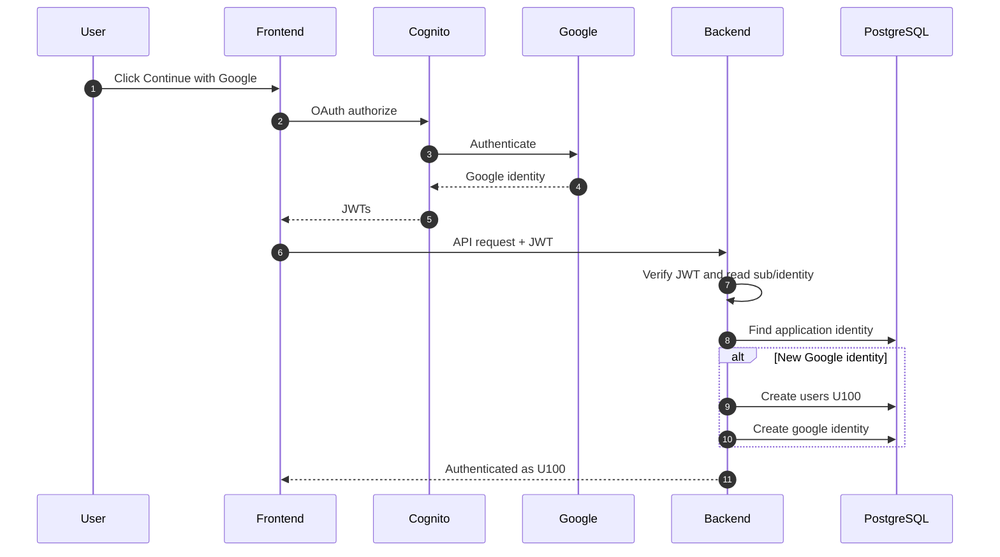

Cognito có thể tạo một federated user profile khi Google sign-in lần đầu nếu chưa có local profile liên kết. AWS mô tả đúng hành vi này trong hướng dẫn linking federated users.

---

## 6.2 User muốn tạo password

Có hai hướng kỹ thuật.

### Hướng được khuyến nghị cho product flow này

**Không gọi SignUp() để tạo user thứ hai.**

Thay vào đó, backend, sau khi đã xác thực user hiện tại, sử dụng:

```text
AdminSetUserPassword
```

trên **federated profile hiện tại**.

AWS tài liệu hiện hành xác nhận API này có thể set password cho federated user profile; trạng thái chuyển từ `EXTERNAL_PROVIDER` sang `CONFIRMED`, sau đó profile có thể dùng các authentication flows dành cho API.

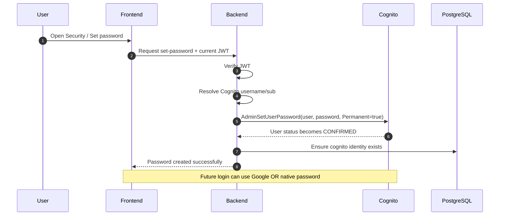

### Kết quả

```text
Cognito User B
├── Google identity
└── Password

Application User U200
└── user_identities
    ├── google / google-sub
    └── cognito / cognito-sub (if your DB models native login explicitly)
```

Quan trọng nhất:

```text
KHÔNG:
Google user B
        + SignUp(email,password)
        -> Local user C
```

vì cách đó tạo hai Cognito profiles.

---

## 6.3 Trade-off của Google-first → AdminSetUserPassword

AWS hiện khuyến nghị không set password trực tiếp trên federated profile vì best practice là giữ native password authentication tách khỏi external IdP và dùng linked local user cho mô hình native + IdP.

Tuy nhiên, đối với requirement sản phẩm:

```text
"User Google-first nhưng sau đó muốn tạo password mà không tạo account thứ hai"
```

thì `AdminSetUserPassword` là đường thực dụng và được Cognito hỗ trợ chính thức.

Nếu hệ thống của bạn ưu tiên tối đa mô hình Cognito "local profile + linked Google identity", hãy cân nhắc flow ngay từ đầu theo hướng tạo local profile rồi link Google. Với federated profile đã sign in rồi, AWS lưu ý rằng để link một federated user đã tồn tại vào profile khác, phải xử lý profile hiện tại trước; không thể coi đó như một `SignUp()` bình thường.

---

# 7. Flow tổng hợp

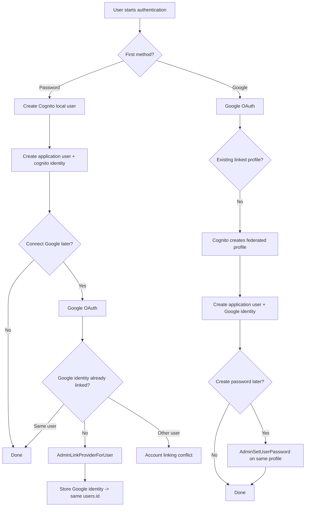

---

# 8. Non-happy cases

## 8.1 User đã có password account, bấm Google ở login page

Ví dụ:

```text
Existing:
users.email = bao@gmail.com
Cognito local user = A
```

User bấm Google:

```text
Google email = bao@gmail.com
Google sub = G123
```

### Không nên làm

```text
if email exists:
    auto link Google
```

### Nên làm

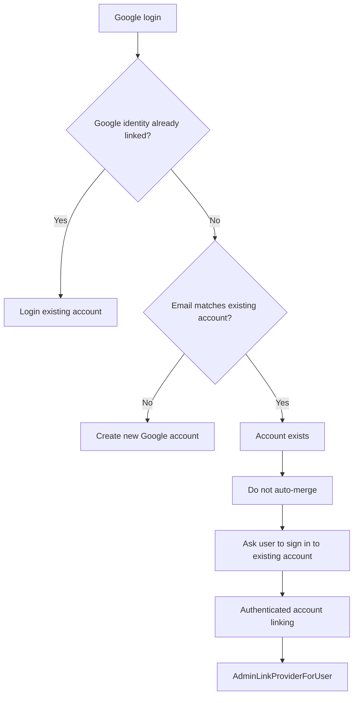

Lý do: linking identity là security-sensitive operation; AWS cảnh báo API này cho phép external identity đăng nhập vào local profile và chỉ nên dùng với IdP/attributes mà bạn tin tưởng.

---

## 8.2 User đã có Google account, sau đó Sign up bằng password

Đây là case người dùng dễ tạo duplicate nhất.

### Không làm

```text
Google user B
    ↓
SignUp(email,password)
    ↓
Local user C
```

### Làm

```text
Google user B
    ↓
User đã authenticated
    ↓
Set password
    ↓
AdminSetUserPassword(B)
    ↓
Same Cognito profile B
```

Kết quả:

```text
One Cognito profile
├── Google
└── Password
```

AWS hiện xác nhận `AdminSetUserPassword` hỗ trợ đặt password trực tiếp cho profile được tạo từ federated sign-in.

---

## 8.3 Google identity đã thuộc account khác

Ví dụ:

```text
U100 -> google/G123
U200 -> trying to connect google/G123
```

Không merge tự động.

Backend trả:

```http
409 Conflict
```

Ví dụ response:

```json
{
  "code": "IDENTITY_ALREADY_LINKED",
  "message": "This Google account is already connected to another account."
}
```

Không tiết lộ quá nhiều thông tin về account kia.

---

## 8.4 Hai account có cùng email

Ví dụ:

```text
U100 -> bao@gmail.com -> password
U200 -> bao@gmail.com -> Google
```

Không tự động merge chỉ bằng email.

Đề xuất:

1. Hiển thị account conflict.
2. Yêu cầu user authenticate account hiện tại.
3. Cho user thực hiện account linking.
4. Nếu cần merge dữ liệu nghiệp vụ, đó là một operation riêng và phải có transaction/audit.

---

## 8.5 User login Google nhưng Google email không verified

Không dùng email chưa được tin cậy để auto-link.

Application nên kiểm tra claim/IdP configuration và policy của bạn trước khi coi email là verified.

Identity key vẫn là:

```text
provider + provider_subject
```

không phải email.

---

## 8.6 User đang connect Google nhưng đóng browser giữa chừng

Dùng bảng/linking intent ở backend:

```sql
CREATE TABLE account_linking_intents (
    id UUID PRIMARY KEY DEFAULT gen_random_uuid(),
    user_id UUID NOT NULL REFERENCES users(id),
    provider VARCHAR(32) NOT NULL,
    state_hash VARCHAR(255) NOT NULL,
    expires_at TIMESTAMPTZ NOT NULL,
    consumed_at TIMESTAMPTZ,
    created_at TIMESTAMPTZ NOT NULL DEFAULT NOW()
);
```

Đặc tính:

- State có expiration.
- Chỉ consume một lần.
- Bind state với current authenticated user.
- Không cho đổi user giữa flow.

---

## 8.7 Hai request connect Google chạy đồng thời

Ví dụ user double-click.

Cần idempotency:

```sql
UNIQUE(provider, provider_subject)
```

và xử lý transaction/unique violation ở backend.

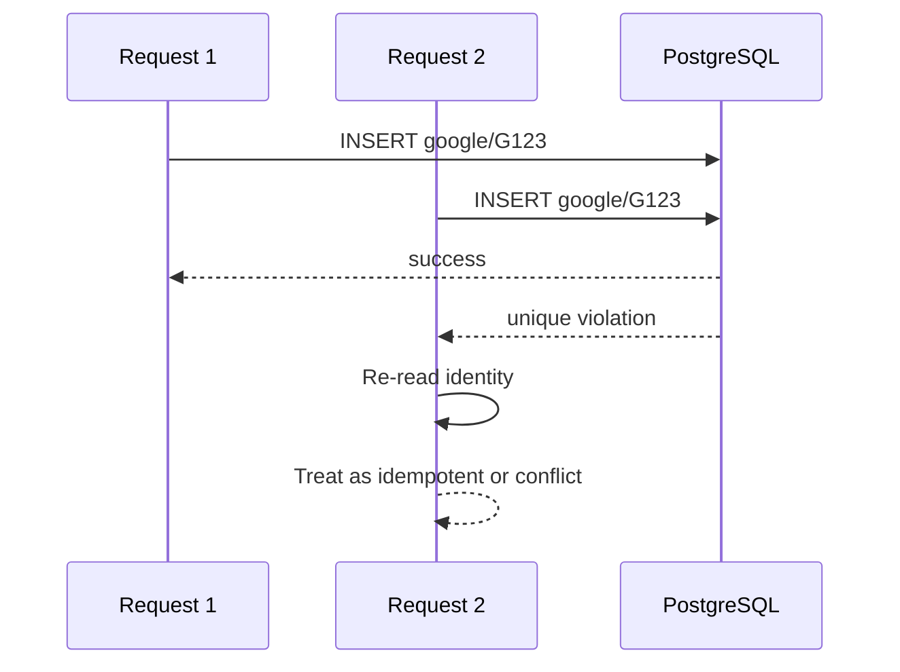

---

## 8.8 User muốn unlink Google

Không cho unlink nếu đó là phương thức đăng nhập duy nhất.

Ví dụ:

```text
Account U100
Google = connected
Password = not available
```

Không cho disconnect Google nếu sau đó account không còn authentication method usable.

Nếu đã có password:

```text
Google + Password
```

thì có thể cho unlink Google.

AWS cung cấp `AdminDisableProviderForUser` để disassociate federated identity khỏi profile.

---

## 8.9 User đổi email

Không dùng email để tìm user sau khi identity đã được thiết lập.

Mapping vẫn là:

```text
Cognito sub / provider identity
        ↓
users.id
```

Email chỉ được đồng bộ vào `users.email` khi policy của application cho phép.

---

## 8.10 Password reset

Password reset phải đi qua Cognito.

Không lưu plaintext password trong DB.

AWS xác nhận Cognito lưu password dưới dạng hash/salt và không thể retrieve plaintext password từ user profile.

---

# 9. Backend API design

Gợi ý:

```text
POST /auth/register
POST /auth/login
POST /auth/google/callback              # nếu backend xử lý callback
POST /account/identities/google/link
POST /account/password
DELETE /account/identities/google
GET  /account/identities
```

### `POST /account/password`

Dùng cho Google-first user.

Backend:

```text
1. Verify current access token.
2. Resolve Cognito user.
3. Check account state / password policy.
4. Call AdminSetUserPassword.
5. Update application identity metadata if needed.
6. Return success.
```

### `POST /account/identities/google/link`

Dùng cho password-first user.

Backend:

```text
1. Verify currently authenticated account.
2. Validate OAuth/link intent.
3. Extract trusted Google subject.
4. Check whether Google subject belongs elsewhere.
5. Call AdminLinkProviderForUser.
6. Insert user_identities row.
7. Commit.
```

---

# 10. JWT → application user resolution

Backend middleware nên có logic tương tự:

```text
HTTP request
    ↓
Authorization: Bearer <access_token>
    ↓
Verify Cognito JWT
    ↓
Read claims.sub
    ↓
Resolve Cognito/native identity
    ↓
users.id
    ↓
request.user
```

Không làm:

```text
frontend sends { userId: "U100" }
backend trusts it
```

Thay vào đó:

```text
JWT -> trusted identity -> U100
```

---

# 11. Cách lưu identity trong DB cho hai flow

## Password-first → Google

```text
users
U100

user_identities
--------------------------------
U100 | cognito | COGNITO_SUB_A
U100 | google  | GOOGLE_SUB_A
```

## Google-first → Password

```text
users
U200

user_identities
--------------------------------
U200 | google  | GOOGLE_SUB_B
```

Password của Cognito có thể tồn tại trên chính federated-created profile sau `AdminSetUserPassword`.

Nếu application muốn audit explicit auth capabilities, có thể thêm bảng/metadata riêng:

```sql
CREATE TABLE user_auth_methods (
    user_id UUID PRIMARY KEY REFERENCES users(id) ON DELETE CASCADE,
    has_password BOOLEAN NOT NULL DEFAULT FALSE,
    updated_at TIMESTAMPTZ NOT NULL DEFAULT NOW()
);
```

Tuy nhiên đây là **application metadata**, không phải source of truth về password. Cognito vẫn là source of truth về authentication.

---

# 12. Security rules

## Rule 1 — Không auto-link theo email

Email match không đủ để chứng minh cùng một application account.

## Rule 2 — Chỉ backend được dùng admin APIs

Các API như:

```text
AdminLinkProviderForUser
AdminSetUserPassword
AdminDisableProviderForUser
```

cần AWS credentials/IAM permissions; không expose credentials cho frontend. AWS yêu cầu IAM authorization cho các admin operations này.

## Rule 3 — `sub`/provider subject là identity key

```text
(provider, provider_subject)
```

phải unique.

## Rule 4 — Linking phải cần authenticated context

User A đang đăng nhập thì chỉ được link identity vào User A.

## Rule 5 — Chống race condition

DB unique constraints + transaction.

## Rule 6 — Không cho account rơi vào trạng thái không có authentication method

Đặc biệt khi unlink Google.

## Rule 7 — Audit account-linking events

Khuyến nghị bảng:

```sql
CREATE TABLE account_security_events (
    id UUID PRIMARY KEY DEFAULT gen_random_uuid(),
    user_id UUID NOT NULL REFERENCES users(id),
    event_type VARCHAR(64) NOT NULL,
    provider VARCHAR(32),
    metadata JSONB,
    created_at TIMESTAMPTZ NOT NULL DEFAULT NOW()
);
```

Ví dụ event:

```text
GOOGLE_LINKED
GOOGLE_UNLINKED
PASSWORD_CREATED
PASSWORD_CHANGED
PASSWORD_RESET
IDENTITY_CONFLICT
```

---

# 13. Recommended UX

## Login page

```text
+--------------------------------+
| Sign in                        |
|                                |
| Email                          |
| Password                       |
| [ Sign in ]                    |
|                                |
| -------- OR --------           |
|                                |
| [ Continue with Google ]       |
+--------------------------------+
```

## Security settings

```text
Authentication methods

Password      Connected
Google        Connected

[Connect Google]
[Change Password]
[Disconnect Google]
```

### Khi Google chưa connected

User phải đang đăng nhập rồi mới connect Google.

### Khi account Google-first

```text
Authentication methods

Google        Connected
Password      Not set

[Create Password]
```

Bấm `Create Password` → backend `AdminSetUserPassword` → cùng Cognito profile.

---

# 14. State machine đề xuất

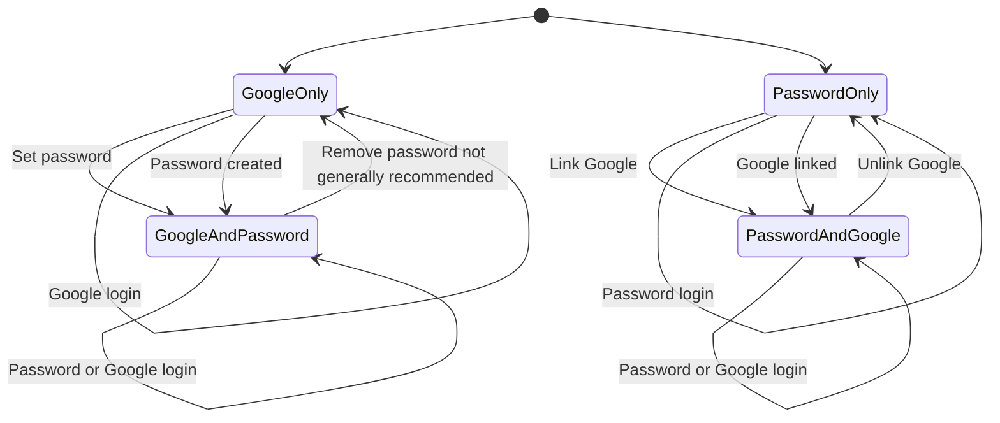

> Lưu ý: việc "remove password" không được xem là operation thông thường; Cognito không cho xóa password của user đã có password chỉ để biến họ trở lại passwordless. Hãy thiết kế product để không phụ thuộc vào operation này. AWS xác nhận password không thể đơn giản bị remove khỏi user profile đã có password.

---

# 15. Decision table

| Scenario | Cognito action | DB action | Kết quả |
|---|---|---|---|
| Password signup | Create local user | Create `users` + cognito identity | 1 account |
| Password user connects Google | `AdminLinkProviderForUser` | Add Google identity to same `users.id` | 1 account |
| Google signup | Cognito creates federated profile | Create `users` + Google identity | 1 account |
| Google user creates password | `AdminSetUserPassword` | Keep same `users.id` | 1 account |
| Google email matches existing password account | **Do not auto-link** | No merge | Conflict / explicit linking |
| Google identity already belongs to another user | Reject link | No merge | 409 conflict |
| Google unlink with no other auth method | Reject | No change | Account stays usable |
| Double link request | Idempotent / unique constraint | Upsert/re-read | No duplicate |
| Password signup after Google without authenticated context | Reject/redirect to login | No new account | Prevent duplicate |

---

# 16. Recommended implementation strategy

## Phase 1 — Core

1. Configure Cognito User Pool.
2. Configure Google IdP.
3. Implement email/password signup/login.
4. Implement Google login.
5. Create `users` + `user_identities`.
6. Build backend JWT middleware.

## Phase 2 — Account linking

1. `POST /account/identities/google/link`
2. Implement OAuth state/linking intent.
3. Use `AdminLinkProviderForUser` for password-first users.
4. Add conflict handling.
5. Add audit logs.

## Phase 3 — Google-first password

1. `POST /account/password`.
2. Require authenticated Google session.
3. Validate password policy.
4. Call `AdminSetUserPassword` on the existing Cognito profile.
5. Never call normal `SignUp()` from this flow.

## Phase 4 — Hardening

1. Rate limiting.
2. CSRF/state validation where applicable.
3. Unique DB constraints.
4. Audit security events.
5. Tests for race conditions.
6. Tests for duplicate-email and duplicate-identity scenarios.

---

# 17. Test matrix trước khi production

| Test | Expected |
|---|---|
| New password signup | 1 Cognito profile + 1 DB user |
| New Google signup | 1 Cognito profile + 1 DB user |
| Password -> Google | 1 Cognito profile, 2 auth methods |
| Google -> Password | 1 Cognito profile, password enabled |
| Password signup same email as Google existing | No automatic duplicate merge |
| Link same Google twice | Idempotent |
| Link Google already linked to another user | 409 conflict |
| Unlink last auth method | Rejected |
| Double-click link | No duplicate identity |
| Invalid/expired linking state | Rejected |
| JWT from user A accessing user B | 403/404 according to policy |

---

# 18. Final architecture recommendation

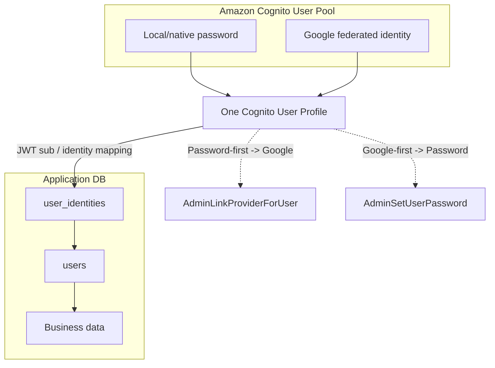

### Quy tắc quyết định cuối cùng

```text
Password-first -> Connect Google
    => AdminLinkProviderForUser
    => same local Cognito profile

Google-first -> Create Password
    => AdminSetUserPassword on same federated-created profile
    => DO NOT SignUp a second local user

Business identity
    => users.id

Authentication identity
    => Cognito + provider subject

Account linking
    => authenticated + explicit + backend-only

Email
    => attribute/contact information, NOT primary identity
```

Đây là thiết kế phù hợp khi mục tiêu sản phẩm là **một account, nhiều phương thức đăng nhập**, đồng thời vẫn giữ application database độc lập với Cognito.

---

# 19. AWS references

- Amazon Cognito — Linking federated users to an existing user profile: https://docs.aws.amazon.com/cognito/latest/developerguide/cognito-user-pools-identity-federation-consolidate-users.html
- Amazon Cognito — `AdminLinkProviderForUser`: https://docs.aws.amazon.com/cognito-user-identity-pools/latest/APIReference/API_AdminLinkProviderForUser.html
- Amazon Cognito — `AdminSetUserPassword`: https://docs.aws.amazon.com/cognito-user-identity-pools/latest/APIReference/API_AdminSetUserPassword.html
- Amazon Cognito — Authentication flows: https://docs.aws.amazon.com/cognito/latest/developerguide/amazon-cognito-user-pools-authentication-flow-methods.html
- Amazon Cognito — Passwords, account recovery, and password policies: https://docs.aws.amazon.com/cognito/latest/developerguide/managing-users-passwords.html

AWS documentation referenced above was checked on 2026-09-09.
