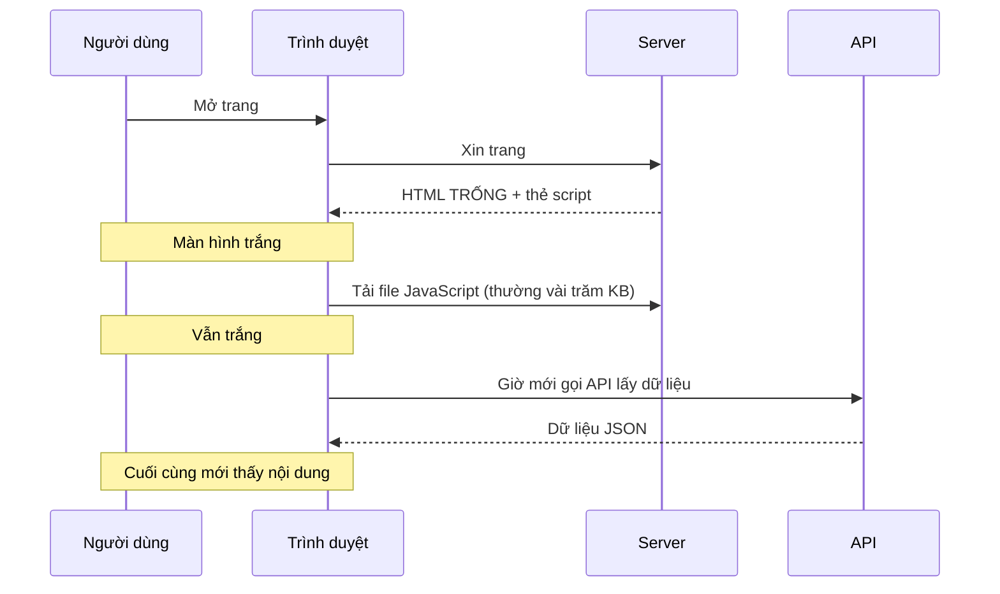
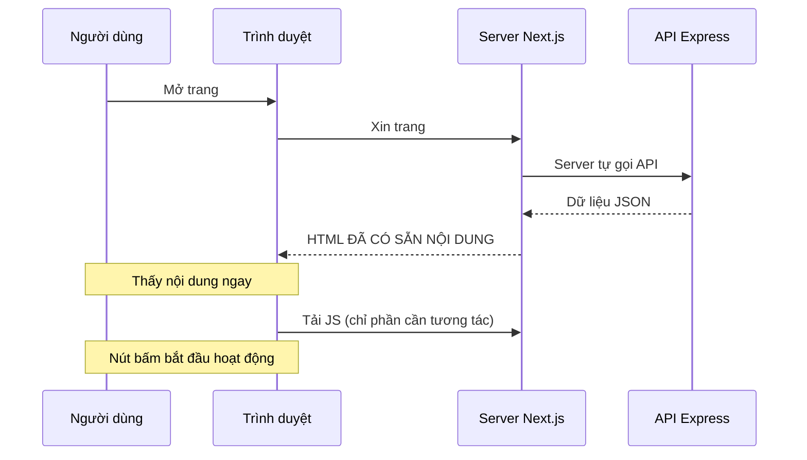
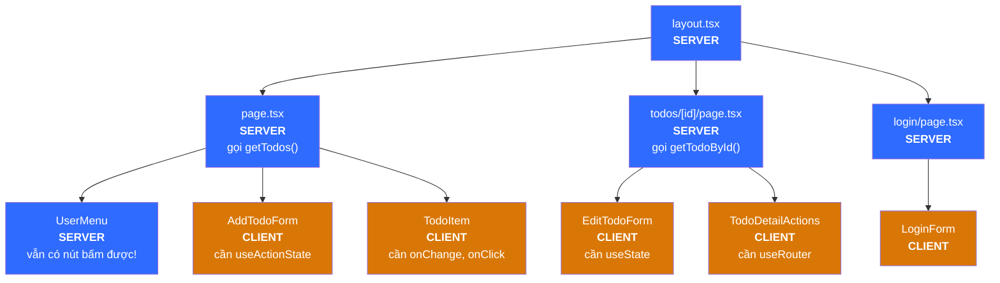
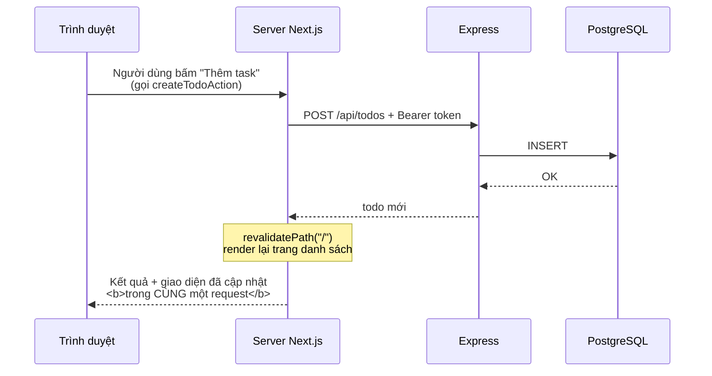
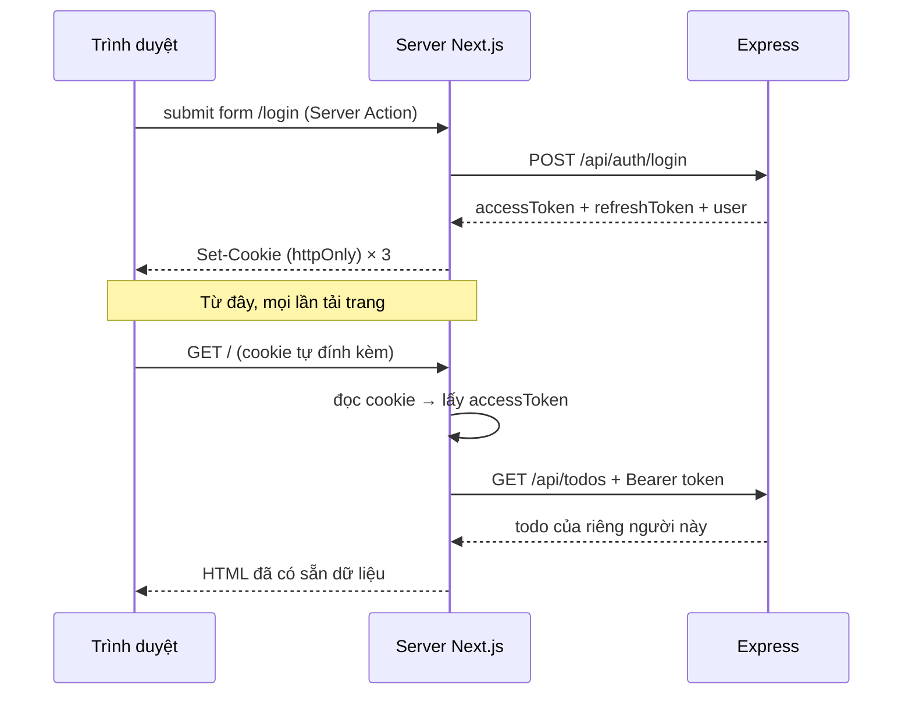

# Học Next.js qua chính dự án này

Tài liệu này giải thích **bức tranh lớn** — những thứ khó nhét vừa vào comment trong code. Đọc file này trước, rồi mở code đọc comment sẽ dễ hiểu hơn nhiều.

> Nếu bạn chưa đọc [`docs/`](../docs/README.md), hãy đọc bốn chương ở đó trước. Tài liệu này đi sâu vào riêng phía frontend.

---

## 1. Vấn đề Next.js sinh ra để giải quyết

### Cách làm React truyền thống (SPA)



Ba lần chờ nối tiếp nhau. Người dùng nhìn màn hình trắng khá lâu, và bot tìm kiếm nhận về một trang rỗng.

### Cách của Next.js (Server Component)



Nội dung hiện ra ngay từ lần phản hồi đầu tiên. JavaScript tải sau chỉ để "gắn điện" cho các nút bấm.

Và có một lợi ích thứ ba, ít được nhắc nhưng quan trọng không kém: vì có một **server của chính bạn** đứng giữa, bạn có chỗ an toàn để cất token đăng nhập. Xem mục 7.

---

## 2. Server Component và Client Component

Đây là khái niệm **quan trọng nhất**. Nếu chỉ nhớ một thứ từ tài liệu này, hãy nhớ phần này.

| | Server Component | Client Component |
|---|---|---|
| Đánh dấu bằng | *(mặc định, không cần gì)* | `"use client"` ở đầu file |
| Chạy ở đâu | Chỉ trên server | Server (dựng HTML) **rồi** trình duyệt |
| Được `async` / `await` | Có | Không |
| Gọi database / API bí mật | Có | Không |
| Đọc cookie `httpOnly` | Có | **Không** |
| `useState`, `useEffect` | **Không** | Có |
| `onClick`, `onChange` | **Không** | Có |
| `window`, `localStorage` | **Không** | Có |
| Gửi JS xuống trình duyệt | Không byte nào | Có |

### Trong dự án này



Để ý: **mọi trang đều là Server Component**. Chỉ những mảnh nhỏ cần tương tác mới là Client. Đó là cách dùng đúng — càng ít màu cam càng tốt.

Và chú ý `UserMenu` — nó có một nút "Đăng xuất" bấm được, nhưng vẫn là Server Component. Xem mục 7 để hiểu vì sao.

### Quy tắc chiều lồng nhau

- Server Component **được** render Client Component bên trong. ✅
- Client Component **không** import được Server Component. ❌

Lý do: khi Next.js gửi Client Component xuống trình duyệt, mọi thứ nó import cũng phải đi cùng — mà Server Component thì không thể chạy ở trình duyệt.

### Hiểu lầm thường gặp

> "use client" nghĩa là component chỉ chạy ở trình duyệt.

**Sai.** Nó vẫn được render trên server để tạo HTML ban đầu. `"use client"` chỉ đánh dấu **ranh giới**: từ đây trở xuống, code cũng được gửi xuống trình duyệt.

---

## 3. Tên file quyết định chức năng

Next.js không có file cấu hình route. **Cấu trúc thư mục chính là route.**

```
src/app/
├── layout.tsx              khung bao ngoài MỌI trang (bắt buộc phải có)
├── page.tsx                →  URL "/"
├── loading.tsx             giao diện chờ cho "/"
├── icon.svg                icon trên tab trình duyệt (tự nhận, không cần khai báo)
├── globals.css
├── login/
│   └── page.tsx            →  URL "/login"
├── register/
│   └── page.tsx            →  URL "/register"
└── todos/
    └── [id]/               ngoặc vuông = khớp mọi giá trị
        ├── page.tsx        →  URL "/todos/1", "/todos/2", ...
        ├── loading.tsx     giao diện chờ cho trang chi tiết
        └── not-found.tsx   giao diện khi gọi notFound()
```

| Tên file | Vai trò |
|---|---|
| `page.tsx` | Tạo ra một URL xem được |
| `layout.tsx` | Khung bao quanh, **không** render lại khi chuyển trang |
| `loading.tsx` | Hiện tạm trong lúc `page.tsx` đang chờ dữ liệu |
| `not-found.tsx` | Hiện khi code gọi `notFound()` |
| `error.tsx` | Hiện khi có lỗi *(dự án này chưa dùng)* |

Lưu ý: thư mục `app/todos/` **không có** `page.tsx`, nên URL `/todos` là 404. Thư mục chỉ tạo ra đoạn đường dẫn; phải có `page.tsx` mới thành trang.

Còn một file convention nữa nằm ngoài `app/`: **`src/proxy.ts`** (trước Next.js 16 tên là `middleware.ts`). Nó phải nằm đúng chỗ đó — nhét vào `features/` hay `shared/` thì nó đơn giản là không bao giờ chạy, và không có lỗi nào được báo.

### `app/` chỉ dùng cho routing

Trong dự án này, `app/` cố tình rất mỏng. Mở [src/app/login/page.tsx](src/app/login/page.tsx) mà xem: nó chỉ đọc tham số URL rồi giao hết cho `<LoginForm />`, thứ nằm ở `features/auth/components/`.

Lý do đầy đủ nằm ở [docs/04-cau-truc-thu-muc.md](../docs/04-cau-truc-thu-muc.md). Tóm tắt: `app/` thuộc về Next.js, còn nghiệp vụ là tài sản của bạn — và tài sản thì không nên khoá chặt vào một framework cụ thể.

---

## 4. Đọc và ghi dữ liệu

### Đọc — gọi thẳng trong Server Component

```tsx
export default async function TodoListPage() {
  const todos = await getTodos();   // xong. Không useEffect, không state loading.
  return <ul>{todos.map(...)}</ul>;
}
```

Không cần `useEffect`, không cần `useState` cho loading, không cần React Query.

### Ghi — Server Action



Điểm mấu chốt: **một vòng gửi/nhận cho cả việc ghi lẫn việc cập nhật giao diện.**

Đây là lý do trong dự án này **không có `useState` nào giữ danh sách todo**. Server là nguồn sự thật duy nhất:

```
người dùng bấm → Server Action → ghi DB → revalidatePath → server render lại → props mới về client
```

### Hai cách gọi Server Action

| Tình huống | Cách dùng | Ví dụ trong dự án |
|---|---|---|
| Form có ô nhập | `<form action={...}>` + `useActionState` | `AddTodoForm`, `LoginForm` |
| Chỉ một cú bấm | `onClick` + `useTransition` | `TodoItem`, `TodoDetailActions` |
| Nút không cần state | `<form action={...}>` thuần, không hook | `UserMenu` (đăng xuất) |

### ⚠️ Một lưu ý an ninh về Server Action

Next.js **sinh ra một endpoint HTTP thật** cho mỗi Server Action được export. Kẻ xấu có thể gửi POST thẳng tới đó mà không qua giao diện của bạn.

Nghĩa là: **đừng bao giờ tin rằng "chỉ form của mình mới gọi được hàm này".**

Trong dự án này, việc kiểm tra quyền xảy ra ở đâu? Không phải trong Server Action. Mỗi action gọi xuống `features/*/api.ts`, file đó dùng `request()` — thứ luôn đính access token từ cookie. Rồi backend Express kiểm chữ ký và lọc mọi query theo `userId`.

Nên kể cả khi ai đó gọi thẳng `deleteTodoAction(5)`, họ vẫn chỉ xoá được todo của chính họ.

> Lớp bảo vệ thật nằm ở nơi **gần dữ liệu nhất**, không nằm ở tầng giao diện.

---

## 5. Về cache — vì sao code có `cache: "no-store"`

Next.js thay `fetch` gốc bằng phiên bản riêng có khả năng cache. Với app todo, cache là **có hại**: bạn thêm task xong mà trang vẫn hiện danh sách cũ thì trông như app hỏng.

Nên trong [src/shared/api/http.ts](src/shared/api/http.ts) mọi lời gọi đều dùng `cache: "no-store"` — luôn hỏi backend thật.

Hệ quả: chạy `npm run build` bạn sẽ thấy

```
┌ ƒ /
├ ○ /_not-found
├ ○ /icon.svg
├ ƒ /login
├ ○ /register
└ ƒ /todos/[id]

○  (Static)   dựng sẵn HTML lúc build
ƒ  (Dynamic)  render lại ở mỗi request
```

Những trang có dữ liệu hoặc đọc URL đều là `ƒ` (Dynamic) — đúng như mong muốn. `/register` là `○` (Static) vì nó chẳng đọc gì cả, chỉ dựng một cái form.

Đây là bằng chứng nhìn thấy được của những lựa chọn bạn viết trong code. Đáng chạy `npm run build` một lần chỉ để xem bảng này.

---

## 6. Những cái bẫy hay gặp

| Bẫy | Triệu chứng | Cách sửa |
|---|---|---|
| Quên `await params` | `id` là `undefined` | `const { id } = await props.params` — từ Next.js 15, `params` là Promise |
| Dùng `next/router` | Lỗi import | App Router dùng `next/navigation` |
| `window` trong Server Component | `window is not defined` | Thêm `"use client"`, hoặc chuyển logic vào `useEffect` |
| Quên `name` trên input | `formData.get()` trả về `null` | Mỗi input gửi đi phải có `name` (không phải `id`) |
| `useState` trong Server Component | Báo lỗi lúc build | Thêm `"use client"` |
| Đặt `"use client"` ở `layout.tsx` | Mất hết lợi ích Server Component | Đẩy `"use client"` xuống càng sâu càng tốt |
| Dùng chỉ số mảng làm `key` | Xoá một dòng thì các dòng khác lỗi trạng thái | Dùng `id` từ database |
| Server Action không `async` | Lỗi lúc build | Mọi hàm export từ file `"use server"` phải là `async` |
| `redirect()` gọi trong `try` | Bấm nút, không lỗi, nhưng không chuyển trang | `redirect()` ném exception đặc biệt — phải gọi **ngoài** `try/catch` |
| Ghi cookie trong Server Component | Không báo lỗi, cookie đơn giản không được set | Chỉ ghi cookie được ở Server Action, Route Handler, `proxy.ts` |
| Chuỗi `*/` lọt vào block comment | Lỗi cú pháp rất khó hiểu | Đừng viết đường dẫn kiểu `features/*/actions.ts` trong `/* */` |

---

## 7. Đăng nhập — token cất ở đâu và ai giữ cửa

Phần này giải thích ba quyết định thiết kế của tính năng đăng nhập. Chi tiết kỹ thuật của token nằm ở [docs/03-luong-xac-thuc.md](../docs/03-luong-xac-thuc.md); ở đây chỉ bàn phần Next.js.

### Toàn cảnh: token đi những đâu



Điều đáng chú ý nhất: **token không bao giờ đi vào tầng JavaScript của trình duyệt**. Nó đi từ Express → server Next.js → cookie, và mỗi lần dùng thì server Next.js đọc lại từ cookie. Code chạy trong trình duyệt không có cách nào chạm tới.

Và để ý cả `LoginForm`: dù nó là Client Component, nó **không đọc giá trị ô mật khẩu** ở bất cứ đâu. Không `useState`, không `onChange`. Mật khẩu nằm trong `<input>` do trình duyệt quản lý, rồi trình duyệt gói cả form gửi thẳng tới Server Action. Giá trị không bao giờ được đọc vào biến thì không có gì để đọc trộm.

### Quyết định 1 — Cookie `httpOnly`, không phải `localStorage`

Rất nhiều hướng dẫn trên mạng bảo lưu token vào `localStorage`. Đừng.

| Chỗ cất | JavaScript đọc được? | Sống qua F5? | Chống XSS? |
|---|---|---|---|
| `localStorage` | ✅ Có | ✅ | ❌ **Không** |
| React state | ❌ | ❌ Mất | ✅ |
| Cookie `httpOnly` | ❌ | ✅ | ✅ |

`localStorage` mở toang cho mọi đoạn script chạy trên trang — kể cả script đến từ một thư viện npm bị cài mã độc. Cookie `httpOnly` thì `document.cookie` không nhìn thấy, nên có XSS cũng không mang token đi đâu được.

Cách này khả thi là nhờ kiến trúc sẵn có: trình duyệt chỉ nói chuyện với server Next.js, và chính server đó mới gọi Express. **Một ứng dụng React thuần không có lựa chọn này** — không có server nào của bạn để đọc cookie, nên buộc phải cất token ở nơi JavaScript đọc được.

Xem [src/shared/lib/session.ts](src/shared/lib/session.ts).

### Quyết định 2 — `proxy.ts` là lớp trải nghiệm, không phải lớp bảo mật

📌 Từ Next.js 16, `middleware.ts` đổi tên thành **`proxy.ts`**. Tài liệu cũ nhắc `middleware.ts` chính là file này.

`proxy.ts` chỉ nhìn xem cookie có tồn tại hay không — nó **không** kiểm chữ ký token, và cố ý không làm vậy (nó không có `JWT_SECRET`, và cũng không nên có). Ai cũng tự tạo được một cookie tên `access_token` với nội dung bịa để qua mặt nó.

Nhưng qua được cũng vô ích, vì lớp bảo vệ thật nằm ở Express. Bạn tự kiểm chứng được:

```bash
curl -H 'Cookie: access_token=toi-tu-bia-ra' http://localhost:3001/
```

Proxy cho qua (HTTP 200), rồi trang hiện hộp lỗi *"Phiên đăng nhập không hợp lệ hoặc đã hết hạn"* — câu đó đến từ `requireAuth` bên Express.

Đây là **phòng thủ nhiều lớp**, và mỗi lớp có một việc:

| Lớp | Ở đâu | Việc | Qua mặt được không? |
|---|---|---|---|
| Trải nghiệm | `proxy.ts` | Đưa người chưa đăng nhập tới form đăng nhập | Được, và không sao cả |
| **Bảo mật** | `requireAuth` (Express) | Kiểm chữ ký JWT | **Không** — cần `JWT_SECRET` |
| **Bảo mật** | `todo.service.ts` | Mọi query kèm `WHERE userId` | **Không** |

Nguyên tắc rút ra: mọi thứ chạy gần người dùng đều có thể bị giả mạo. Chỉ những gì server tự kiểm chứng mới đáng tin.

### Quyết định 3 — Gia hạn token đặt trong `proxy.ts`

Access token sống 1 giờ. Nếu hết hạn là bắt đăng nhập lại thì không ai chịu nổi, nên proxy lặng lẽ dùng refresh token xin cặp token mới.

Vì sao phải là proxy mà không phải `shared/api/http.ts`? Vì gia hạn xong thì phải **lưu** token mới vào cookie, mà Next.js chỉ cho ghi cookie ở ba nơi:

| Nơi | Ghi cookie được? |
|---|---|
| Server Component (`page.tsx`) | ❌ Không |
| Server Action (`features/auth/actions.ts`) | ✅ Có |
| Route Handler | ✅ Có |
| `proxy.ts` | ✅ Có |

Lý do rất vật lý: `Set-Cookie` là một HTTP header, mà header phải đi **trước** nội dung. Tới lúc Server Component render thì header đã gửi đi rồi. Đây là cách HTTP vận hành, không phải hạn chế do Next.js đặt ra.

Hiểu được điều đó thì bạn không phải học thuộc bảng trên — bạn tự suy ra được.

Một mẹo nhỏ đáng để ý trong `session.ts`: hạn của **cookie** access token được đặt bằng đúng hạn của **token** (trừ hao 1 phút). Nhờ vậy câu hỏi "token còn sống không?" trở thành "cookie còn đó không?" — trình duyệt tự xoá giúp, không cần so sánh thời gian ở đâu cả.

> Nguyên tắc chung đáng học từ đây: hãy tìm cách **biến một phép tính thành một sự thật có sẵn**. Code không viết ra thì không thể có bug.

### ⚠️ Cái bẫy của xoay vòng token

Backend **xoay vòng** refresh token: mỗi lần gia hạn, token cũ bị xoá khỏi database và một token mới được cấp. Nghĩa là `proxy.ts` bắt buộc phải ghi đè **cả ba** cookie, không chỉ `access_token`.

Quên ghi đè `refresh_token` thì hiện tượng rất khó hiểu: mọi thứ chạy tốt trong một giờ đầu, rồi lần gia hạn **thứ hai** thất bại. Một bug chỉ xuất hiện sau hai tiếng đồng hồ — đúng loại bug không bao giờ bị phát hiện lúc bạn ngồi test bằng tay.

### `UserMenu` — nút bấm được mà vẫn là Server Component

Đây là một trong những chỗ đẹp nhất của React Server Components, và đáng mở file ra xem.

Nút "Đăng xuất" nằm trong một `<form>` bình thường, `action` trỏ thẳng tới Server Action. Không `onClick`, không `useState`, không `fetch`. Nghĩa là:

- Không một dòng JavaScript nào của component này bị gửi xuống trình duyệt
- Nút vẫn **hoạt động** kể cả khi JavaScript bị tắt hoàn toàn, vì nó chỉ là một form HTML gửi POST như thời web mới ra đời

Đây là "progressive enhancement" (nâng cấp tiệm tiến) — thứ mà React từng đánh mất trong nhiều năm và nay lấy lại được nhờ Server Actions.

### Các file của phần đăng nhập

| File | Việc |
|---|---|
| [src/shared/lib/session.ts](src/shared/lib/session.ts) | Đọc/ghi cookie. **Đọc file này trước** |
| [src/features/auth/actions.ts](src/features/auth/actions.ts) | Server Actions: đăng ký, đăng nhập, đăng xuất |
| [src/features/auth/api.ts](src/features/auth/api.ts) | Gọi `/api/auth/*` |
| [src/proxy.ts](src/proxy.ts) | Chặn cửa + tự động gia hạn token |
| [src/features/auth/components/LoginForm.tsx](src/features/auth/components/LoginForm.tsx) | Form đăng nhập, `useActionState` |
| [src/features/auth/components/UserMenu.tsx](src/features/auth/components/UserMenu.tsx) | Nút bấm được mà vẫn là Server Component |

---

## 8. Thứ tự đọc code

Đọc theo thứ tự này sẽ thấy mọi thứ nối vào nhau:

1. **[src/features/todos/types.ts](src/features/todos/types.ts)** — hình dạng dữ liệu. Ngắn, dễ.
2. **[src/shared/api/http.ts](src/shared/api/http.ts)** — cách nói chuyện với backend. Vì sao chỉ chạy trên server.
3. **[src/app/layout.tsx](src/app/layout.tsx)** — khung bao ngoài, font, metadata.
4. **[src/app/page.tsx](src/app/page.tsx)** — Server Component đầu tiên. Đọc kỹ file này.
5. **[src/features/todos/actions.ts](src/features/todos/actions.ts)** — Server Action. File quan trọng nhất về khái niệm.
6. **[src/features/todos/components/AddTodoForm.tsx](src/features/todos/components/AddTodoForm.tsx)** — Client Component đầu tiên, form + `useActionState`.
7. **[src/features/todos/components/TodoItem.tsx](src/features/todos/components/TodoItem.tsx)** — cách khác: sự kiện + `useTransition`.
8. **[src/app/todos/[id]/page.tsx](src/app/todos/%5Bid%5D/page.tsx)** — route động, `params`, `notFound()`.
9. **[src/features/todos/components/EditTodoForm.tsx](src/features/todos/components/EditTodoForm.tsx)** — controlled form, file khó nhất.
10. **[src/features/todos/components/TodoDetailActions.tsx](src/features/todos/components/TodoDetailActions.tsx)** — `useRouter`, điều hướng bằng code.

Phần đăng nhập đọc sau, khi đã nắm mười file trên — bảng file nằm ở cuối mục 7.

Về **vì sao file nằm ở đâu** (`app/` vs `features/` vs `shared/`), xem [docs/04-cau-truc-thu-muc.md](../docs/04-cau-truc-thu-muc.md).

---

## 9. Thử nghịch để hiểu sâu hơn

Vài thí nghiệm nhỏ, làm xong nhớ hoàn tác:

1. **Xóa `"use client"` khỏi `TodoItem.tsx`** → xem Next.js báo lỗi gì. Đó chính là cách bạn nhận ra một component cần là Client.
2. **Thêm `console.log("xin chào")` vào `app/page.tsx`** → dòng chữ hiện ở **terminal**, không phải console trình duyệt. Bằng chứng file đó chạy trên server.
3. **Xóa `revalidatePath` trong `createTodoAction`** → thêm task xong danh sách không đổi. Bấm F5 mới thấy. Đó là việc `revalidatePath` đang làm.
4. **Đổi `cache: "no-store"` thành `cache: "force-cache"`** trong `shared/api/http.ts` → dữ liệu bị đóng băng.
5. **Tắt backend rồi tải lại trang** → thấy hộp lỗi thay vì màn hình lỗi đỏ. Đó là khối `try/catch` trong `app/page.tsx`.
6. **Đăng nhập, rồi mở DevTools → Application → Cookies** → thấy ba cookie, cột `HttpOnly` đều tick. Giờ gõ `document.cookie` vào Console: chuỗi trả về **không** chứa token. Đó là `httpOnly` đang làm việc.
7. **Xoá cookie `access_token` (giữ nguyên hai cookie kia) rồi F5** → trang vẫn hiện bình thường. Bạn vừa chứng kiến `proxy.ts` tự gia hạn token mà không làm phiền ai. Mở lại tab Cookies: cả ba cookie đều có giá trị mới.
8. **Xoá cả ba cookie rồi F5** → bị đá về `/login?next=/`. Đăng nhập lại sẽ quay đúng về trang cũ.
9. **Đăng ký tài khoản thứ hai, tạo vài todo, rồi đăng nhập lại bằng tài khoản đầu** → danh sách của mỗi người tách bạch hoàn toàn. Đây là bằng chứng cuối cùng rằng tính năng chạy đúng.
10. **Thử `/login?next=https://example.com`, đăng nhập, xem nó đưa bạn đi đâu** → về trang chủ, không phải example.com. Đó là `safeRedirectPath` chặn lỗ hổng open redirect.
11. **Chạy `npm run build` và đọc bảng route** → đối chiếu dấu `ƒ`/`○` với mục 5. Mỗi ký hiệu là hệ quả của một dòng code bạn đã đọc.
12. **Trong `UserMenu.tsx`, tắt JavaScript của trình duyệt rồi bấm Đăng xuất** → vẫn chạy. Còn `AddTodoForm` thì không. Khác biệt đó chính là ranh giới Server/Client Component.

---

## 10. Đọc thêm

Bản Next.js dùng ở đây (16.3.2) có tài liệu **nằm sẵn trong máy**, không cần lên mạng:

```bash
ls node_modules/next/dist/docs/01-app/01-getting-started/
```

Nên đọc bản này thay vì tra Google, vì rất nhiều bài trên mạng viết cho Pages Router (kiến trúc cũ) và sẽ không chạy với dự án này.
