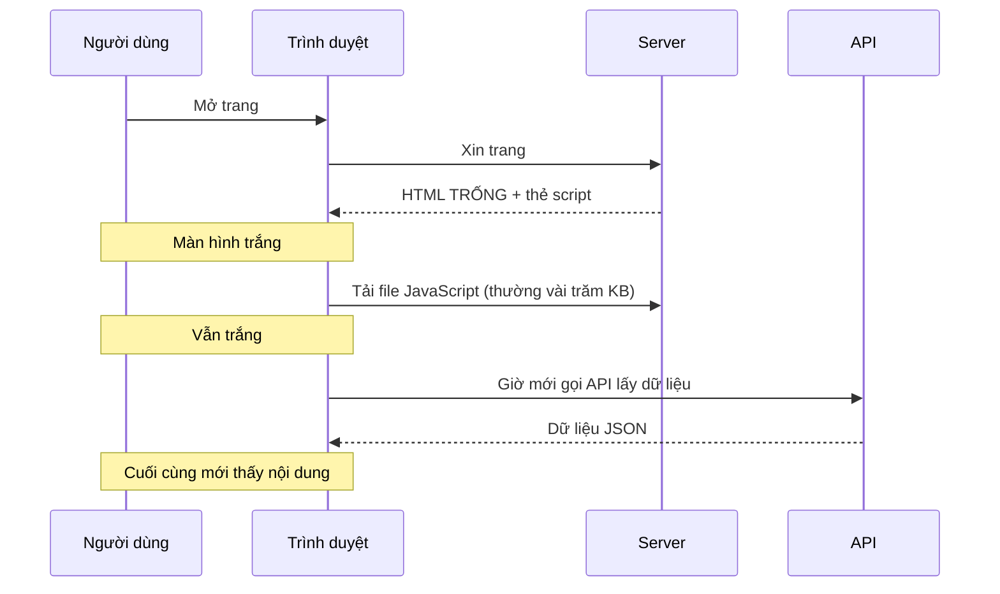
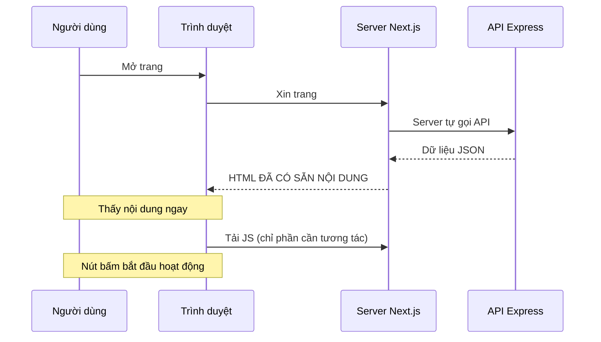
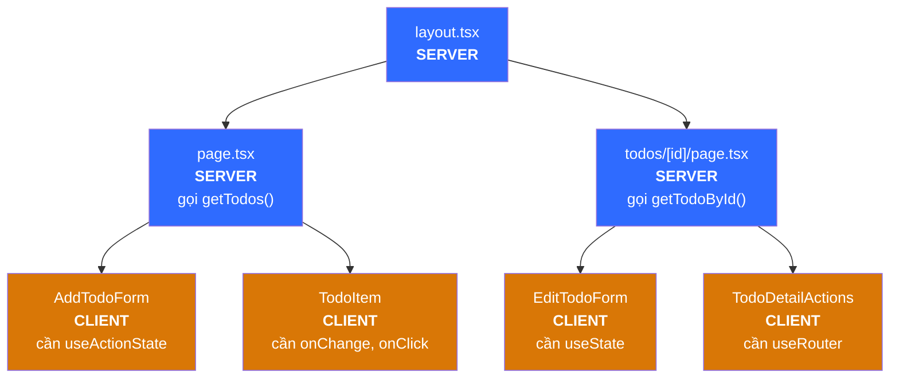
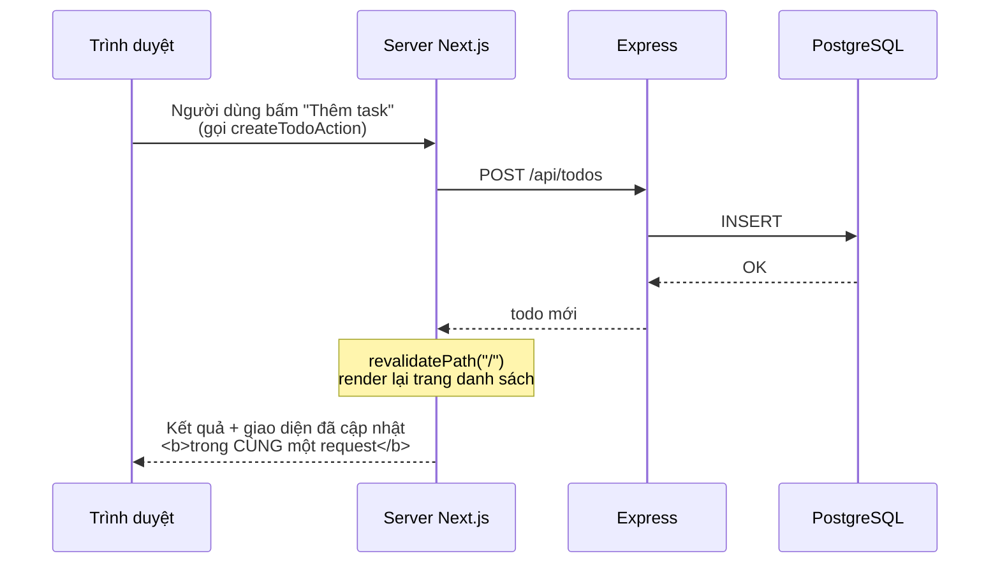

# Học Next.js qua chính dự án này

Tài liệu này giải thích **bức tranh lớn** — những thứ khó nhét vừa vào comment trong code. Đọc file này trước, rồi mở code đọc comment sẽ dễ hiểu hơn nhiều.

---

## 1. Vấn đề Next.js sinh ra để giải quyết

### Cách làm React truyền thống (SPA)



Ba lần chờ nối tiếp nhau. Người dùng nhìn màn hình trắng khá lâu, và bot tìm kiếm nhận về một trang rỗng.

### Cách của Next.js (Server Component)



Nội dung hiện ra ngay từ lần phản hồi đầu tiên. JavaScript tải sau chỉ để "gắn điện" cho các nút bấm.

---

## 2. Server Component và Client Component

Đây là khái niệm **quan trọng nhất**. Nếu chỉ nhớ một thứ từ tài liệu này, hãy nhớ phần này.

| | Server Component | Client Component |
|---|---|---|
| Đánh dấu bằng | *(mặc định, không cần gì)* | `"use client"` ở đầu file |
| Chạy ở đâu | Chỉ trên server | Server (dựng HTML) **rồi** trình duyệt |
| Được `async` / `await` | Có | Không |
| Gọi database / API bí mật | Có | Không |
| `useState`, `useEffect` | **Không** | Có |
| `onClick`, `onChange` | **Không** | Có |
| `window`, `localStorage` | **Không** | Có |
| Gửi JS xuống trình duyệt | Không byte nào | Có |

### Trong dự án này



Để ý: **hai trang đều là Server Component**. Chỉ những mảnh nhỏ cần tương tác mới là Client. Đó là cách dùng đúng — càng ít màu cam càng tốt.

### Quy tắc chiều lồng nhau

- Server Component **được** render Client Component bên trong. ✅
- Client Component **không** import được Server Component. ❌

Lý do: khi Next.js gửi Client Component xuống trình duyệt, mọi thứ nó import cũng phải đi cùng — mà Server Component thì không thể chạy ở trình duyệt.

### Hiểu lầm thường gặp

> "use client" nghĩa là component chỉ chạy ở trình duyệt.

**Sai.** Nó vẫn được render trên server để tạo HTML ban đầu. `"use client"` chỉ đánh dấu **ranh giới**: từ đây trở xuống, code cũng được gửi xuống trình duyệt.

---

## 3. Tên file quyết định chức năng

Next.js không có file cấu hình route. **Cấu trúc thư mục chính là route.**

```
src/app/
├── layout.tsx              khung bao ngoài MỌI trang (bắt buộc phải có)
├── page.tsx                →  URL "/"
├── loading.tsx             giao diện chờ cho "/"
├── icon.svg                icon trên tab trình duyệt (tự nhận, không cần khai báo)
├── globals.css
└── todos/
    └── [id]/               ngoặc vuông = khớp mọi giá trị
        ├── page.tsx        →  URL "/todos/1", "/todos/2", ...
        ├── loading.tsx     giao diện chờ cho trang chi tiết
        └── not-found.tsx   giao diện khi gọi notFound()
```

| Tên file | Vai trò |
|---|---|
| `page.tsx` | Tạo ra một URL xem được |
| `layout.tsx` | Khung bao quanh, **không** render lại khi chuyển trang |
| `loading.tsx` | Hiện tạm trong lúc `page.tsx` đang chờ dữ liệu |
| `not-found.tsx` | Hiện khi code gọi `notFound()` |
| `error.tsx` | Hiện khi có lỗi *(dự án này chưa dùng)* |

Lưu ý: thư mục `app/todos/` **không có** `page.tsx`, nên URL `/todos` là 404. Thư mục chỉ tạo ra đoạn đường dẫn; phải có `page.tsx` mới thành trang.

---

## 4. Đọc và ghi dữ liệu

### Đọc — gọi thẳng trong Server Component

```tsx
export default async function TodoListPage() {
  const todos = await getTodos();   // xong. Không useEffect, không state loading.
  return <ul>{todos.map(...)}</ul>;
}
```

Không cần `useEffect`, không cần `useState` cho loading, không cần React Query.

### Ghi — Server Action



Điểm mấu chốt: **một vòng gửi/nhận cho cả việc ghi lẫn việc cập nhật giao diện.**

Đây là lý do trong dự án này **không có `useState` nào giữ danh sách todo**. Server là nguồn sự thật duy nhất:

```
người dùng bấm → Server Action → ghi DB → revalidatePath → server render lại → props mới về client
```

### Hai cách gọi Server Action

| Tình huống | Cách dùng | Ví dụ trong dự án |
|---|---|---|
| Form có ô nhập | `<form action={...}>` + `useActionState` | `AddTodoForm`, `EditTodoForm` |
| Chỉ một cú bấm | `onClick` + `useTransition` | `TodoItem`, `TodoDetailActions` |

---

## 5. Về cache — vì sao code có `cache: "no-store"`

Next.js thay `fetch` gốc bằng phiên bản riêng có khả năng cache. Với app todo, cache là **có hại**: bạn thêm task xong mà trang vẫn hiện danh sách cũ thì trông như app hỏng.

Nên trong [src/lib/api.ts](src/lib/api.ts) mọi lời gọi đều dùng `cache: "no-store"` — luôn hỏi backend thật.

Hệ quả: chạy `npm run build` bạn sẽ thấy

```
┌ ƒ /
├ ○ /_not-found
├ ○ /icon.svg
└ ƒ /todos/[id]

○  (Static)   dựng sẵn HTML lúc build
ƒ  (Dynamic)  render lại ở mỗi request
```

Hai trang có dữ liệu đều là `ƒ` (Dynamic) — đúng như mong muốn.

---

## 6. Những cái bẫy hay gặp

| Bẫy | Triệu chứng | Cách sửa |
|---|---|---|
| Quên `await params` | `id` là `undefined` | `const { id } = await props.params` — từ Next.js 15, `params` là Promise |
| Dùng `next/router` | Lỗi import | App Router dùng `next/navigation` |
| `window` trong Server Component | `window is not defined` | Thêm `"use client"`, hoặc chuyển logic vào `useEffect` |
| Quên `name` trên input | `formData.get()` trả về `null` | Mỗi input gửi đi phải có `name` |
| `useState` trong Server Component | Báo lỗi lúc build | Thêm `"use client"` |
| Đặt `"use client"` ở `layout.tsx` | Mất hết lợi ích Server Component | Đẩy `"use client"` xuống càng sâu càng tốt |
| Dùng chỉ số mảng làm `key` | Xóa một dòng thì các dòng khác lỗi trạng thái | Dùng `id` từ database |
| Server Action không `async` | Lỗi lúc build | Mọi hàm export từ file `"use server"` phải là `async` |

---

## 7. Thứ tự đọc code

Đọc theo thứ tự này sẽ thấy mọi thứ nối vào nhau:

1. **[src/lib/types.ts](src/lib/types.ts)** — hình dạng dữ liệu. Ngắn, dễ.
2. **[src/lib/api.ts](src/lib/api.ts)** — cách nói chuyện với backend. Vì sao chỉ chạy trên server.
3. **[src/app/layout.tsx](src/app/layout.tsx)** — khung bao ngoài, font, metadata.
4. **[src/app/page.tsx](src/app/page.tsx)** — Server Component đầu tiên. Đọc kỹ file này.
5. **[src/lib/actions.ts](src/lib/actions.ts)** — Server Action. File quan trọng nhất về khái niệm.
6. **[src/components/AddTodoForm.tsx](src/components/AddTodoForm.tsx)** — Client Component đầu tiên, form + `useActionState`.
7. **[src/components/TodoItem.tsx](src/components/TodoItem.tsx)** — cách khác: sự kiện + `useTransition`.
8. **[src/app/todos/[id]/page.tsx](src/app/todos/%5Bid%5D/page.tsx)** — route động, `params`, `notFound()`.
9. **[src/components/EditTodoForm.tsx](src/components/EditTodoForm.tsx)** — controlled form, file khó nhất.
10. **[src/components/TodoDetailActions.tsx](src/components/TodoDetailActions.tsx)** — `useRouter`, điều hướng bằng code.

---

## 8. Thử nghịch để hiểu sâu hơn

Vài thí nghiệm nhỏ, làm xong nhớ hoàn tác:

1. **Xóa `"use client"` khỏi `TodoItem.tsx`** → xem Next.js báo lỗi gì. Đó chính là cách bạn nhận ra một component cần là Client.
2. **Thêm `console.log("xin chào")` vào `app/page.tsx`** → dòng chữ hiện ở **terminal**, không phải console trình duyệt. Bằng chứng file đó chạy trên server.
3. **Xóa `revalidatePath` trong `createTodoAction`** → thêm task xong danh sách không đổi. Bấm F5 mới thấy. Đó là việc `revalidatePath` đang làm.
4. **Đổi `cache: "no-store"` thành `cache: "force-cache"`** trong `api.ts` → dữ liệu bị đóng băng.
5. **Tắt backend rồi tải lại trang** → thấy hộp lỗi thay vì màn hình lỗi đỏ. Đó là khối `try/catch` trong `app/page.tsx`.

---

## 9. Đọc thêm

Bản Next.js dùng ở đây (16.3.2) có tài liệu **nằm sẵn trong máy**, không cần lên mạng:

```bash
ls node_modules/next/dist/docs/01-app/01-getting-started/
```

Nên đọc bản này thay vì tra Google, vì rất nhiều bài trên mạng viết cho Pages Router (kiến trúc cũ) và sẽ không chạy với dự án này.
