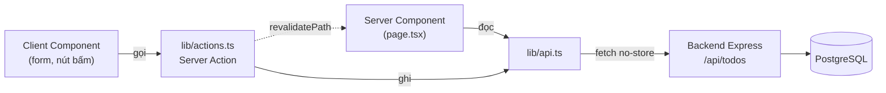

# Todo List — Frontend

Giao diện web cho API todo ở [`../backend`](../backend), viết bằng Next.js 16 (App Router) + TypeScript + CSS Modules.

## Yêu cầu

Backend phải chạy trước, vì mọi dữ liệu đều lấy từ đó. Xem hướng dẫn ở `../backend`.

## Chạy dự án

```bash
cp .env.example .env.local   # chỉnh lại nếu backend không chạy ở cổng 3000
npm install
npm run dev
```

Mở http://localhost:3001

> Frontend dùng cổng **3001** vì backend đã giữ cổng 3000.

## Biến môi trường

| Biến | Mặc định | Mô tả |
| --- | --- | --- |
| `API_BASE_URL` | `http://localhost:3000/api` | Base URL của backend. Chỉ đọc ở phía server nên không lộ ra browser. |

## Các trang

| Đường dẫn | Chức năng |
| --- | --- |
| `/` | Danh sách task, tách nhóm chưa xong / đã xong. Thêm task, tick hoàn thành, xóa. |
| `/todos/[id]` | Chi tiết task: sửa nội dung, đổi trạng thái, xóa, xem ngày tạo / cập nhật. |

## Cấu trúc

```
src/
├── app/
│   ├── layout.tsx           Root layout, font, metadata
│   ├── globals.css          Design token (sáng / tối) + reset
│   ├── page.tsx             Trang danh sách
│   └── todos/[id]/          Trang chi tiết + not-found
├── components/              Component UI, mỗi cái kèm *.module.css
└── lib/
    ├── api.ts               Gọi backend (server-side), bóc envelope { success, data }
    ├── actions.ts           Server Actions + revalidatePath
    ├── types.ts             Kiểu dữ liệu khớp với backend
    ├── constants.ts         Route helper, giá trị mặc định
    └── format.ts            Format ngày giờ vi-VN
```

## Luồng dữ liệu



Mọi request đều dùng `cache: "no-store"` để luôn lấy dữ liệu mới nhất; sau mỗi lần ghi, Server Action gọi `revalidatePath` để render lại trang liên quan.

## Lệnh

| Lệnh | Tác dụng |
| --- | --- |
| `npm run dev` | Chạy dev server ở cổng 3001 |
| `npm run build` | Build production |
| `npm start` | Chạy bản build ở cổng 3001 |
| `npm run lint` | ESLint |
